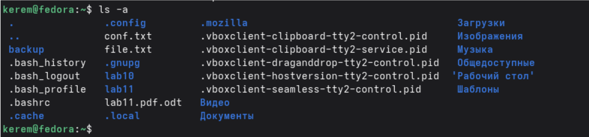
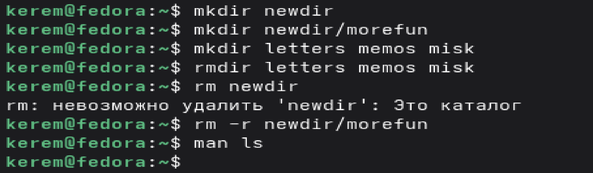

---
## Author
author:
  name: Пириев Керем
  email: 1032254162@rudn.ru
  affiliation:
    - name: Российский университет дружбы народов
      country: Российская Федерация
      postal-code: 117198
      city: Москва
      address: ул. Миклухо-Маклая, д. 6

## Title
title: "Лабораторная работа №1"
subtitle: "Установка и конфигурация операционной системы на виртуальную машину"
license: CC BY
date: today
date-format: "YYYY-MM-DD" # Example: 2025-09-06
---

# Информация

## Докладчик

:::::::::::::: {.columns align=center}
::: {.column width="70%"}

* Пириев Керем
* студент группы НПИбд-02-25
* Российский университет дружбы народов
* [1032254162@rudn.ru](mailto:1032254162@rudn.ru)

:::
::: {.column width="30%"}

:::
::::::::::::::

# Цель работы

Приобретение практических навыков взаимодействия пользователя с системой посредством командной строки.

# Задание

1. Определить домашний каталог пользователя.
2. Изучить содержимое домашнего каталога с помощью команды `ls` и её опций (`-l`, `-a`, `-la`).
3. Проверить наличие подкаталога `cron` в каталоге `/var/spool`.
4. Создать и удалить каталоги с помощью команд `mkdir`, `rmdir`, `rm`.
5. Изучить справку по команде `ls` с помощью `man`.
6. Просмотреть историю выполненных команд.

# Выполнение лабораторной работы

## Определение домашнего каталога

{width=50%}

## Работа с каталогом /tmp

{width=50%}

## Работа с каталогом /tmp

{width=50%}

## Работа с каталогом /tmp

{width=50%}

## Работа с каталогом /tmp

{width=50%}

## Проверка наличия каталога cron

{width=50%}

**Вывод:** подкаталог `cron` в `/var/spool` отсутствует.

## Содержимое домашнего каталога

{width=50%}

## Создание и удаление каталогов

{width=50%}

## Работа с командой man

- `ls -R` — просмотр содержимого каталога вместе с подкаталогами.
- `ls -lt` — сортировка по времени последнего изменения с развёрнутым описанием.

## Работа с историей команд

- `mkdir -p` — создание каталога вместе с родительскими каталогами.
- `rm -r` — рекурсивное удаление каталога с содержимым.
- `rm -f` — принудительное удаление без подтверждения.
- `rmdir -p` — удаление каталога и его родительских каталогов (если они пусты).

{width=50%}

# Выводы

В ходе выполнения лабораторной работы приобретены практические навыки работы с командной строкой Unix. Изучены и отработаны следующие команды и их опции:

| Команда | Назначение | Основные опции |
|---------|------------|----------------|
| pwd | Показать текущий каталог | — |
| cd | Перемещение по файловой системе | — |
| ls | Просмотр содержимого каталога | -l, -a, -R, -t |
| mkdir | Создание каталогов | -p, -m |
| rmdir | Удаление пустых каталогов | -p |
| rm | Удаление файлов и каталогов | -r, -f, -i |
| man | Получение справки | — |
| history | Просмотр истории команд | — |

Полученные навыки позволяют эффективно взаимодействовать с операционной системой через командную строку.