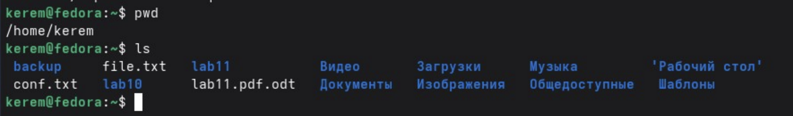
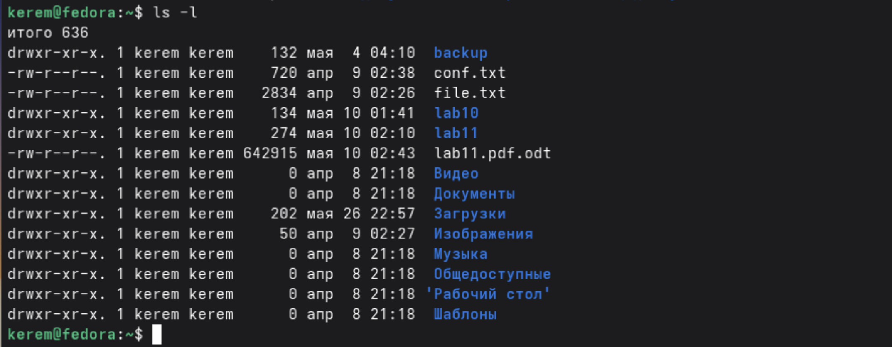
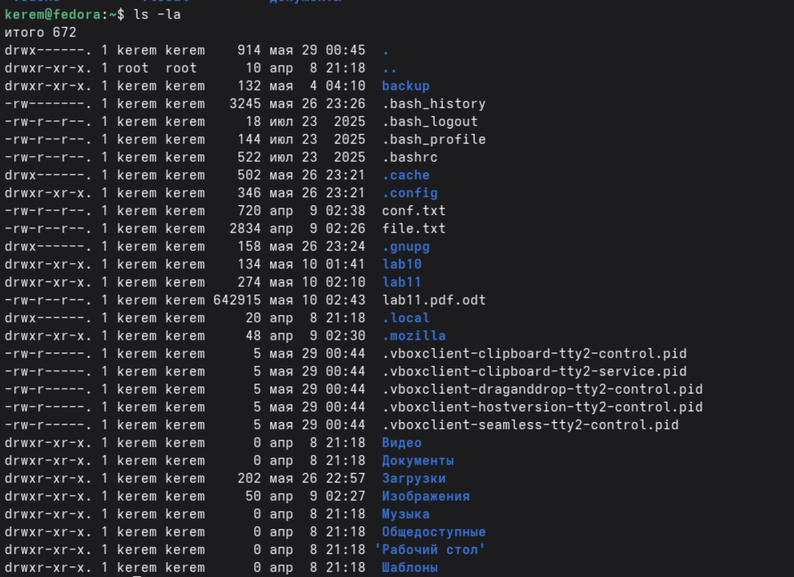
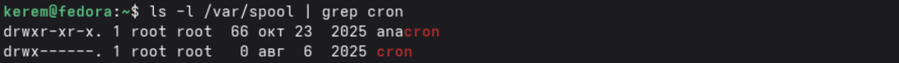
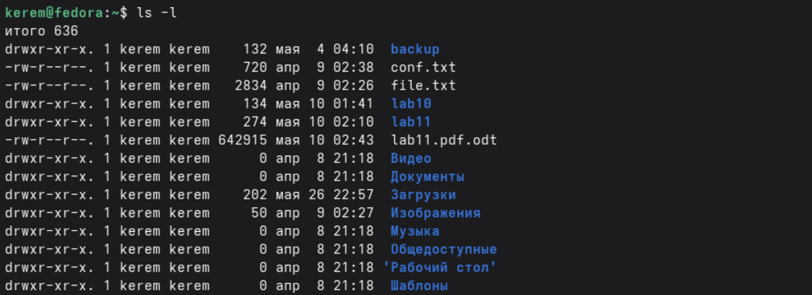
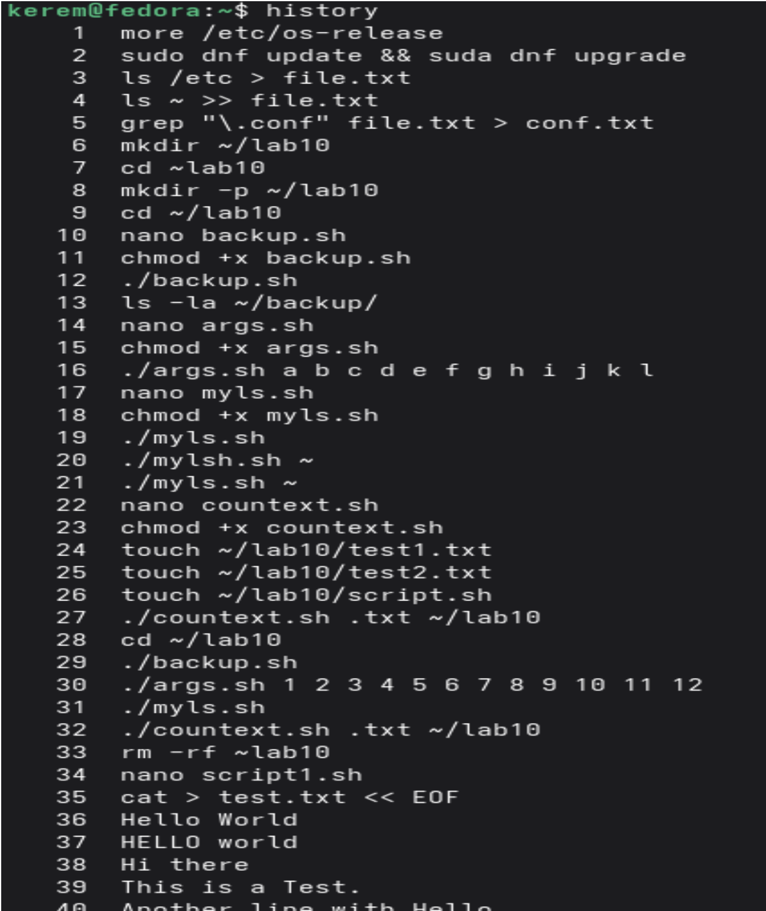

---
## Author
author:
  name: Пириев Керем
  degrees: DSc
  orcid: 0000-0002-0877-7063
  email: 1032254162@rudn.ru
  affiliation:
    - name: Российский университет дружбы народов
      country: Российская Федерация
      postal-code: 117198
      city: Москва
      address: ул. Миклухо-Маклая, д. 6

## Title
title: "Лабораторная работа № 1"
subtitle: "Установка и конфигурация операционной системы на виртуальную машину"
license: "CC BY"

bibliography: bib/cite.bib
csl: _resources/csl/gost-r-7-0-5-2008-numeric.csl

nocite: "@*"
---

# Цель работы

Приобретение практических навыков взаимодействия пользователя с системой посредством командной строки.

# Задание

1. Определить домашний каталог пользователя.
2. Изучить содержимое домашнего каталога с помощью команды `ls` и её опций (`-l`, `-a`, `-la`).
3. Проверить наличие подкаталога `cron` в каталоге `/var/spool`.
4. Создать и удалить каталоги с помощью команд `mkdir`, `rmdir`, `rm`.
5. Изучить справку по команде `ls` с помощью `man`.
6. Просмотреть историю выполненных команд.
7. Ответить на контрольные вопросы.

# Выполнение лабораторной работы

## Определение домашнего каталога

{#fig-001 width=70%}

## Работа с каталогом /tmp

{#fig-002 width=70%}

{#fig-003 width=70%}

{#fig-004 width=70%}

{#fig-005 width=70%}

**Пояснение:**

- `ls` — только имена файлов
- `ls -l` — права доступа, владелец, размер, дата
- `ls -a` — показывает скрытые файлы (начинающиеся с `.`)
- `ls -la` — комбинация двух опций

## Проверка наличия каталога cron

{#fig-006 width=70%}

**Вывод:** подкаталог `cron` в `/var/spool` отсутствует.
 
## Содержимое домашнего каталога

{#fig-007 width=70%}

## Создание и удаление каталогов

{#fig-008 width=70%}

**Пояснение:**

- `rm` без опции `-r` не может удалить каталог.
- Для удаления каталога используется `rm -r` или `rmdir` (только для пустых каталогов).

## Работа с командой man

- `ls -R` — просмотр содержимого каталога вместе с подкаталогами.
- `ls -lt` — сортировка по времени последнего изменения с развёрнутым описанием.

## Работа с историей команд

- `mkdir -p` — создание каталога вместе с родительскими каталогами.
- `rm -r` — рекурсивное удаление каталога с содержимым.
- `rm -f` — принудительное удаление без подтверждения.
- `rmdir -p` — удаление каталога и его родительских каталогов (если они пусты).

{#fig-009 width=70%}

# Вывод

В ходе выполнения лабораторной работы приобретены практические навыки работы с командной строкой Unix. Изучены и отработаны следующие команды и их опции:

| Команда | Назначение | Основные опции |
|---------|------------|----------------|
| pwd | Показать текущий каталог | — |
| cd | Перемещение по файловой системе | — |
| ls | Просмотр содержимого каталога | -l, -a, -R, -t |
| mkdir | Создание каталогов | -p, -m |
| rmdir | Удаление пустых каталогов | -p |
| rm | Удаление файлов и каталогов | -r, -f, -i |
| man | Получение справки | — |
| hist | Просмотр истории команд | — |

Полученные навыки позволяют эффективно взаимодействовать с операционной системой через командную строку.

# Контрольные вопросы

## 1. Что такое командная строка?

Командная строка — это интерфейс взаимодействия пользователя с операционной системой, где команды вводятся в виде текста построчно.

## 2. При помощи какой команды можно определить абсолютный путь текущего каталога?

Команда pwd. Пример: pwd покажет /home/liveuser.

## 3. При помощи какой команды и каких опций можно определить только тип файлов и их имена?

ls -F. Пример: ls -F выводит / для каталогов, * для исполняемых файлов, @ для ссылок.

## 4. Каким образом отобразить информацию о скрытых файлах?

Использовать опцию -а. Пример: ls -а.

## 5. При помощи каких команд можно удалить файл и каталог? Можно ли это сделать одной командой?

- Файл: rm filename
- Пустой каталог: rmdir dirname
- Каталог с файлами: rm -r dirname
- Да, командой rm -r можно удалить и файлы, и каталоги.

## 6. Каким образом можно вывести информацию о последних выполненных командах?

Команда history.

## 7. Как воспользоваться историей команд для их модифицированного выполнения?

!<номер_команды>:s/<что_меняем>/<на_что_меняем>/
Пример: !5:s/ls/ll/

## 8. Пример запуска нескольких команд в одной строке

cd /tmp; ls -l; pwd

## 9. Что такое символы экранирования?

Символы, отменяющие специальное значение других символов. Пример: echo \$100 выведет \$100, а не значение переменной.

## 10. Вывод команды ls -l

drwxr-xr-x. 2 liveuser liveuser 40 Mar 19 16:40 Desktop

- d — тип файла (каталог)
- rwxr-xr-x — права доступа
- 2 — число ссылок
- liveuser — владелец
- liveuser — группа
- 40 — размер
- Mar 19 16:40 — дата
- Desktop — имя

## 11. Что такое относительный путь?

Путь относительно текущего каталога. Пример:

- Относительный: cd newdir

## 12. Как получить информацию о команде?

Команда man <имя_команды>. Пример: man ls.

## 13. Какая клавиша для автодополнения команд?

Клавиша Tab.

# Список литературы{.unnumbered}

::: {#refs}
:::
