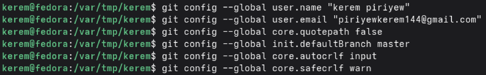
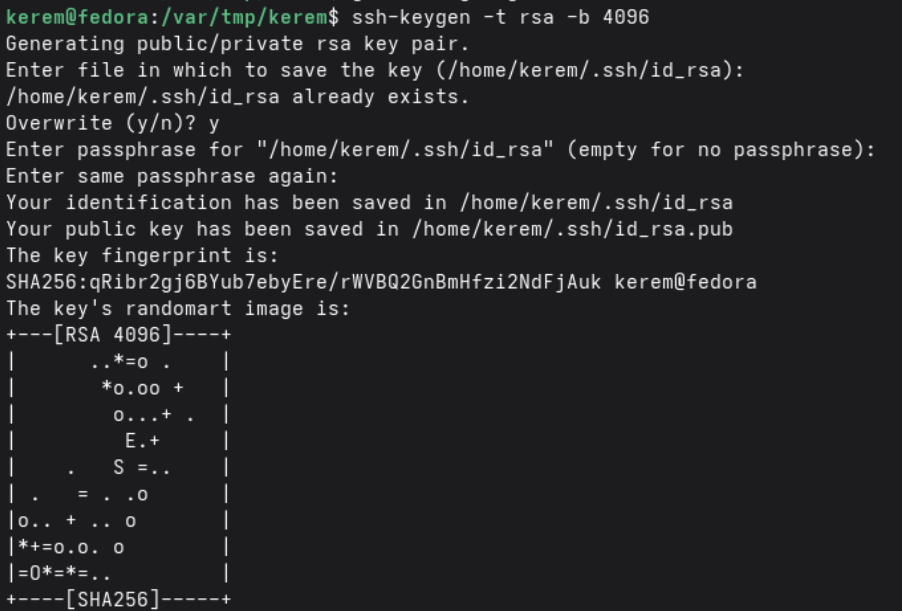
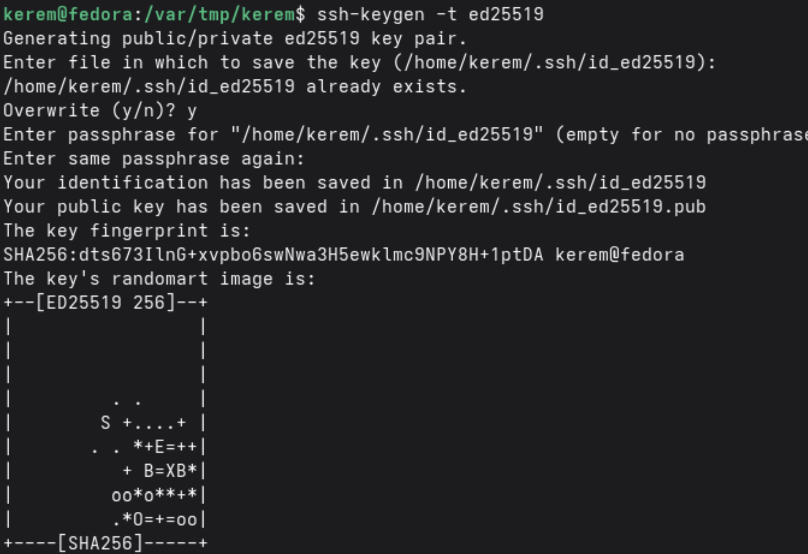
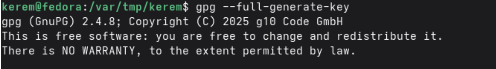
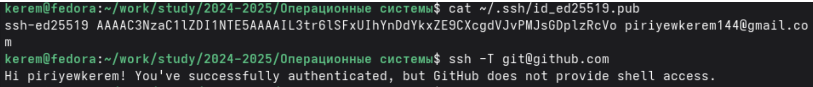
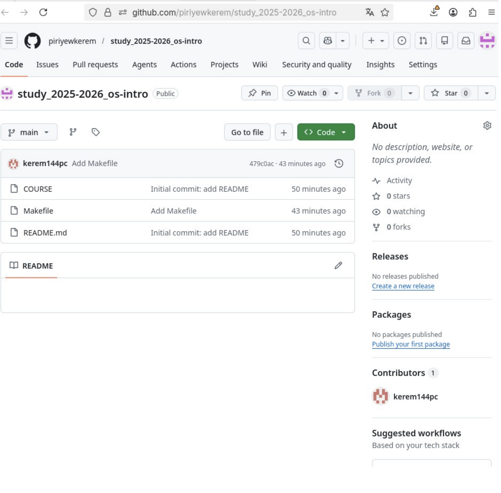
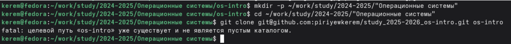
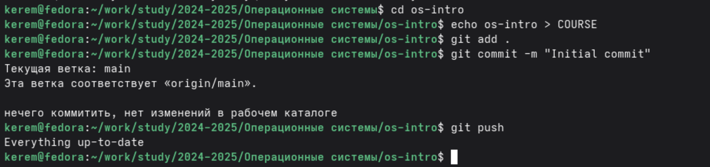

---
## Author
author:
  name: Пириев Керем
  email: 1032254162@rudn.ru
  affiliation:
    - name: Российский университет дружбы народов
      country: Российская Федерация
      postal-code: 117198
      city: Москва
      address: ул. Миклухо-Маклая, д. 6

## Title
title: "Лабораторная работа № 2"
subtitle: "Первоначальная настройка git"
license: CC BY
date: today
date-format: "YYYY-MM-DD"
---

# Информация

## Докладчик

:::::::::::::: {.columns align=center}
::: {.column width="70%"}

* Пириев Керем
* студент группы НПИбд-02-25
* Российский университет дружбы народов
* [1032254162@rudn.ru](mailto:1032254162@rudn.ru)

:::
::: {.column width="30%"}

:::
::::::::::::::

# Цель работы

Изучить идеологию и применение средств контроля версий, освоить умения по работе c git.

# Задание

1. Установка ПО (Git, GitHub CLI).
2. Базовая настройка git.
3. Создание SSH и PGP ключей.
4. Добавление ключей на GitHub.
5. Настройка подписи коммитов git.
6. Создание репозитория и клонирование.
7. Настройка каталога курса.

# Выполнение лабораторной работы

## Установка Git

Установка Git командой `sudo dnf install git`:

{width=50%}

## Установка программного обеспечения

Установка GitHub CLI (gh) командой `sudo dnf install gh`:

{width=50%}

## Базовая настройка git

Настройка конфигурации (имя, email, ветка по умолчанию, crlf):

{width=50%}

## Создание ключа RSA

Генерация ключа RSA командой `ssh-keygen -t rsa`:

{width=50%}

## Создание ключа ed25519

Генерация ключа ed25519 командой `ssh-keygen -t ed25519`:

{width=50%}

## Просмотр публичного ключа SSH

Просмотр публичного ключа командой `cat ~/.ssh/id_ed25519.pub`:

{width=50%}

## Создание PGP ключа (GPG)

Генерация ключа GPG командой `gpg --full-generate-key`:

{width=50%}

## Просмотр GPG ключей

Просмотр созданных ключей:

{width=50%}

## Добавление SSH ключа на GitHub

Просмотр и работа с SSH для добавления на платформу:

{width=50%}

## Добавление GPG ключа на GitHub

Просмотр ключа и проверка аутентификации через `ssh -T git@github.com`:

{width=50%}

## Настройка подписи коммитов git

Подпись коммитов и путь к gpg (`commit.gpgsign`):

{width=50%}

## Создание репозитория на GitHub

Созданный репозиторий `study_2025-2026_os-intro`:

{width=50%}

## Клонирование репозитория

Создание каталогов и команда `git clone`:

{width=50%}

## Настройка каталога курса

Добавление файла COURSE и отправка первого коммита:

{width=50%}

# Выводы

В ходе выполнения лабораторной работы я:
* Установил и настроил Git и GitHub CLI.
* Сгенерировал SSH и GPG ключи.
* Добавил ключи в аккаунт GitHub.
* Настроил автоматическую подпись коммитов.
* Создал удалённый репозиторий и клонировал его локально.
* Настроил рабочее пространство для выполнения лабораторных работ.

Цель работы достигнута: я освоил базовые навыки работы с системой контроля версий Git.