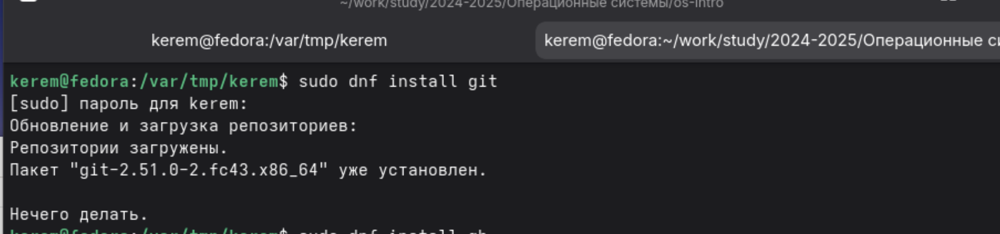
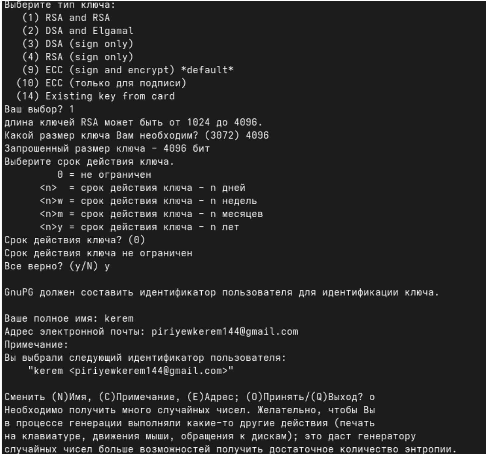
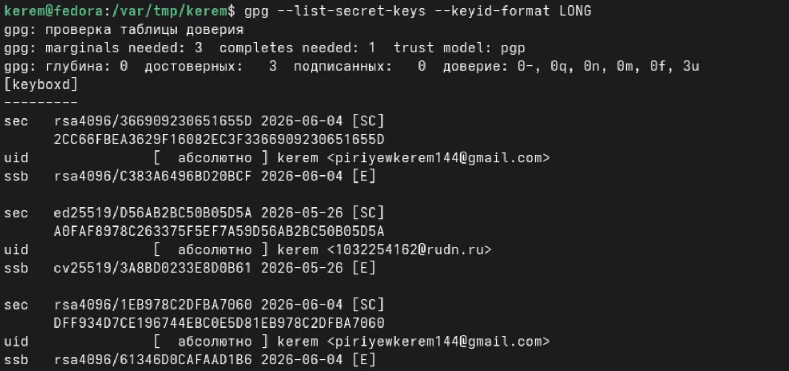
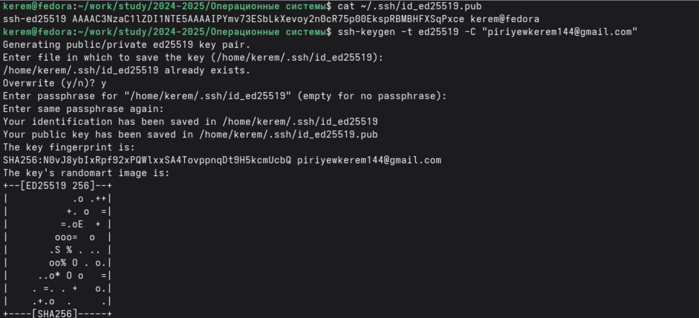
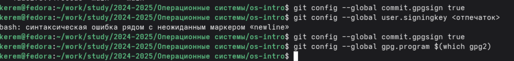

---
## Author
author:
  name: Пириев Керем
  degrees: DSc
  orcid: 0000-0002-0877-7063
  email: 1032254162@rudn.ru
  affiliation:
    - name: Российский университет дружбы народов
      country: Российская Федерация
      postal-code: 117198
      city: Москва
      address: ул. Миклухо-Маклая, д. 6

## Title
title: "Лабораторная работа № 2"
subtitle: "Первоначальная настройка git"
license: "CC BY"

bibliography: bib/cite.bib
csl: _resources/csl/gost-r-7-0-5-2008-numeric.csl

nocite: "@*"
---

# Цель работы

Изучить идеологию и применение средств контроля версий, освоить умения по работе c git.

# Задание

1. Установка программного обеспечения.
2. Базовая настройка git.
3. Создание SSH ключей.
4. Создание PGP ключа (GPG).
5. Добавление SSH ключа на GitHub.
6. Добавление GPG ключа на GitHub.
7. Настройка подписи коммитов git.
8. Создание репозитория на GitHub.
9. Клонирование репозитория.
10. Настройка каталога курса.

# Выполнение лабораторной работы

## 1. Установка программного обеспечения

### 1.1 Установка Git
Git был установлен командой `sudo dnf install git` (рис. @fig-001).

{#fig-001 width=70%}

### 1.2 Установка GitHub CLI (gh)
Был установлен пакет GitHub CLI командой `sudo dnf install gh` (рис. @fig-002).

{#fig-002 width=70%}

## 2. Базовая настройка git

Были выполнены команды для глобальной настройки git (имя, email, ветка по умолчанию и параметры crlf) (рис. @fig-003).

{#fig-003 width=70%}

## 3. Создание SSH ключей

### 3.1 Создание ключей RSA и ed25519
Сначала был сгенерирован ключ RSA командой `ssh-keygen -t rsa -b 4096` (рис. @fig-004).

{#fig-004 width=70%}

Затем был создан ключ ed25519 с помощью команды `ssh-keygen -t ed25519` (рис. @fig-005).

{#fig-005 width=70%}

### 3.2 Просмотр публичного ключа
Публичный ключ был выведен на экран командой `cat ~/.ssh/id_ed25519.pub` (рис. @fig-006).

{#fig-006 width=70%}

## 4. Создание PGP ключа (GPG)

Был создан GPG ключ командой `gpg --full-generate-key` (тип RSA, размер 4096, бессрочно) (рис. @fig-007).

{#fig-007 width=70%}

### 4.1 Просмотр созданных ключей
Просмотр созданных ключей был выполнен с помощью команды `gpg --list-secret-keys --keyid-format LONG` (рис. @fig-008).

{#fig-008 width=70%}

## 5. Добавление SSH ключа на GitHub

SSH ключ скопирован командой `cat ~/.ssh/id_ed25519.pub` и добавлен на GitHub в разделе Settings -> SSH and GPG keys -> New SSH key (рис. @fig-009).

{#fig-009 width=70%}

## 6. Добавление GPG ключа на GitHub

GPG ключ был экспортирован командой `gpg --armor --export <отпечаток>` и добавлен на GitHub. Успешность аутентификации проверена через `ssh -T git@github.com` (рис. @fig-010).

{#fig-010 width=70%}

## 7. Настройка подписи коммитов git

Были выполнены команды для настройки подписи коммитов: `git config --global user.signingkey <отпечаток>`, `git config --global commit.gpgsign true` и `git config --global gpg.program $(which gpg2)` (рис. @fig-011).

{#fig-011 width=70%}

## 8. Создание репозитория на GitHub

Был создан публичный репозиторий `study_2025-2026_os-intro` на платформе GitHub (рис. @fig-012).

{#fig-012 width=70%}

## 9. Клонирование репозитория

Были созданы директории курса, и репозиторий был клонирован локально командой `git clone git@github.com:piriyewkerem/study_2025-2026_os-intro.git os-intro` (рис. @fig-013).

{#fig-013 width=70%}

## 10. Настройка каталога курса

Был выполнен переход в каталог `os-intro`, создан файл `COURSE`, файлы добавлены в индекс (`git add .`), зафиксированы (`git commit -m "Initial commit"`) и отправлены на сервер (`git push`) (рис. @fig-014).

{#fig-014 width=70%}

# Вывод

В ходе выполнения лабораторной работы я:
* Установил и настроил Git и GitHub CLI.
* Сгенерировал SSH и GPG ключи.
* Добавил ключи в аккаунт GitHub.
* Настроил автоматическую подпись коммитов.
* Создал удалённый репозиторий и клонировал его локально.
* Настроил рабочее пространство для выполнения лабораторных работ.

Таким образом, цель работы достигнута: я освоил базовые навыки работы с системой контроля версий Git.

# Контрольные вопросы

## 1. Что такое системы контроля версий (VCS) и для решения каких задач они предназначаются?
Системы контроля версий — это программные инструменты, которые отслеживают изменения в файлах, позволяют хранить историю изменений, возвращаться к предыдущим версиям, работать над проектом нескольким разработчикам одновременно, разрешать конфликты.

## 2. Объясните следующие понятия VCS и их отношения: хранилище, commit, история, рабочая копия.
* Хранилище (repository) — база данных, содержащая все версии файлов.
* Commit — фиксация изменений, создающая новую версию.
* История (history) — цепочка коммитов, показывающая эволюцию проекта.
* Рабочая копия (working copy) — текущая версия файлов, с которой работает пользователь.

## 3. Что представляют собой и чем отличаются централизованные и децентрализованные VCS? Приведите примеры VCS каждого вида.
* Централизованные (CVS, Subversion): есть единый центральный сервер, все изменения отправляются на него.
* Децентрализованные (Git, Mercurial): каждый разработчик имеет полную копию репозитория, можно работать без подключения к серверу.

## 4. Опишите действия с VCS при единоличной работе с хранилищем.
Создание локального репозитория (`git init`), добавление файлов (`git add`), фиксация изменений (`git commit`), просмотр истории (`git log`), просмотр различий (`git diff`).

## 5. Опишите порядок работы с общим хранилищем VCS.
Клонирование удалённого репозитория (`git clone`), получение изменений (`git pull`), создание коммитов, отправка изменений (`git push`), разрешение конфликтов при необходимости.

## 6. Каковы основные задачи, решаемые инструментальным средством git?
* Отслеживание истории изменений.
* Работа с ветками.
* Слияние изменений.
* Совместная разработка.
* Откат к предыдущим версиям.

## 7. Назовите и дайте краткую характеристику командам git.
* `git init` — создание нового репозитория.
* `git add` — добавление файлов в индекс.
* `git commit` — фиксация изменений.
* `git push` — отправка изменений на удалённый сервер.
* `git pull` — получение изменений с сервера.
* `git clone` — копирование удалённого репозитория.
* `git branch` — работа с ветками.
* `git merge` — слияние веток.
* `git log` — просмотр истории.

## 8. Приведите примеры использования при работе с локальным и удалённым репозиториями.
Локальный:
`git init`, `git add .`, `git commit -m "message"`.
Удалённый:
`git clone git@github.com:user/repo.git`, `git pull`, `git push`.

## 9. Что такое и зачем могут быть нужны ветви (branches)?
Ветки — это независимые линии разработки. Нужны для:
* Разработки новых функций без влияния на основной код.
* Исправления ошибок.
* Экспериментов.
* Параллельной работы нескольких разработчиков.

## 10. Как и зачем можно игнорировать некоторые файлы при commit?
Создаётся файл `.gitignore`, в котором перечисляются шаблоны имён файлов/каталогов. Это нужно, чтобы не включать в репозиторий временные файлы, служебные файлы ОС, файлы с паролями, скомпилированные объектные файлы и т.д.

# Список литературы{.unnumbered}

::: {#refs}
:::
