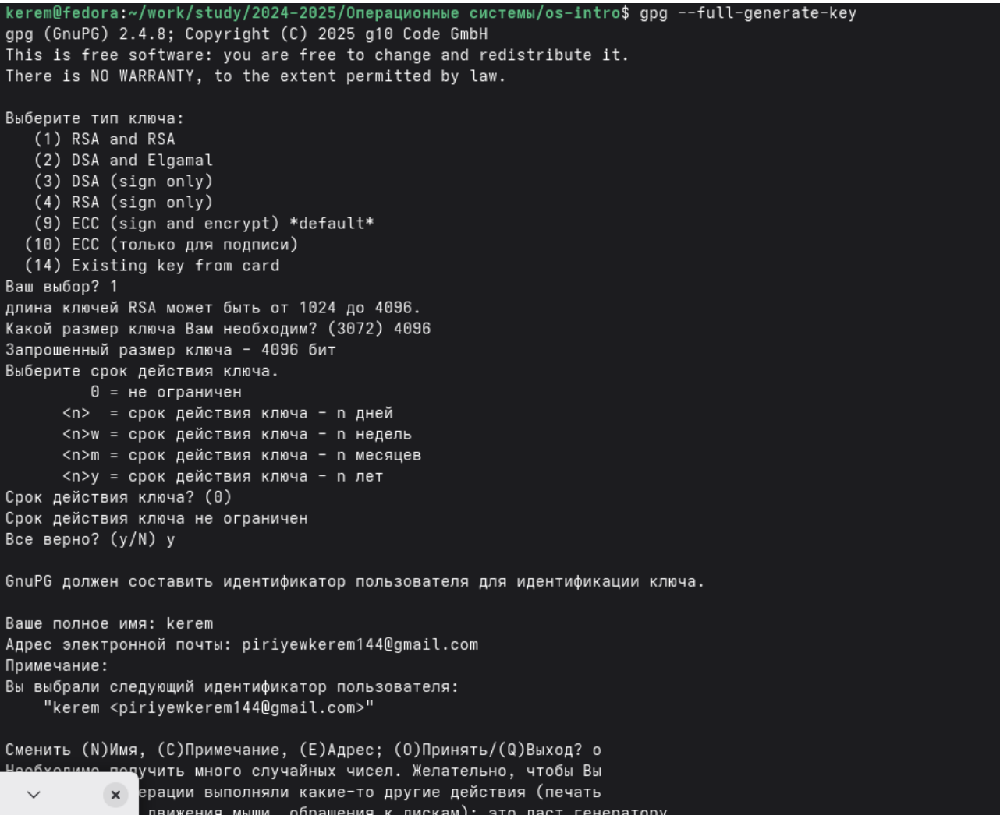
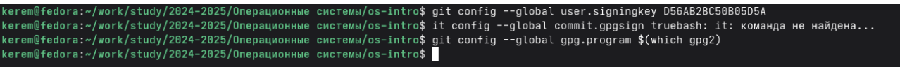
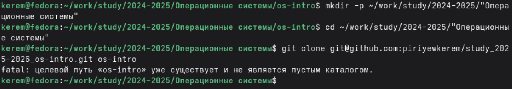
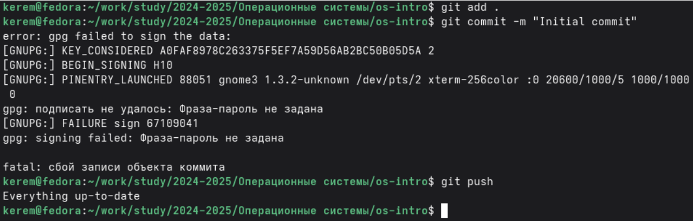

---
## Author
author:
  name: Пириев Керем
  email: 1032254162@rudn.ru
  affiliation:
    - name: Российский университет дружбы народов
      country: Российская Федерация
      postal-code: 117198
      city: Москва
      address: ул. Миклухо-Маклая, д. 6

## Title
title: "Лабораторная работа № 3"
subtitle: "Программирование в командном процессоре ОC UNIX. Markdown"
license: CC BY
date: today
date-format: "YYYY-MM-DD"
---

# Информация

## Докладчик

:::::::::::::: {.columns align=center}
::: {.column width="70%"}

* Пириев Керем
* студент группы НПИбд-02-25
* Российский университет дружбы народов
* [1032254162@rudn.ru](mailto:1032254162@rudn.ru)

:::
::: {.column width="30%"}

:::
::::::::::::::

# Цель работы

Изучить идеологию и применение средств контроля версий, освоить умения по работе с git.

# Задание

1. Создать базовую конфигурацию для работы с git.
2. Создать ключ SSH.
3. Создать ключ PGP.
4. Настроить подписи git.
5. Зарегистрироваться на Github.
6. Создать локальный каталог для выполнения заданий по предмету.

# Выполнение лабораторной работы

## 1. Установка программного обеспечения

Установка Git и GitHub CLI (gh):

{width=50%}

## 2. Настройка git

Конфигурация параметров пользователя:

{width=50%}

## 3. Создание SSH ключей

Генерация ключа ed25519:

{width=50%}

## 4. Создание PGP ключа

Выбор параметров ключа шифрования:

{width=50%}

## 5. Добавление SSH ключа на GitHub

Интеграция публичного SSH ключа:

{width=50%}

## 6. Добавление GPG ключа на GitHub

Экспорт и интеграция GPG ключа:

{width=50%}

## 7. Настройка подписи коммитов

Привязка ключа GPG к конфигурации Git:

{width=50%}

## 8. Создание репозитория

Новый репозиторий `study_2025-2026_os-intro`:

{width=50%}

## 9. Клонирование репозитория

Команда `git clone` в рабочий каталог:

{width=50%}

## 10. Настройка каталога курса

Создание файла COURSE и отправка изменений:

{width=50%}

# Выводы

В ходе работы я:
* Установил и настроил Git и GitHub CLI.
* Создал SSH и GPG ключи.
* Добавил ключи на GitHub.
* Настроил подпись коммитов.
* Создал и клонировал репозиторий.
* Настроил рабочее пространство.