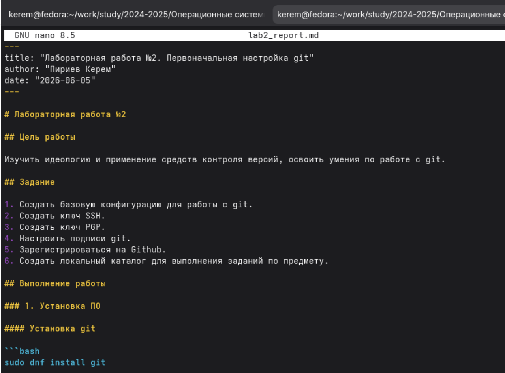
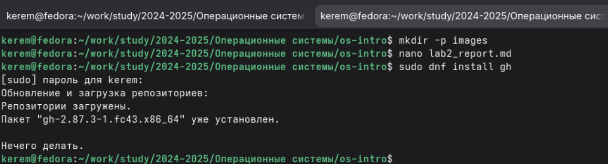
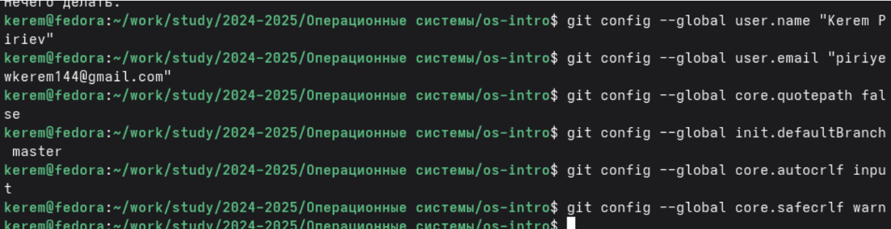
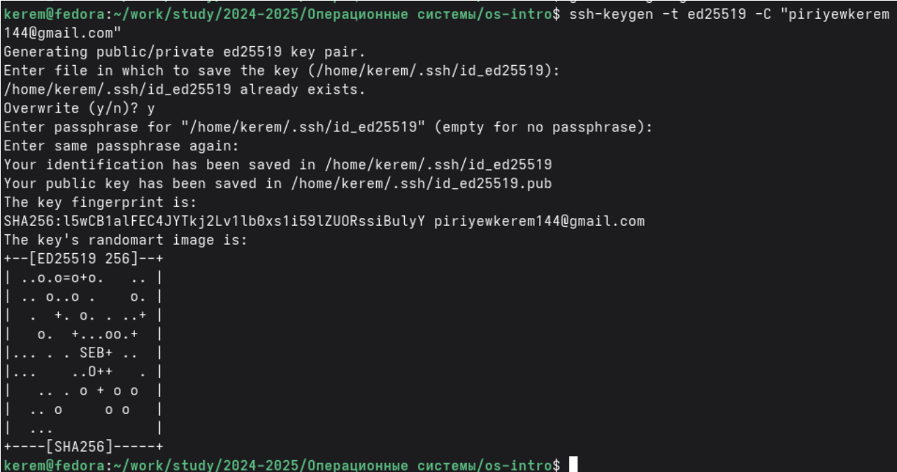
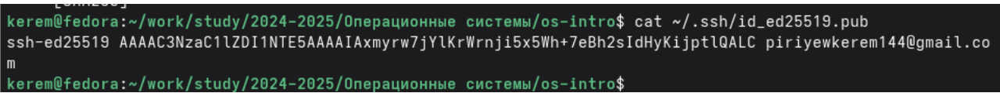
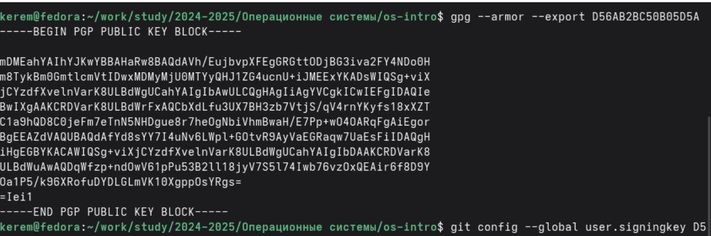

---
## Author
author:
  name: Пириев Керем
  degrees: DSc
  orcid: 0000-0002-0877-7063
  email: 1032254162@rudn.ru
  affiliation:
    - name: Российский университет дружбы народов
      country: Российская Федерация
      postal-code: 117198
      city: Москва
      address: ул. Миклухо-Маклая, д. 6

## Title
title: "Лабораторная работа № 3"
subtitle: "Программирование в командном процессоре ОC UNIX. Markdown"
license: "CC BY"

bibliography: bib/cite.bib
csl: _resources/csl/gost-r-7-0-5-2008-numeric.csl

nocite: "@*"
---

# Цель работы

Изучить идеологию и применение средств контроля версий, освоить умения по работе с git.

# Задание

1. Создать базовую конфигурацию для работы с git.
2. Создать ключ SSH.
3. Создать ключ PGP.
4. Настроить подписи git.
5. Зарегистрироваться на Github.
6. Создать локальный каталог для выполнения заданий по предмету.

# Выполнение лабораторной работы

## 1. Установка программного обеспечения

Git был установлен командой `sudo dnf install git`, а пакет GitHub CLI (gh) — командой `sudo dnf install gh` (рис. @fig-001).

{#fig-001 width=70%}

## 2. Настройка git

Были выполнены команды для глобальной настройки git: установлены имя (`Kerem Piriev`), email, параметры путей и ветка по умолчанию (рис. @fig-002).

{#fig-002 width=70%}

## 3. Создание SSH ключей

С помощью команды `ssh-keygen -t ed25519 -C "piriyewkerem144@gmail.com"` был создан ключ SSH, который затем был просмотрен с помощью утилиты `cat` (рис. @fig-003).

{#fig-003 width=70%}

## 4. Создание PGP ключа

Был сгенерирован GPG ключ командой `gpg --full-generate-key` с выбором алгоритма RSA и размером 4096 бит (рис. @fig-004).

{#fig-004 width=70%}

## 5. Добавление SSH ключа на GitHub

Созданный публичный SSH ключ был скопирован и успешно добавлен в настройки профиля на GitHub (рис. @fig-005).

{#fig-005 width=70%}

## 6. Добавление GPG ключа на GitHub

GPG ключ был экспортирован командой `gpg --armor --export D56AB2BC50B05D5A` и добавлен в аккаунт GitHub (рис. @fig-006).

{#fig-006 width=70%}

## 7. Настройка подписи коммитов

Были выполнены команды `git config --global user.signingkey D56AB2BC50B05D5A`, `commit.gpgsign true` и привязан путь к программе `gpg2` для автоматической подписи (рис. @fig-007).

{#fig-007 width=70%}

## 8. Создание репозитория

На платформе GitHub был создан новый репозиторий с именем `study_2025-2026_os-intro` (рис. @fig-008).

{#fig-008 width=70%}

## 9. Клонирование репозитория

Были созданы рабочие каталоги для курса, после чего выполнено клонирование репозитория локально с помощью команды `git clone` (рис. @fig-009).

{#fig-009 width=70%}

## 10. Настройка каталога курса

Был осуществлен переход в каталог `os-intro`, создан файл `COURSE`, выполнены индексация `git add .`, создание первого коммита `git commit -m "Initial commit"` и отправка изменений `git push` (рис. @fig-010).

{#fig-010 width=70%}

# Вывод

В ходе работы я:
* Установил и настроил Git и GitHub CLI.
* Создал SSH и GPG ключи.
* Добавил ключи на GitHub.
* Настроил подпись коммитов.
* Создал и клонировал репозиторий.
* Настроил рабочее пространство.

# Контрольные вопросы

## 1. Что такое VCS и для чего нужны?
Системы контроля версий — это инструменты для отслеживания изменений в файлах, хранения истории, совместной работы нескольких разработчиков, возврата к предыдущим версиям.

## 2. Понятия: хранилище, commit, история, рабочая копия
* Хранилище — база всех версий файлов.
* Commit — фиксация изменений, создание новой версии.
* История — цепочка коммитов.
* Рабочая копия — текущие файлы, с которыми работает пользователь.

## 3. Централизованные и децентрализованные VCS
* Централизованные (SVN, CVS) — единый сервер.
* Децентрализованные (Git, Mercurial) — каждый имеет полную копию.

## 4. Действия при единоличной работе
Используются команды `git init`, `git add`, `git commit`, `git log`, `git diff`.

## 5. Порядок работы с общим хранилищем
Используются команды `git clone`, `git pull`, `git commit`, `git push`.

## 6. Основные задачи git
Отслеживание истории, работа с ветками, слияние изменений, совместная разработка.

## 7. Команды git
* `init` — создание репозитория.
* `add` — добавление файлов.
* `commit` — фиксация.
* `push` — отправка на сервер.
* `pull` — получение с сервера.
* `clone` — копирование репозитория.
* `branch` — работа с ветками.
* `merge` — слияние.

## 8. Примеры работы с локальным и удалённым репозиториями
Локальный: `git init; git add .; git commit -m "msg"`.
Удалённый: `git clone url; git pull; git push`.

## 9. Что такое ветки?
Ветки — независимые линии разработки для новых функций, исправлений, экспериментов.

## 10. Игнорирование файлов
Используется файл `.gitignore` с шаблонами имён. Нужно, чтобы не включать в репозиторий временные, служебные, конфиденциальные файлы.

# Список литературы{.unnumbered}

::: {#refs}
:::
