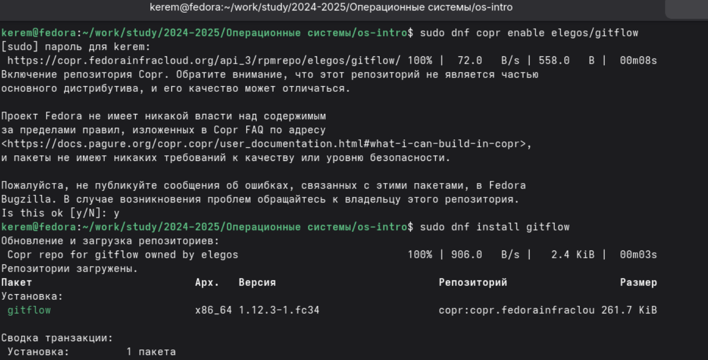
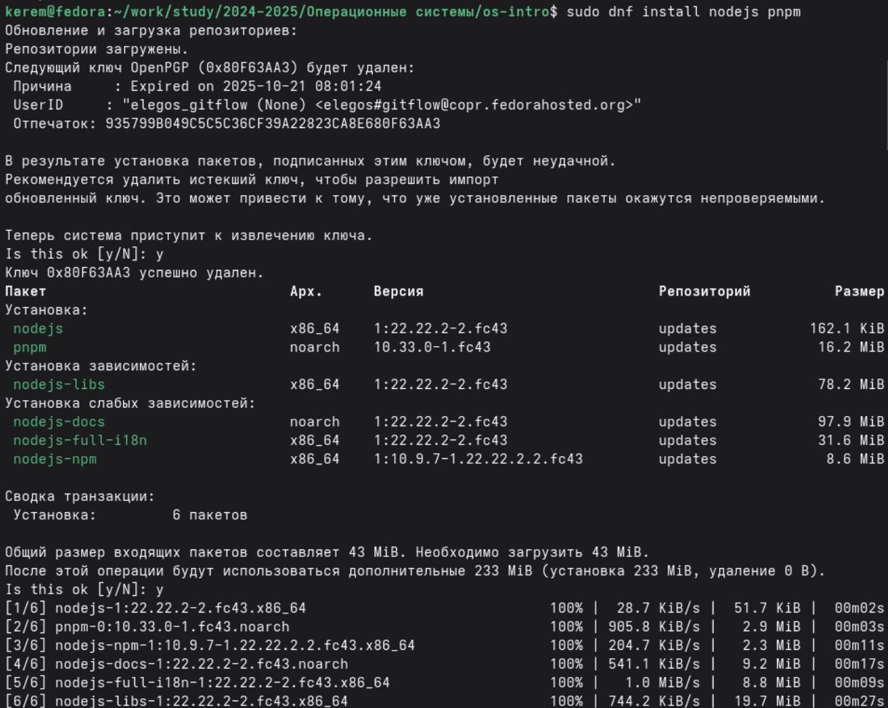
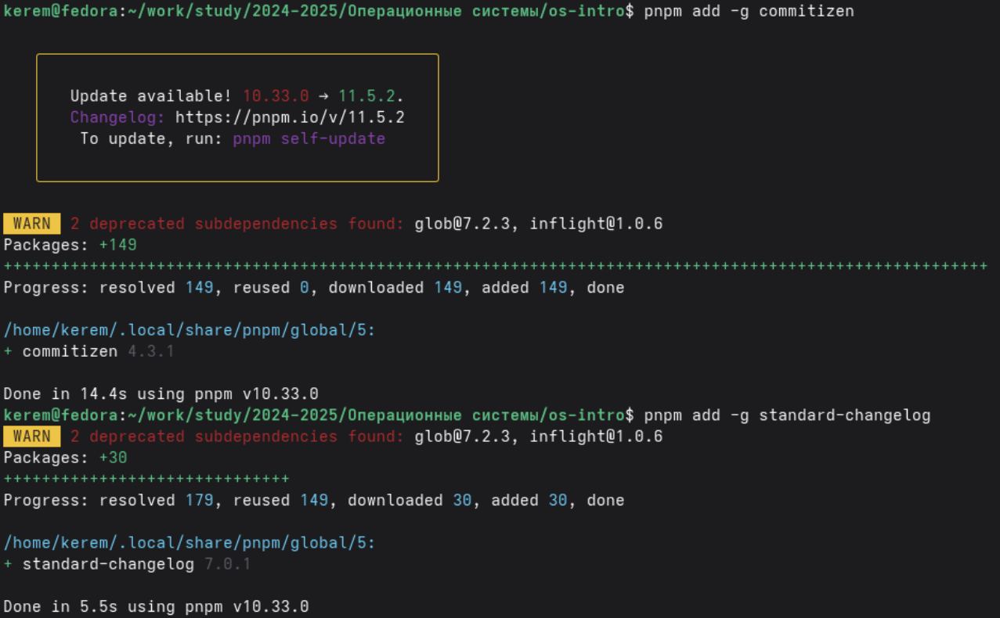

---
## Author
author:
  name: Пириев Керем
  email: 1032254162@rudn.ru
  affiliation:
    - name: Российский университет дружбы народов
      country: Российская Федерация
      postal-code: 117198
      city: Москва
      address: ул. Миклухо-Маклая, д. 6

## Title
title: "Лабораторная работа № 4"
subtitle: "Продвинутое использование git"
license: CC BY
date: today
date-format: "YYYY-MM-DD"
---

# Информация

## Докладчик

:::::::::::::: {.columns align=center}
::: {.column width="70%"}

* Пириев Керем
* студент группы НПИбд-02-25
* Российский университет дружбы народов
* [1032254162@rudn.ru](mailto:1032254162@rudn.ru)

:::
::: {.column width="30%"}

:::
::::::::::::::

# Цель работы

Получение навыков правильной работы с репозиториями git, изучение рабочего процесса Gitflow, семантического версионирования и общепринятых коммитов.

# Задание

1. Установка ПО (git-flow, Node.js, pnpm, commitizen, standard-changelog).
2. Инициализация репозитория `git-extended`.
3. Настройка процесса git-flow.
4. Создание релиза 1.0.0.
5. Работа с feature-веткой.
6. Создание релиза 1.2.3.

# Теоретические сведения

## Модели и стандарты

* **Gitflow Workflow**: Включает ветки `master`, `develop`, `feature/`, `release/`, `hotfix/`.
* **Семантическое версионирование**: `МАЖОРНАЯ.МИНОРНАЯ.ПАТЧ` (например, 1.2.3).
* **Conventional Commits**: Единый стандарт именования (feat, fix, docs, chore).

# Выполнение лабораторной работы

## 1.1 Установка git-flow

Установка пакета git-flow через репозитории copr:

{width=50%}

## 1.2 Установка Node.js и pnpm

Установка Node.js и пакетного менеджера:

{width=50%}

## Перезагрузка профиля

Применение изменений `~/.bashrc` и первая попытка установки pnpm:

{width=50%}

## 1.3 Установка commitizen и standard-changelog

Глобальная установка утилит через pnpm:

{width=50%}

## 2.2 Инициализация локального репозитория

Создание директорий, `git init` и инициализация конфигурации:

{width=50%}

## 2.3 Создание package.json

Генерация файла конфигурации проекта `package.json`:

{width=50%}

## 2.4 Первый коммит

Настройка URL и отправка ветки main на GitHub:

{width=50%}

## 3.1 Инициализация git-flow

Запуск команды `git flow init` со стандартными параметрами:

{width=50%}

## 3.2 Отправка веток на GitHub

Связывание локальной ветки develop с удаленной:

{width=50%}

## 4. Создание релиза 1.0.0

Работа с веткой release/1.0.0 и генерация CHANGELOG:

{width=50%}

## Публикация релиза 1.0.0 и старт feature-ветки

Публикация версии 1.0.0 на GitHub и запуск `feature_branch`:

{width=50%}

## 6. Создание релиза 1.2.3

Завершение feature, релиз 1.2.3 и обновление истории на сервере:

{width=50%}

# Выводы

* Установлены инструменты: git-flow, Node.js, commitizen, standard-changelog.
* Инициализирован и настроен репозиторий `git-extended`.
* Настроены общепринятые коммиты.
* Отработан жизненный цикл Gitflow (master, develop, feature, release).
* Сгенерированы Changelog-файлы для версий 1.0.0 и 1.2.3.