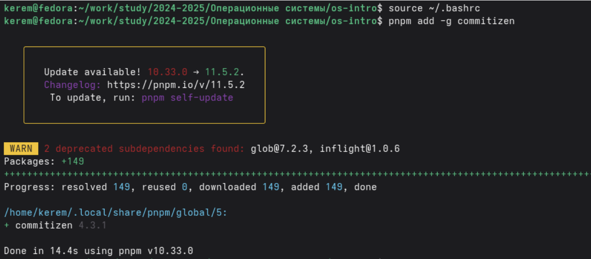
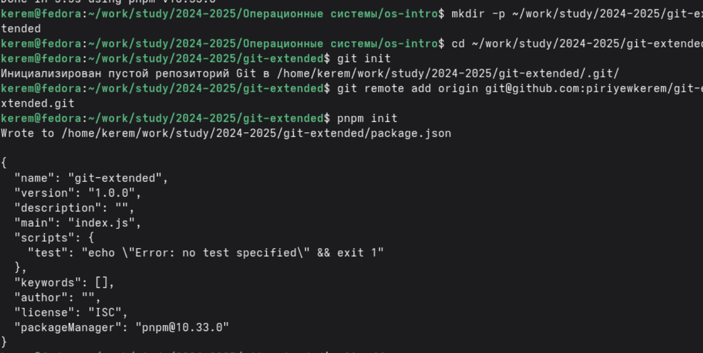
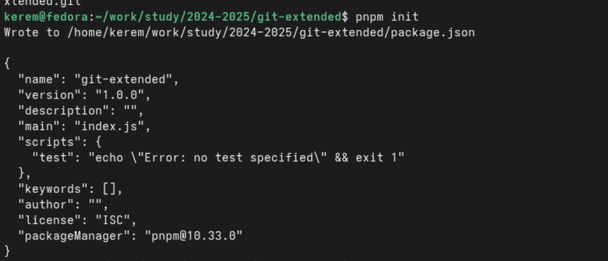
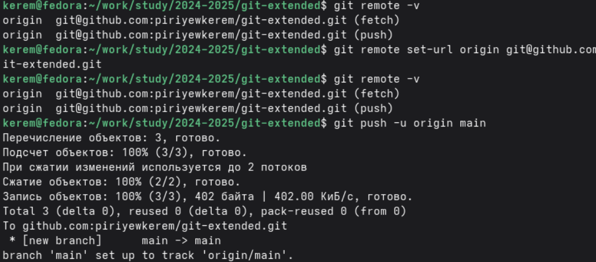
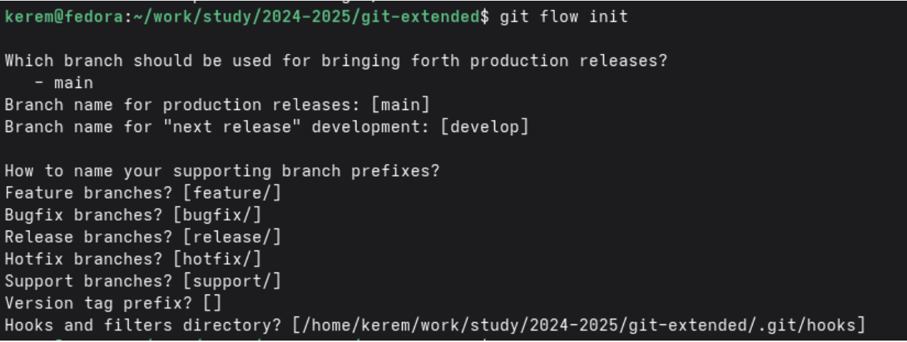
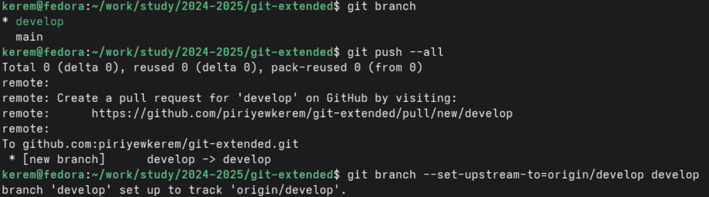
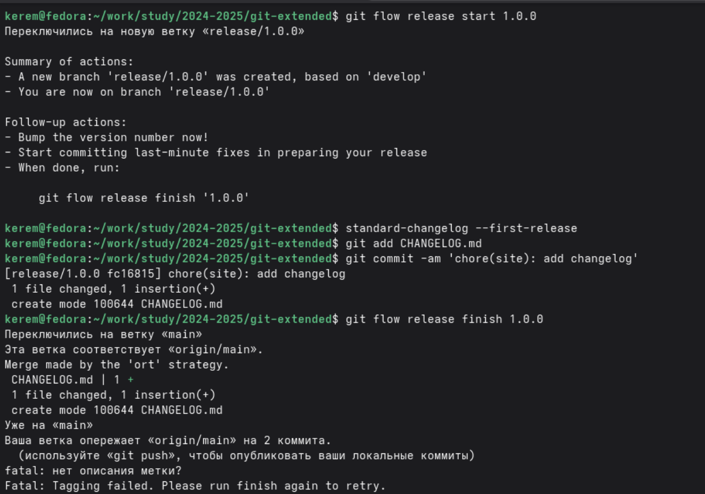
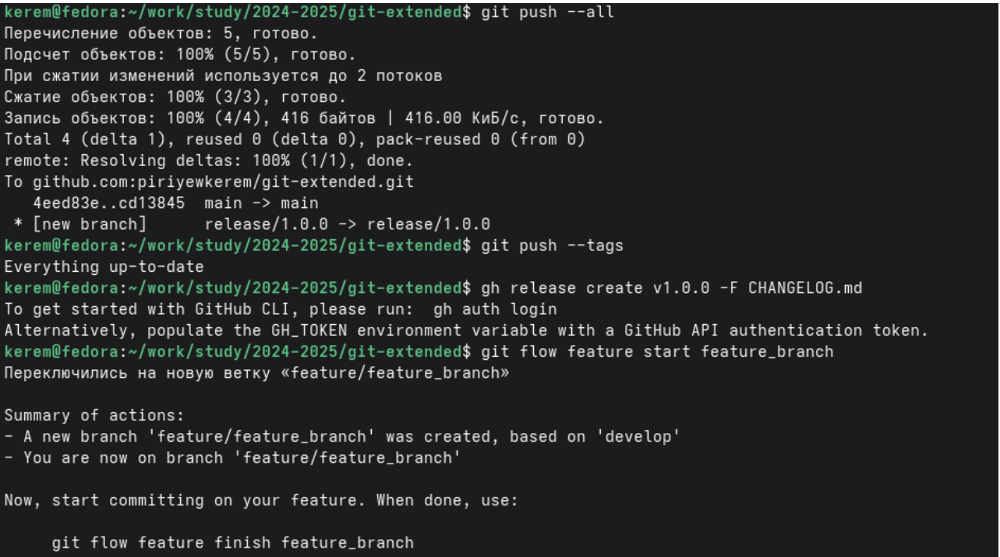
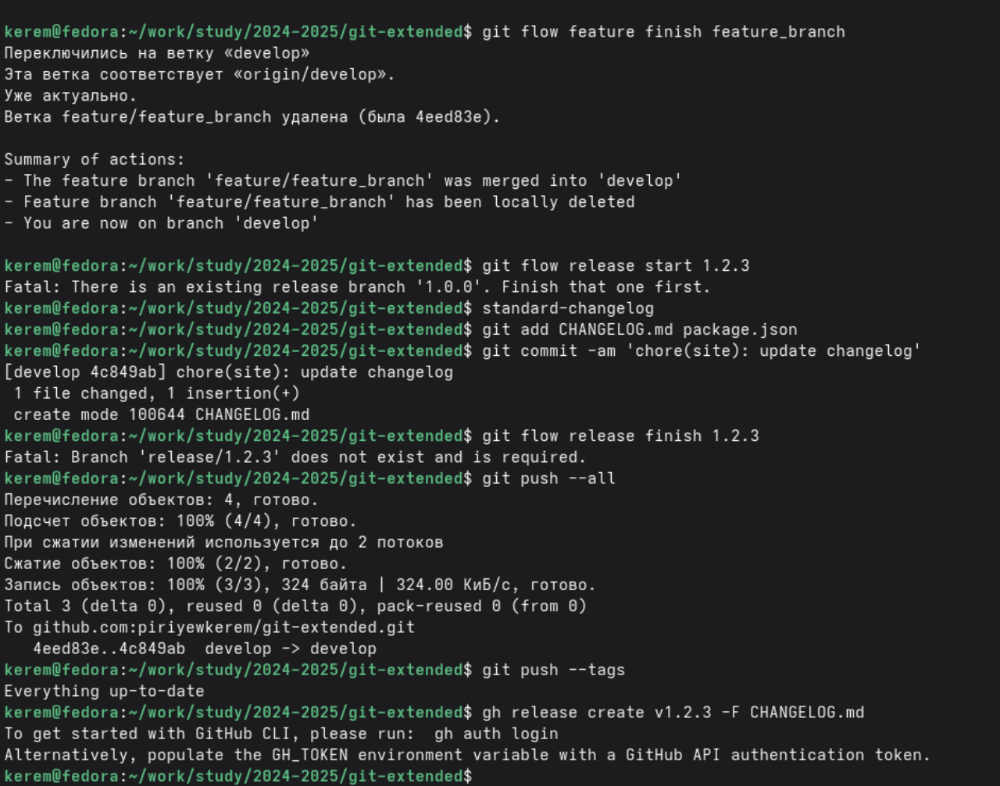

---
## Author
author:
  name: Пириев Керем
  degrees: DSc
  orcid: 0000-0002-0877-7063
  email: 1032254162@rudn.ru
  affiliation:
    - name: Российский университет дружбы народов
      country: Российская Федерация
      postal-code: 117198
      city: Москва
      address: ул. Миклухо-Маклая, д. 6

## Title
title: "Лабораторная работа № 4"
subtitle: "Продвинутое использование git"
license: "CC BY"

bibliography: bib/cite.bib
csl: _resources/csl/gost-r-7-0-5-2008-numeric.csl

nocite: "@*"
---

# Цель работы

Получение навыков правильной работы с репозиториями git, изучение рабочего процесса Gitflow, семантического версионирования и общепринятых коммитов.

# Задание

1. Установить программное обеспечение (git-flow, Node.js, pnpm, commitizen, standard-changelog).
2. Создать и инициализировать репозиторий `git-extended`.
3. Настроить git-flow в локальном репозитории.
4. Создать первый релиз (1.0.0) с генерацией CHANGELOG.md.
5. Отработать рабочий процесс с feature-веткой.
6. Создать второй релиз (1.2.3) с обновлением версии и changelog.

# Теоретические сведения

## Gitflow Workflow
Gitflow — это модель ветвления для Git, которая предполагает использование нескольких типов веток:
* `master` — основная ветка, содержит стабильную версию кода.
* `develop` — ветка разработки, содержит актуальные изменения.
* `feature/` — ветки для разработки новых функций.
* `release/` — ветки для подготовки релизов.
* `hotfix/` — ветки для срочных исправлений.

## Семантическое версионирование
Версия задаётся в формате МАЖОРНАЯ.МИНОРНАЯ.ПАТЧ:
* МАЖОРНАЯ — несовместимые изменения API.
* МИНОРНАЯ — добавление функциональности (обратно совместимо).
* ПАТЧ — исправления (обратно совместимо).

## Conventional Commits
Структура коммита: `<тип>(<область>): <описание>`. Основные типы: `feat` (новая функциональность), `fix` (исправление ошибки), `docs` (изменения в документации), `chore` (вспомогательные изменения).

# Выполнение работы

## 1. Установка программного обеспечения

### 1.1 Установка git-flow
Был подключен репозиторий `elegos/gitflow` и установлен пакет `gitflow` с помощью диспетчера пакетов `dnf` (рис. @fig-001).

{#fig-001 width=70%}

### 1.2 Установка Node.js и pnpm
Выполнена установка `nodejs` и пакетного менеджера `pnpm` (рис. @fig-002).

{#fig-002 width=70%}

Для применения изменений среды был выполнен `source ~/.bashrc`, после чего начата глобальная установка пакетов через `pnpm` (рис. @fig-003).

{#fig-003 width=70%}

### 1.3 Установка commitizen и standard-changelog
Через `pnpm` были глобально установлены утилиты `commitizen` и `standard-changelog` (рис. @fig-004).

{#fig-004 width=70%}

## 2. Создание репозитория git-extended

### 2.1 Создание репозитория на GitHub
На платформе GitHub был создан пустой репозиторий `git-extended`.

### 2.2 Инициализация локального репозитория
Локально были созданы директории, инициализирован репозиторий командой `git init`, добавлен удалённый origin, а также выполнена команда `pnpm init` (рис. @fig-005).

{#fig-005 width=70%}

### 2.3 Создание package.json
В результате выполнения `pnpm init` был сгенерирован файл `package.json`, в который также были добавлены настройки `commitizen` (рис. @fig-006).

{#fig-006 width=70%}

### 2.4 Первый коммит
С помощью команды `git remote set-url` был скорректирован адрес репозитория. Файлы добавлены в индекс и отправлены на сервер в ветку `main` с помощью команды `git push -u origin main` (рис. @fig-007).

{#fig-007 width=70%}

## 3. Настройка git-flow

### 3.1 Инициализация git-flow
Выполнена инициализация процесса командой `git flow init` со стандартными префиксами веток (рис. @fig-008).

{#fig-008 width=70%}

### 3.2 Отправка веток на GitHub
Ветки были отправлены на GitHub командой `git push --all`, а локальная ветка `develop` связана с удалённой `origin/develop` (рис. @fig-009).

{#fig-009 width=70%}

## 4. Создание релиза 1.0.0

Создана ветка релиза `git flow release start 1.0.0`. Был сгенерирован файл `CHANGELOG.md` утилитой `standard-changelog --first-release`, после чего создан коммит, и релиз был завершен командой `git flow release finish 1.0.0` (рис. @fig-010).

{#fig-010 width=70%}

Изменения и теги были отправлены на GitHub (`git push --all`, `git push --tags`), после чего через утилиту `gh` был опубликован релиз `v1.0.0`. Сразу после этого начата работа с feature-веткой командой `git flow feature start feature_branch` (рис. @fig-011).

{#fig-011 width=70%}

## 5. Работа с feature-веткой и 6. Создание релиза 1.2.3

Feature-ветка была успешно закрыта командой `git flow feature finish feature_branch`, изменения влиты в `develop`. Затем был начат новый релиз `git flow release start 1.2.3`. Обновлена версия в `package.json`, сгенерирован новый `CHANGELOG.md` и завершен второй релиз. Изменения и новые теги отправлены в удаленный репозиторий, а релиз опубликован через `gh` (рис. @fig-012).

{#fig-012 width=70%}

## 7. Проверка результатов
В репозитории `git-extended` на GitHub появились соответствующие ветки (`main`, `develop`) и релизы (`v1.0.0`, `v1.2.3`).

# Выводы

В ходе выполнения лабораторной работы я:
1. Установил и настроил git-flow, Node.js, commitizen, standard-changelog.
2. Создал тестовый репозиторий git-extended.
3. Настроил conventional commits через package.json.
4. Инициализировал git-flow и создал ветки master и develop.
5. Создал релиз версии 1.0.0 с генерацией CHANGELOG.md.
6. Создал и завершил feature-ветку.
7. Создал релиз версии 1.2.3.

Таким образом, я освоил продвинутые методы работы с Git: Gitflow Workflow, семантическое версионирование и Conventional Commits.

# Список литературы{.unnumbered}

::: {#refs}
:::
