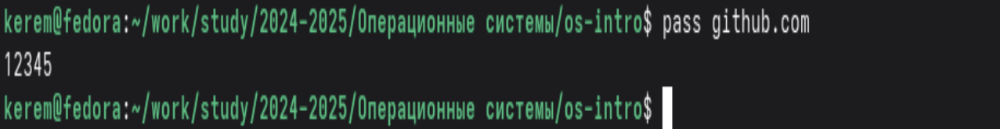
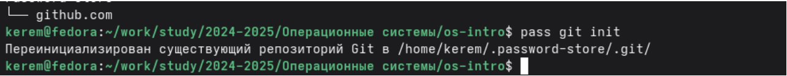
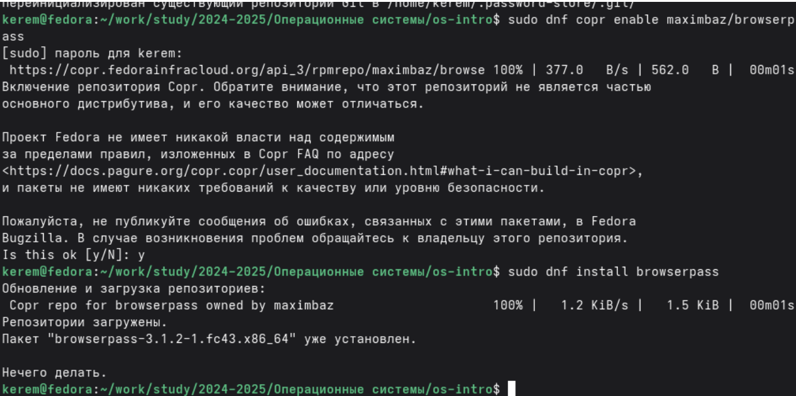
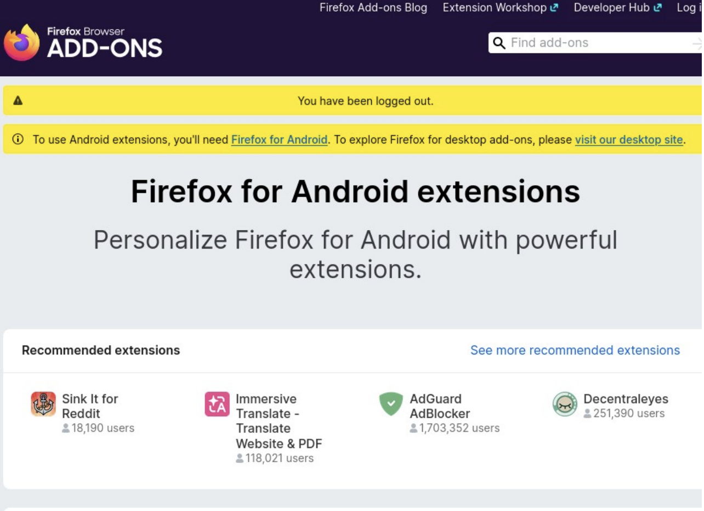
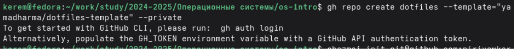
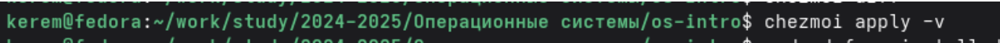
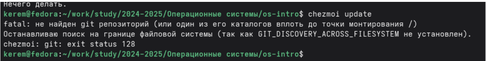

---
## Author
author:
  name: Пириев Керем
  email: 1032254162@rudn.ru
  affiliation:
    - name: Российский университет дружбы народов
      country: Российская Федерация
      postal-code: 117198
      city: Москва
      address: ул. Миклухо-Маклая, д. 6

## Title
title: "Лабораторная работа № 5"
subtitle: "Настройка рабочей среды"
license: CC BY
date: today
date-format: "YYYY-MM-DD"
---

# Информация

## Докладчик

:::::::::::::: {.columns align=center}
::: {.column width="70%"}

* Пириев Керем
* студент группы НПИбд-02-25
* Российский университет дружбы народов
* [1032254162@rudn.ru](mailto:1032254162@rudn.ru)

:::
::: {.column width="30%"}

:::
::::::::::::::

# Цель работы

Настройка рабочей среды: установка и конфигурация менеджера паролей pass и системы управления файлами конфигурации chezmoi.

# Задание

1. Установка и настройка менеджера паролей `pass`.
2. Интеграция паролей в браузер через `browserpass`.
3. Установка и настройка системы управления конфигурациями `chezmoi`.
4. Создание репозитория `dotfiles`.
5. Установка дополнительного ПО.

# Теоретические сведения

## Менеджер паролей pass
* Данные хранятся в файловой системе.
* Файлы шифруются GPG-ключом.
* Поддерживает синхронизацию через git.

## Управление конфигурациями chezmoi
* Хранит конфигурации (dotfiles) в git-репозитории.
* Поддерживает шаблоны.
* Позволяет быстро настроить новую систему.

# Выполнение лабораторной работы

## 1.1 Установка pass

Установка пакетов pass и pass-otp:

{width=50%}

## 1.2 Просмотр GPG ключей

Вывод списка секретных GPG-ключей:

{width=50%}

## 1.3 Инициализация хранилища паролей

Команда `pass init`:

{width=50%}

## 1.4 Добавление пароля

Команда `pass insert github.com`:

{width=50%}

## 1.5 Просмотр добавленного пароля

Вывод пароля через команду `pass github.com`:

{width=50%}

## 1.6 Просмотр всех паролей

Вывод структуры хранилища `pass`:

{width=50%}

## 1.7 Инициализация git для pass

Инициализация git-репозитория:

{width=50%}

## 1.8 Установка browserpass

Подключение репозитория copr и установка пакета:

{width=50%}

## 1.9 Установка расширения для браузера

Установка аддона в Firefox:

{width=50%}

## 2.1 Установка chezmoi

Загрузка бинарного файла утилиты chezmoi:

{width=50%}

## 2.2 Создание репозитория dotfiles на GitHub

Создание репозитория из шаблона через gh CLI:

{width=50%}

## 2.3 Инициализация chezmoi

Команда `chezmoi init`:

{width=50%}

## 2.4 Просмотр изменений

Команда `chezmoi diff`:

{width=50%}

## 2.5 Применение изменений

Команда `chezmoi apply -v`:

{width=50%}

## 2.6 Получение обновлений

Команда `chezmoi update`:

{width=50%}

## 3. Установка дополнительного ПО

Установка dunst, шрифтов, waybar, kitty и других утилит:

{width=50%}

# Выводы

* Установлен менеджер паролей pass и настроена GPG-шифрация.
* Настроена синхронизация паролей через git и расширение browserpass.
* Установлена система chezmoi для централизованного управления dotfiles.
* Конфигурации успешно импортированы из GitHub-шаблона и применены.
* Установлен комплект дополнительных системных утилит.