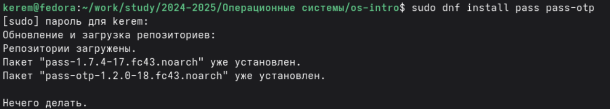
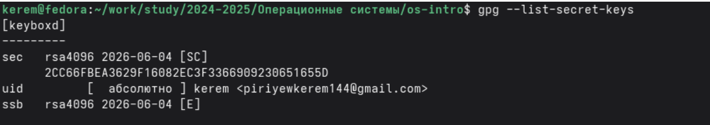
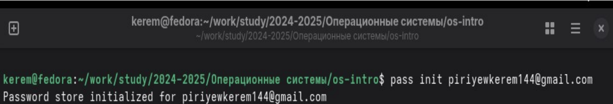
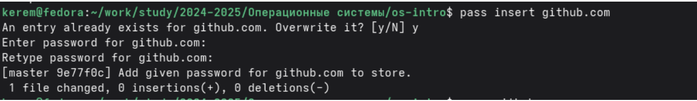
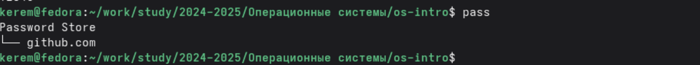
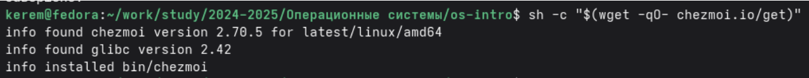
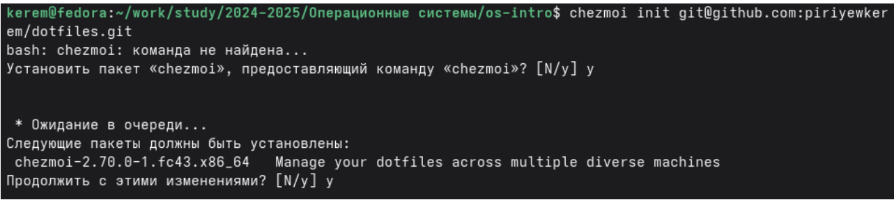
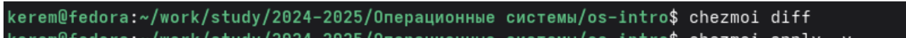
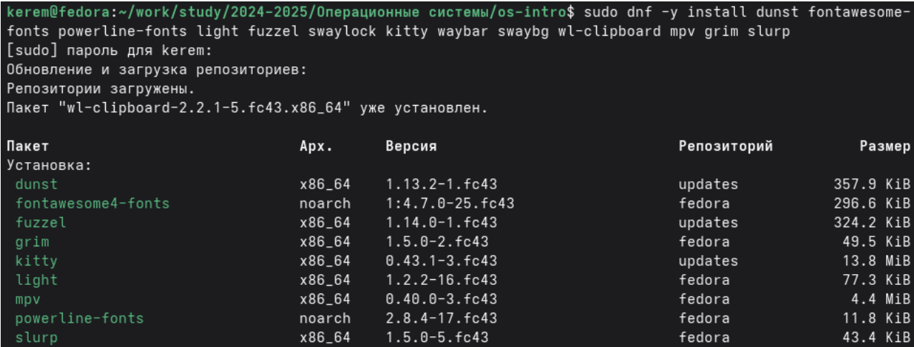

---
## Author
author:
  name: Пириев Керем
  degrees: DSc
  orcid: 0000-0002-0877-7063
  email: 1032254162@rudn.ru
  affiliation:
    - name: Российский университет дружбы народов
      country: Российская Федерация
      postal-code: 117198
      city: Москва
      address: ул. Миклухо-Маклая, д. 6

## Title
title: "Лабораторная работа № 5"
subtitle: "Настройка рабочей среды"
license: "CC BY"

bibliography: bib/cite.bib
csl: _resources/csl/gost-r-7-0-5-2008-numeric.csl

nocite: "@*"
---

# Цель работы

Настройка рабочей среды: установка и конфигурация менеджера паролей pass и системы управления файлами конфигурации chezmoi.

# Задание

1. Установить и настроить менеджер паролей `pass`.
2. Инициализировать хранилище паролей и добавить тестовый пароль.
3. Настроить синхронизацию паролей через git.
4. Установить и интегрировать в браузер `browserpass`.
5. Установить систему управления конфигурациями `chezmoi`.
6. Создать репозиторий dotfiles на GitHub и инициализировать `chezmoi`.
7. Установить дополнительное программное обеспечение для работы.

# Теоретические сведения

## Менеджер паролей pass
`pass` — стандартный менеджер паролей для Unix. Основные свойства:
* Данные хранятся в файловой системе в виде каталогов и файлов.
* Файлы шифруются с помощью GPG-ключа.
* Поддерживает синхронизацию через git.

## Управление файлами конфигурации chezmoi
`chezmoi` — инструмент для управления dotfiles (конфигурационными файлами). Особенности:
* Хранит конфигурации в git-репозитории.
* Поддерживает шаблоны для разных машин.
* Позволяет быстро настроить новую систему.

# Выполнение лабораторной работы

## Часть 1. Установка и настройка pass

### 1.1 Установка pass
Были установлены пакеты `pass` и `pass-otp` командой `sudo dnf install pass pass-otp` (рис. @fig-001).

{#fig-001 width=70%}

### 1.2 Просмотр GPG ключей
Для использования GPG-ключа был просмотрен список доступных секретных ключей командой `gpg --list-secret-keys` (рис. @fig-002).

{#fig-002 width=70%}

### 1.3 Инициализация хранилища паролей
Хранилище паролей было инициализировано для моего email командой `pass init piriyewkerem144@gmail.com` (рис. @fig-003).

{#fig-003 width=70%}

### 1.4 Добавление пароля
С помощью команды `pass insert github.com` в хранилище был добавлен тестовый пароль (рис. @fig-004).

{#fig-004 width=70%}

### 1.5 Просмотр добавленного пароля
Пароль был выведен на экран командой `pass github.com` (рис. @fig-005).

{#fig-005 width=70%}

### 1.6 Просмотр всех паролей
Структура хранилища была проверена командой `pass` (рис. @fig-006).

{#fig-006 width=70%}

### 1.7 Инициализация git для pass
В каталоге хранилища был инициализирован git-репозиторий командой `pass git init` (рис. @fig-007).

{#fig-007 width=70%}

### 1.8 Установка browserpass
Был подключен репозиторий `maximbaz/browserpass` и установлен пакет `browserpass` (рис. @fig-008).

{#fig-008 width=70%}

### 1.9 Установка расширения для браузера
В Firefox было установлено официальное расширение Browserpass CE из магазина дополнений (рис. @fig-009).

{#fig-009 width=70%}

## Часть 2. Установка и настройка chezmoi

### 2.1 Установка chezmoi
Инструмент был скачан и установлен с помощью скрипта `sh -c "$(wget -qO- chezmoi.io/get)"` (рис. @fig-010).

{#fig-010 width=70%}

### 2.2 Создание репозитория dotfiles на GitHub
На GitHub был создан приватный репозиторий `dotfiles` на основе шаблона `yamadharma/dotfiles-template` (команда `gh repo create`) (рис. @fig-011).

{#fig-011 width=70%}

### 2.3 Инициализация chezmoi
Инструмент `chezmoi` был инициализирован с указанием созданного репозитория командой `chezmoi init git@github.com:piriyewkerem/dotfiles.git` (рис. @fig-012).

{#fig-012 width=70%}

### 2.4 Просмотр изменений
Командой `chezmoi diff` были просмотрены ожидающие применения изменения (рис. @fig-013).

{#fig-013 width=70%}

### 2.5 Применение изменений
Командой `chezmoi apply -v` конфигурации были применены к локальной системе (рис. @fig-014).

{#fig-014 width=70%}

### 2.6 Получение обновлений
Проверка обновлений была выполнена командой `chezmoi update` (рис. @fig-015).

{#fig-015 width=70%}

## Часть 3. Установка дополнительного программного обеспечения

Для полноценной работы системы был установлен ряд дополнительных пакетов (dunst, шрифты, light, waybar, kitty, mpv и др.) командой `sudo dnf -y install ...` (рис. @fig-016).

{#fig-016 width=70%}

# Выводы

В ходе выполнения лабораторной работы я:
1. Установил менеджер паролей pass и инициализировал хранилище с использованием существующего GPG-ключа.
2. Добавил тестовый пароль для github.com и проверил его работу.
3. Настроил синхронизацию паролей через git.
4. Установил browserpass для интеграции с браузером.
5. Установил систему управления конфигурациями chezmoi.
6. Создал приватный репозиторий dotfiles на GitHub на основе шаблона.
7. Инициализировал chezmoi и применил конфигурации.
8. Установил дополнительное программное обеспечение для работы.

Таким образом, цель работы достигнута: настроена безопасная рабочая среда с менеджером паролей и системой управления dotfiles.

# Список литературы{.unnumbered}

::: {#refs}
:::
