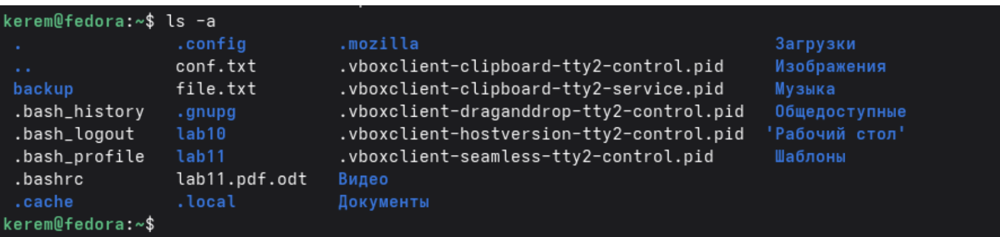
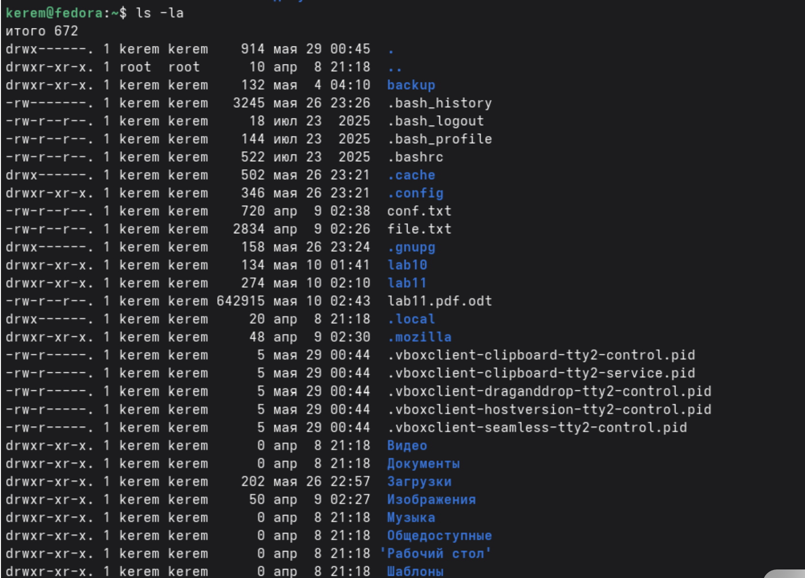
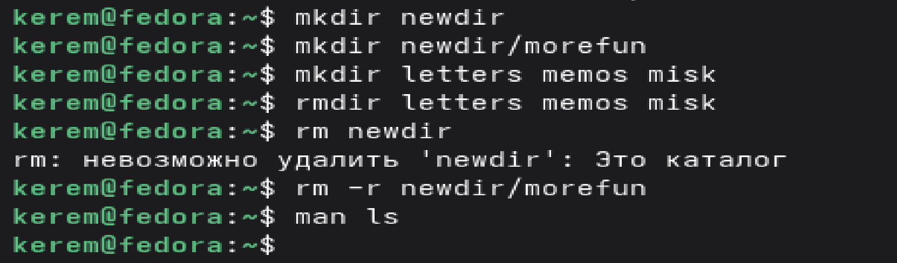

---
## Author
author:
  name: Пириев Керем
  email: 1032254162@rudn.ru
  affiliation:
    - name: Российский университет дружбы народов
      country: Российская Федерация
      postal-code: 117198
      city: Москва
      address: ул. Миклухо-Маклая, д. 6

## Title
title: "Лабораторная работа № 6"
subtitle: "Основы интерфейса взаимодействия пользователя с системой Unix на уровне командной строки"
license: CC BY
date: today
date-format: "YYYY-MM-DD"
---

# Информация

## Докладчик

:::::::::::::: {.columns align=center}
::: {.column width="70%"}

* Пириев Керем
* студент группы НПИбд-02-25
* Российский университет дружбы народов
* [1032254162@rudn.ru](mailto:1032254162@rudn.ru)

:::
::: {.column width="30%"}

:::
::::::::::::::

# Цель работы

Приобретение практических навыков взаимодействия пользователя с системой посредством командной строки.

# Задание

1. Определить домашний каталог пользователя.
2. Изучить команды `ls`, `mkdir`, `rmdir`, `rm`, `man` и `history`.
3. Изучить опции команд (просмотр скрытых файлов, подробной информации и т.д.).
4. Выполнить поиск каталога `cron` в `/var/spool`.
5. Отработать создание и удаление директорий.

# Выполнение лабораторной работы

## Определение домашнего каталога

Вывод абсолютного пути домашней директории пользователя командой `pwd`:

{width=50%}

## Просмотр содержимого каталога

Работа с командой `ls` для базового вывода содержимого:

{width=50%}

## Права доступа и параметры

Использование опции `-l` для вывода прав, владельца, размера и даты:

{width=50%}

## Просмотр скрытых файлов

Использование опций `-a` и `-la` для отображения всех файлов в каталоге:

{width=50%}

## Проверка наличия каталога cron

Использование связки `ls -l` и `grep` для поиска нужного элемента:

{width=50%}

## Содержимое домашнего каталога

Повторная проверка структуры директорий пользователя:

{width=50%}

## Создание и удаление каталогов

Использование утилит `mkdir`, `rmdir` и `rm -r` для работы с файловой системой:

{width=50%}

## Работа с командой man

Получение справки по встроенным утилитам терминала:

{width=50%}

## Работа с историей команд

Вызов списка последних введенных команд через утилиту `history`:

{width=50%}

# Выводы

В ходе выполнения лабораторной работы приобретены практические навыки работы с командной строкой Unix. Изучены команды:

| Команда | Назначение |
|---------|------------|
| pwd | Показать текущий каталог |
| cd | Перемещение по файловой системе |
| ls | Просмотр содержимого каталога |
| mkdir / rmdir | Создание / Удаление пустых каталогов |
| rm | Удаление файлов и каталогов |
| man / history | Получение справки / Просмотр истории |

Полученные навыки позволяют эффективно взаимодействовать с ОС.