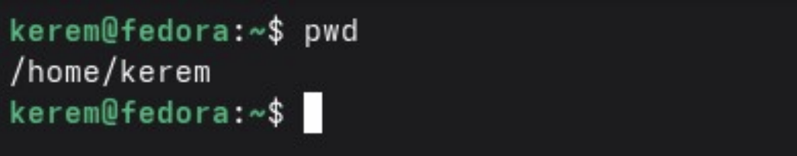
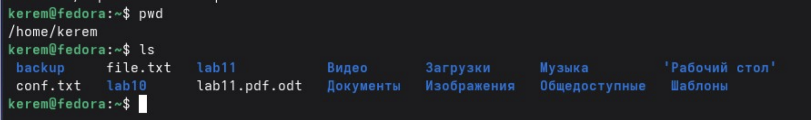
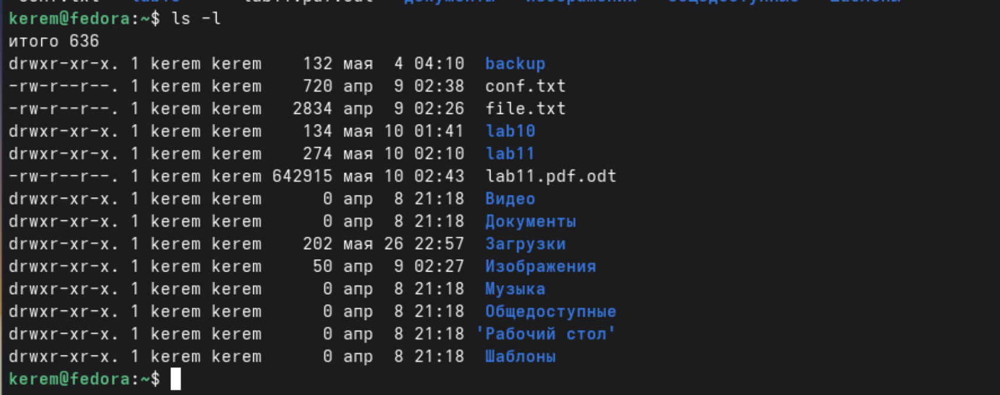
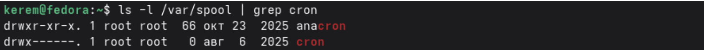
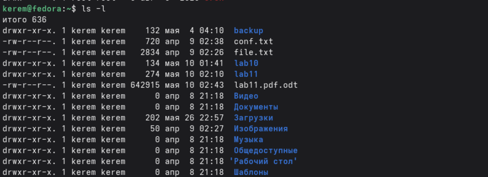
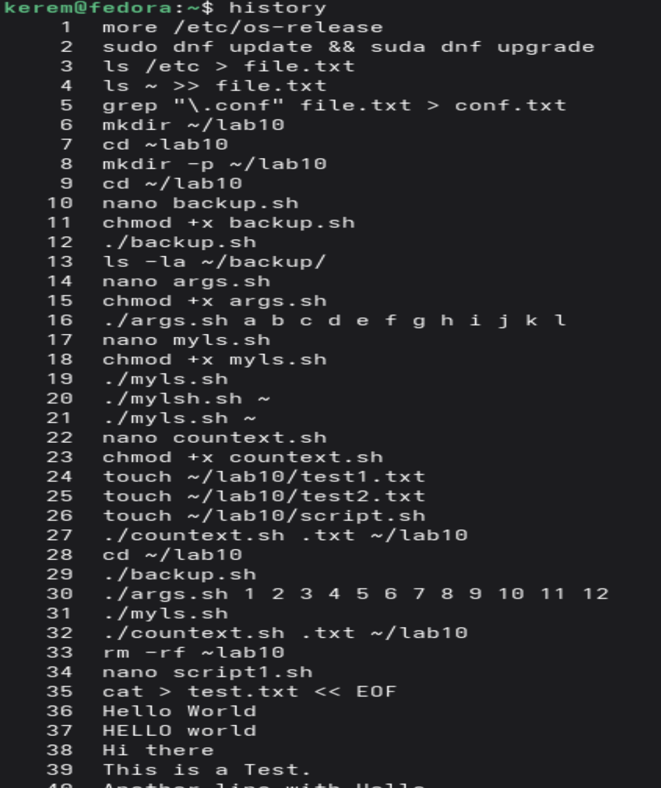

---
## Author
author:
  name: Пириев Керем
  degrees: DSc
  orcid: 0000-0002-0877-7063
  email: 1032254162@rudn.ru
  affiliation:
    - name: Российский университет дружбы народов
      country: Российская Федерация
      postal-code: 117198
      city: Москва
      address: ул. Миклухо-Маклая, д. 6

## Title
title: "Лабораторная работа № 6"
subtitle: "Основы интерфейса взаимодействия пользователя с системой Unix на уровне командной строки"
license: "CC BY"

bibliography: bib/cite.bib
csl: _resources/csl/gost-r-7-0-5-2008-numeric.csl

nocite: "@*"
---

# Цель работы

Приобретение практических навыков взаимодействия пользователя с системой посредством командной строки.

# Задание

1. Определить домашний каталог пользователя.
2. Изучить содержимое каталогов с помощью команды `ls` и её опций (`-l`, `-a`, `-la`).
3. Проверить наличие подкаталога `cron` в каталоге `/var/spool`.
4. Изучить содержимое домашнего каталога.
5. Создать и удалить каталоги с помощью команд `mkdir`, `rmdir`, `rm`.
6. Изучить справку по команде `ls` с помощью `man`.
7. Просмотреть историю выполненных команд.

# Выполнение лабораторной работы

## 3.1 Определение домашнего каталога
С помощью команды `pwd` был определен абсолютный путь домашнего каталога пользователя (рис. @fig-001).

{#fig-001 width=70%}

## 3.2 Работа с каталогом /tmp
Просмотр содержимого каталога был выполнен с помощью команды `ls` (рис. @fig-002).

{#fig-002 width=70%}

Права доступа, владелец, размер и дата изменения файлов были выведены с помощью опции `-l` (рис. @fig-003).

{#fig-003 width=70%}

Просмотр скрытых файлов (начинающихся с `.`) и их комбинация с развернутым выводом были выполнены командами `ls -a` и `ls -la` (рис. @fig-004).

{#fig-004 width=70%}

## 3.3 Проверка наличия каталога cron
Наличие подкаталога `cron` в директории `/var/spool` было проверено командой `ls -l /var/spool | grep cron` (рис. @fig-005). Вывод показал, что каталог отсутствует.

{#fig-005 width=70%}

## 3.4 Содержимое домашнего каталога
Содержимое домашнего каталога вновь было выведено с помощью команды `ls -l` для проверки текущей файловой структуры (рис. @fig-006).

{#fig-006 width=70%}

## 3.5 Создание и удаление каталогов
Были созданы каталоги `newdir`, `newdir/morefun`, `letters`, `memos`, `misk` командой `mkdir`. Пустые каталоги удалены через `rmdir`, а непустые (и принудительно) — командами `rm` и `rm -r` (рис. @fig-007).

{#fig-007 width=70%}

## 3.6 Работа с командой man
Справка по команде `ls` и её опциям (`-R`, `-lt`) была изучена через встроенное руководство `man ls` (рис. @fig-008).

{#fig-008 width=70%}

## 3.7 Работа с историей команд
С помощью команды `history` был выведен пронумерованный список последних выполненных команд в терминале (рис. @fig-009).

{#fig-009 width=70%}

# Вывод

В ходе выполнения лабораторной работы приобретены практические навыки работы с командной строкой Unix. Изучены и отработаны следующие команды и их опции:

| Команда | Назначение | Основные опции |
|---------|------------|----------------|
| pwd | Показать текущий каталог | — |
| cd | Перемещение по файловой системе | — |
| ls | Просмотр содержимого каталога | -l, -a, -R, -t |
| mkdir | Создание каталогов | -p, -m |
| rmdir | Удаление пустых каталогов | -p |
| rm | Удаление файлов и каталогов | -r, -f, -i |
| man | Получение справки | — |
| history | Просмотр истории команд | — |

Полученные навыки позволяют эффективно взаимодействовать с операционной системой через командную строку.

# Контрольные вопросы

## 1. Что такое командная строка?
Командная строка это интерфейс взаимодействия пользователя с операционной системой, где команды вводятся в виде текста построчно.

## 2. При помощи какой команды можно определить абсолютный путь текущего каталога?
Команда pwd. Пример: pwd покажет /home/liveuser.

## 3. При помощи какой команды и каких опций можно определить только тип файлов и их имена?
ls -F. Пример: ls -F выводит / для каталогов, * для исполняемых файлов, @ для ссылок.

## 4. Каким образом отобразить информацию о скрытых файлах?
Использовать опцию а. Пример: ls -a.

## 5. При помощи каких команд можно удалить файл и каталог? Можно ли это сделать одной командой?
* Файл: rm filename
* Пустой каталог: rmdir dirname
* Каталог с файлами: rm -r dirname
Да, командой rm -r можно удалить и файлы, и каталоги.

## 6. Каким образом можно вывести информацию о последних выполненных командах?
Команда history.

## 7. Как воспользоваться историей команд для их модифицированного выполнения?
! <номер_команды>:s/<что_меняем>/<на_что_меняем>
Пример: !5:s/ls/ll/

## 8. Пример запуска нескольких команд в одной строке:
cd /tmp; ls -l; pwd

## 9. Что такое символы экранирования?
Символы, отменяющие специальное значение других символов. Пример: echo \$100 выведет \$100, а не значение переменной.

## 10. Вывод команды ls -l:
drwxr-xr-x. 2 liveuser liveuser 40 Mar 19 16:40 Desktop
d - тип файла (каталог)
rwxr-xr-x - права доступа
2 - число ссылок
liveuser - владелец
liveuser - группа
40 - размер
Mar 19 16:40 - дата
Desktop - имя

## 11. Что такое относительный путь?
Путь относительно текущего каталога. Относительный: cd newdir. Абсолютный: cd /home/liveuser/newdir.

## 12. Как получить информацию о команде?
Команда man <имя_команды>. Пример: man ls.

## 13. Какая клавиша для автодополнения команд?
Клавиша Tab.

# Список литературы{.unnumbered}

::: {#refs}
:::
