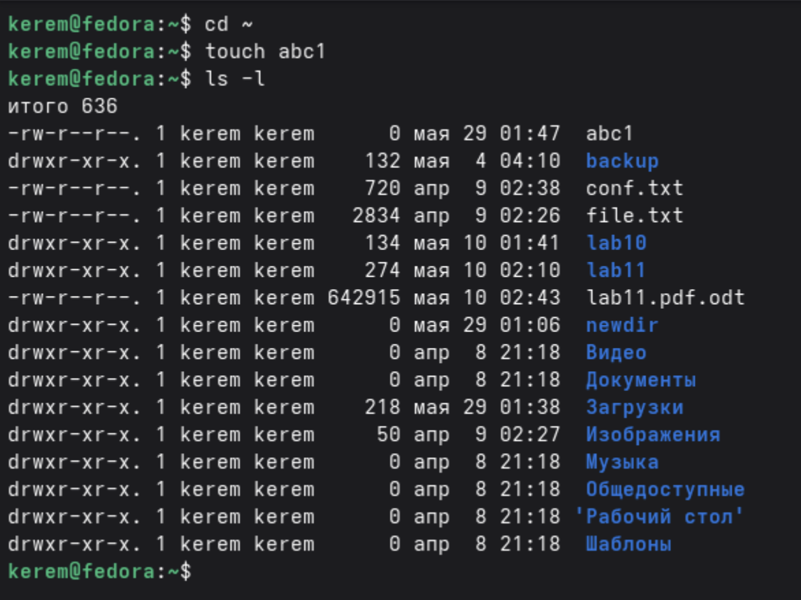
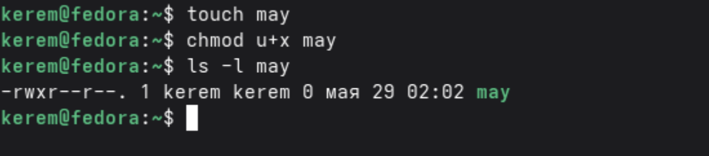
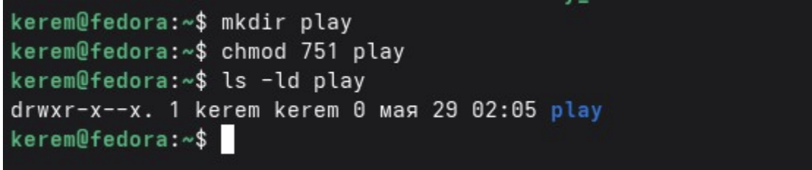
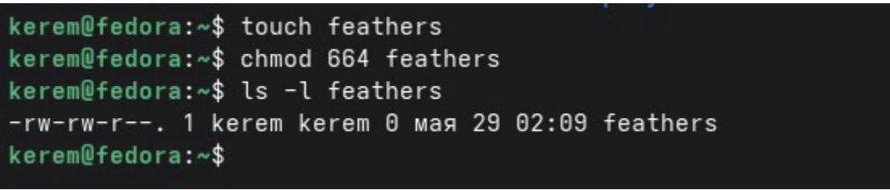
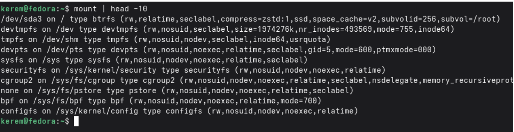
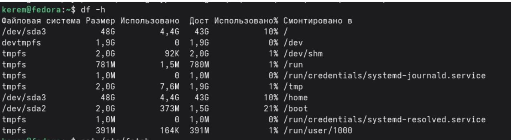

---
## Author
author:
  name: Пириев Керем
  email: 1032254162@rudn.ru
  affiliation:
    - name: Российский университет дружбы народов
      country: Российская Федерация
      postal-code: 117198
      city: Москва
      address: ул. Миклухо-Маклая, д. 6

## Title
title: "Лабораторная работа № 7"
subtitle: "Анализ файловой системы Linux. Команды для работы с файлами и каталогами"
license: CC BY
date: today
date-format: "YYYY-MM-DD"
---

# Информация

## Докладчик

:::::::::::::: {.columns align=center}
::: {.column width="70%"}

* Пириев Керем
* студент группы НПИбд-02-25
* Российский университет дружбы народов
* [1032254162@rudn.ru](mailto:1032254162@rudn.ru)

:::
::: {.column width="30%"}

:::
::::::::::::::

# Цель работы

Приобретение практических навыков работы с файлами и каталогами, анализа файловой системы Linux.

# Задание

1. Создание пустого файла в домашнем каталоге.
2. Копирование файлов.
3. Перемещение и переименование файлов.
4. Изменение прав доступа с помощью `chmod`.
5. Просмотр смонтированных файловых систем (`mount`).
6. Анализ дискового пространства (`df -h`).
7. Просмотр файла конфигурации `/etc/fstab`.

# Выполнение лабораторной работы

## Создание файла abc1

Создание пустого файла в домашнем каталоге и проверка через `ls -l`:

{width=50%}

## Копирование файлов

Копирование файла `abc1` в файлы `april` и `may`:

{width=50%}

## Перемещение и переименование

Переименование `april` в `july` и перенос в каталог `monthly/`:

{width=50%}

## Изменение прав доступа (chmod)

Установка прав для файла `may` (право выполнения для владельца):

{width=50%}

## Права доступа 544 для my_os

Установка числовых прав `544` для файла `my_os`:

{width=50%}

## Права доступа 751 для play

Установка прав `751` для созданного каталога `play`:

{width=50%}

## Права доступа 664 для feathers

Установка прав `664` для файла `feathers`:

{width=50%}

## Смонтированные файловые системы

Вывод первых десяти строк команды `mount`:

{width=50%}

## Анализ дискового пространства

Проверка использования дисков с помощью `df -h`:

{width=50%}

## Просмотр файла /etc/fstab

Вывод содержимого таблицы файловых систем:

{width=50%}

# Выводы

* Освоены базовые операции с файлами: создание (`touch`), копирование (`cp`), перемещение (`mv`).
* Изучено управление правами доступа в символьном и числовом форматах (`chmod`).
* Получены навыки анализа файловой системы с помощью команд `mount` и `df`.
* Изучена структура конфигурационного файла монтирования `/etc/fstab`.
