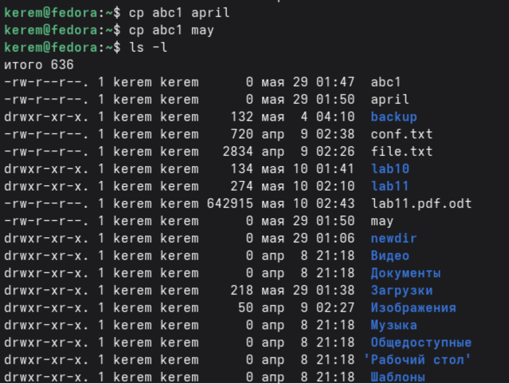
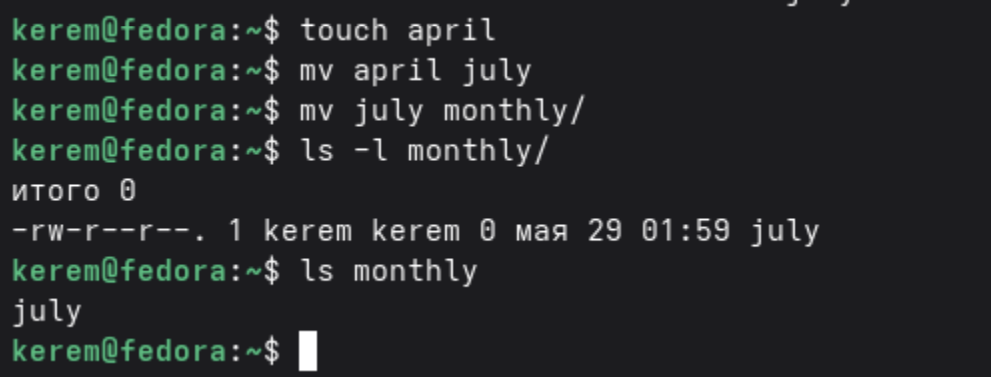
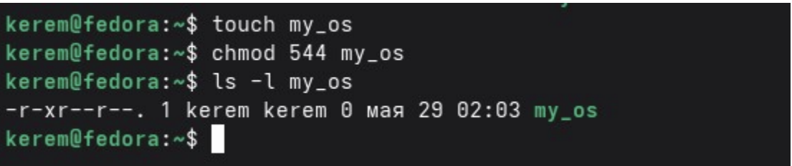
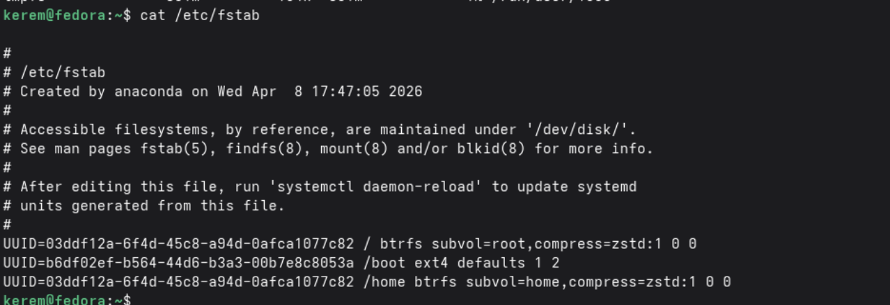

---
## Author
author:
  name: Пириев Керем
  degrees: DSc
  orcid: 0000-0002-0877-7063
  email: 1032254162@rudn.ru
  affiliation:
    - name: Российский университет дружбы народов
      country: Российская Федерация
      postal-code: 117198
      city: Москва
      address: ул. Миклухо-Маклая, д. 6

## Title
title: "Лабораторная работа № 7"
subtitle: "Анализ файловой системы Linux. Команды для работы с файлами и каталогами"
license: "CC BY"

bibliography: bib/cite.bib
csl: _resources/csl/gost-r-7-0-5-2008-numeric.csl

nocite: "@*"
---

# Цель работы

Приобретение практических навыков работы с файлами и каталогами, анализа файловой системы Linux.

# Задание

1. Создать пустой файл в домашнем каталоге.
2. Скопировать созданный файл в другие файлы.
3. Переместить и переименовать файлы.
4. Изменить права доступа для различных файлов и каталогов с помощью команды `chmod`.
5. Просмотреть список смонтированных файловых систем.
6. Проанализировать использование дискового пространства.
7. Просмотреть содержимое файла конфигурации монтирования `/etc/fstab`.

# Выполнение лабораторной работы

## 2.1. Создание файла abcl
В домашнем каталоге был создан пустой файл с именем `abc1` при помощи команды `touch abc1`. После этого для проверки результата выполнена команда `ls -l` (рис. @fig-001).

{#fig-001 width=70%}

## 2.2. Копирование файлов abc1 в april и may
Созданный файл `abc1` был скопирован в новые файлы с именами `april` и `may` с помощью команды `cp abc1 april` и `cp abc1 may` (рис. @fig-002).

{#fig-002 width=70%}

## 2.3. Перемещение и переименование
Файл `april` был переименован в `july` командой `mv april july`. Затем файл `july` был перемещен во вновь созданный (подразумевается) каталог `monthly/` командой `mv july monthly/` (рис. @fig-003).

{#fig-003 width=70%}

## 2.4. Изменение прав доступа (chmod)

### 2.4.1. Изменение прав для файла may
Для файла `may` было добавлено право на выполнение для владельца с использованием символьного режима: `chmod u+x may` (рис. @fig-004).

{#fig-004 width=70%}

### 2.4.2. Изменение прав для файла my_os
Был создан файл `my_os`, и для него установлены права `544` (чтение и выполнение для владельца, только чтение для группы и остальных: `r-xr--r--`) командой `chmod 544 my_os` (рис. @fig-005).

{#fig-005 width=70%}

### 2.4.3. Изменение прав для каталога play
Был создан каталог `play`, для которого установлены права `751` (`drwxr-x--x`) командой `chmod 751 play` (рис. @fig-006).

{#fig-006 width=70%}

### 2.4.4. Изменение прав для файла feathers
Был создан файл `feathers`, и для него установлены права `664` (`rw-rw-r--`) командой `chmod 664 feathers` (рис. @fig-007).

{#fig-007 width=70%}

## 2.5. Просмотр смонтированных файловых систем
Команда `mount` с передачей вывода утилите `head -10` была использована для просмотра первых десяти смонтированных файловых систем (рис. @fig-008).

{#fig-008 width=70%}

## 2.6. Анализ использования дискового пространства
Для анализа доступного и занятого места на дисковых разделах в удобном для чтения формате была использована команда `df -h` (рис. @fig-009).

{#fig-009 width=70%}

## 2.7. Просмотр файла /etc/fstab
С помощью команды `cat /etc/fstab` было выведено содержимое файла конфигурации, который отвечает за монтирование файловых систем при загрузке операционной системы (рис. @fig-010).

{#fig-010 width=70%}

# Выводы

В ходе выполнения лабораторной работы были изучены и практически освоены следующие команды:
* `touch` — создание пустых файлов;
* `cp` — копирование файлов;
* `mv` — перемещение и переименование файлов и каталогов;
* `chmod` — изменение прав доступа (в символьной и числовой формах);
* `mount` — просмотр смонтированных файловых систем;
* `df` — анализ использования дискового пространства;
* `cat /etc/fstab` — просмотр таблицы файловых систем.

# Список литературы{.unnumbered}

::: {#refs}
:::
