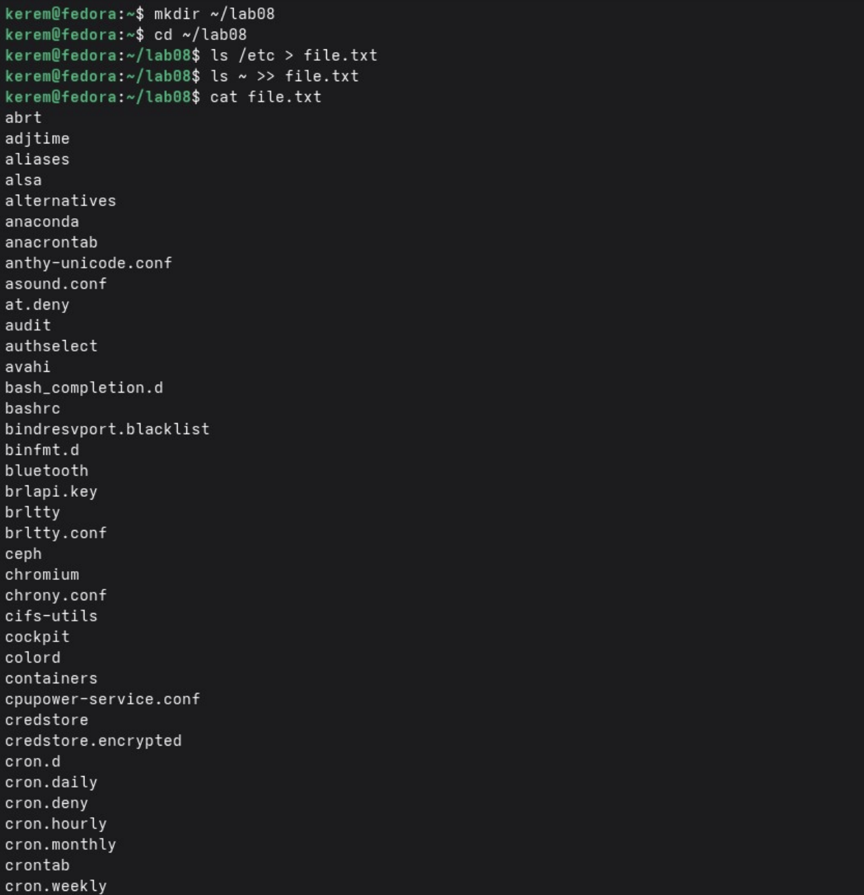
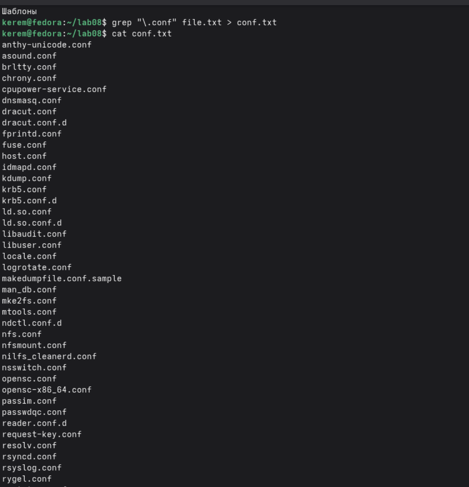
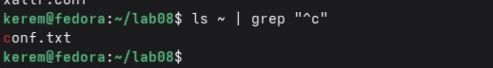
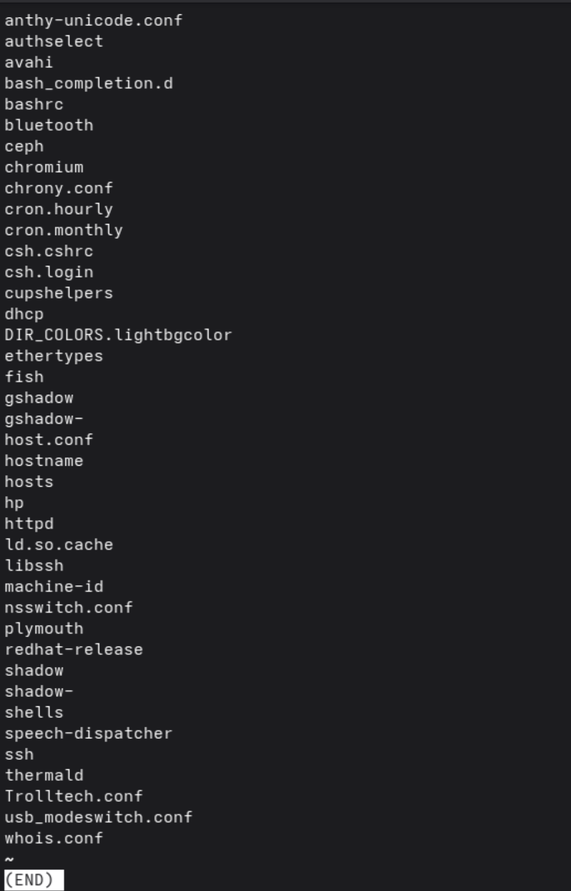
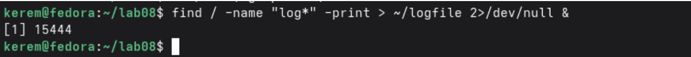
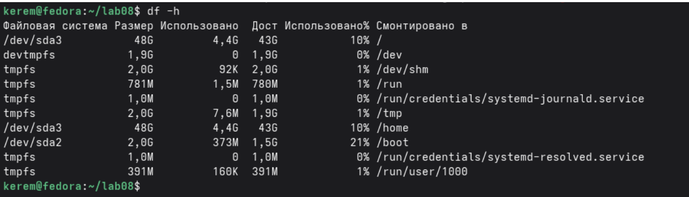

---
## Author
author:
  name: Пириев Керем
  email: 1032254162@rudn.ru
  affiliation:
    - name: Российский университет дружбы народов
      country: Российская Федерация
      postal-code: 117198
      city: Москва
      address: ул. Миклухо-Маклая, д. 6

## Title
title: "Лабораторная работа № 8"
subtitle: "Поиск файлов. Перенаправление ввода-вывода. Просмотр запущенных процессов"
license: CC BY
date: today
date-format: "YYYY-MM-DD"
---

# Информация

## Докладчик

:::::::::::::: {.columns align=center}
::: {.column width="70%"}

* Пириев Керем
* студент группы НПИбд-02-25
* Российский университет дружбы народов
* [1032254162@rudn.ru](mailto:1032254162@rudn.ru)

:::
::: {.column width="30%"}

:::
::::::::::::::

# Цель работы

Ознакомление с инструментами поиска файлов, фильтрации текста, перенаправлением ввода-вывода и управлением процессами.

# Задание

1. Перенаправление ввода-вывода (`>`, `>>`).
2. Фильтрация строк с помощью `grep`.
3. Поиск файлов в домашнем каталоге.
4. Постраничный вывод через `less`.
5. Запуск фоновых процессов.
6. Анализ дискового пространства.

# Выполнение лабораторной работы

## 1. Перенаправление вывода

Сохранение вывода команды `ls /etc` в файл через `>` и `>>`:

{width=50%}

## 2. Фильтрация строк с расширением .conf

Выделение конфигурационных файлов утилитой `grep`:

{width=50%}

## 3. Поиск файлов в домашнем каталоге

Поиск файлов, начинающихся на букву «c»:

{width=50%}

## 4. Вывод через less

Постраничный вывод отфильтрованного списка `ls /etc | grep "h" | less`:

{width=50%}

## 5. Запуск фонового процесса find

Выполнение поиска в фоновом режиме (`&`):

{width=50%}

## 6. Удаление logfile

Удаление файла журнала и проверка завершения фонового задания:

{width=50%}

## 7. Управление процессом gedit (Часть 1)

Запуск `gedit` в фоновом режиме и проверка дискового пространства:

{width=50%}

## 7. Управление процессом gedit (Часть 2)

Проверка запущенного процесса через утилиту `ps aux`:

{width=50%}

## 8. Анализ дискового пространства

Использование команды `df -h` для проверки разделов диска:

{width=50%}

## 8. Поиск каталогов через find

Поиск подкаталогов в домашней директории с помощью `find . -type d`:

{width=50%}

# Выводы

* Освоены операторы перенаправления ввода-вывода (`>`, `>>`, `2>`).
* Изучена фильтрация текста с помощью `grep` и конвейеров (`|`).
* Получены навыки работы с фоновыми процессами и утилитой `find`.
* Отработаны методы мониторинга процессов (`ps`) и анализа дискового пространства (`df`).
