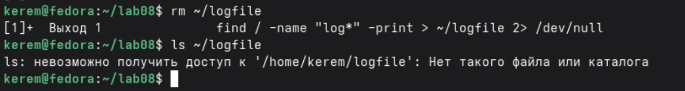
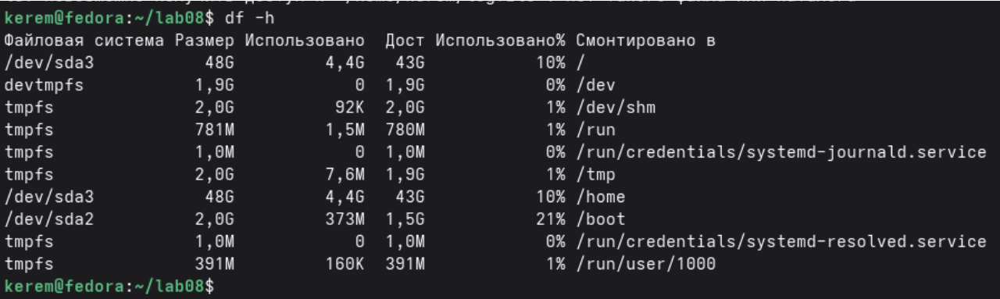
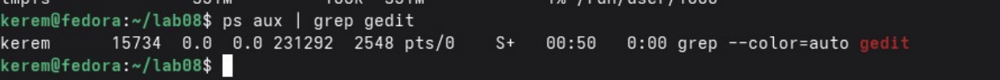
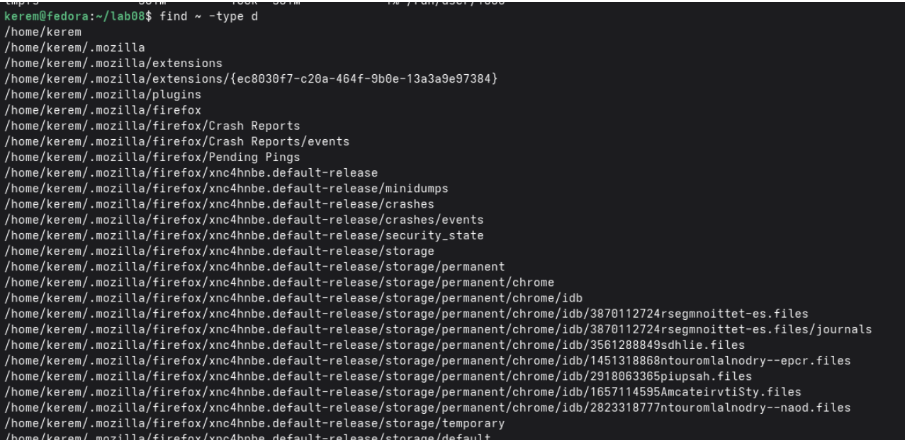

---
## Author
author:
  name: Пириев Керем
  degrees: DSc
  orcid: 0000-0002-0877-7063
  email: 1032254162@rudn.ru
  affiliation:
    - name: Российский университет дружбы народов
      country: Российская Федерация
      postal-code: 117198
      city: Москва
      address: ул. Миклухо-Маклая, д. 6

## Title
title: "Лабораторная работа № 8"
subtitle: "Поиск файлов. Перенаправление ввода-вывода. Просмотр запущенных процессов"
license: "CC BY"

bibliography: bib/cite.bib
csl: _resources/csl/gost-r-7-0-5-2008-numeric.csl

nocite: "@*"
---

# Цель работы

Ознакомление с инструментами поиска файлов, фильтрации текста, перенаправлением ввода-вывода и управлением процессами.

# Задание

1. Создать рабочий каталог `~/lab08` и освоить перенаправление вывода (`>`, `>>`) на примере содержимого каталога `/etc`.
2. Выполнить фильтрацию строк по шаблону `.conf` с помощью команды `grep`.
3. Выполнить поиск файлов в домашнем каталоге, начинающихся на букву `c`.
4. Организовать постраничный вывод содержимого через `less` с использованием конвейеров.
5. Запустить фоновый процесс поиска файлов (`find`).
6. Удалить файл журнала и обработать статус завершения фонового процесса.
7. Запустить редактор `gedit` в фоновом режиме и проверить его работу через `ps aux`.
8. Выполнить анализ дискового пространства и структуры каталогов с помощью `df -h` и `find`.

# Выполнение лабораторной работы

## 1. Перенаправление вывода
В созданном каталоге `~/lab08` были выполнены команды перенаправления вывода `ls /etc > file.txt` и добавления данных `ls >> file.txt` (рис. @fig-001).

{#fig-001 width=70%}

## 2. Фильтрация строк с расширением .conf
С помощью команды `grep "\.conf" file.txt > conf.txt` были отфильтрованы файлы конфигурации (рис. @fig-002).

{#fig-002 width=70%}

## 3. Поиск файлов в домашнем каталоге, начинающихся на букву c
Выполнен поиск файлов в домашнем каталоге, имена которых начинаются на букву `c`, с использованием конвейера `ls ~ | grep "^c"` (рис. @fig-003).

{#fig-003 width=70%}

## 4. Вывод содержимого /etc/h* через less
С помощью конвейера `ls /etc | grep "h" | less` был организован постраничный вывод отфильтрованного списка (рис. @fig-004).

{#fig-004 width=70%}

## 5. Запуск фонового процесса find
Был запущен фоновый процесс поиска файлов `find / -name "log*" -print > ~/logfile 2>/dev/null &` (рис. @fig-005).

{#fig-005 width=70%}

## 6. Удаление logfile
Файл журнала был удален командой `rm ~/logfile`, после чего выведено сообщение о завершении фонового задания и проверено отсутствие файла (рис. @fig-006).

{#fig-006 width=70%}

## 7. Управление процессом gedit (Часть 1)
Запущен процесс текстового редактора в фоновом режиме (`gedit &`), после чего проверено состояние дискового пространства командой `df -h` (рис. @fig-007).

{#fig-007 width=70%}

## 7. Управление процессом gedit (Часть 2)
С помощью команды `ps aux | grep gedit` был найден и проверен запущенный процесс графического редактора (рис. @fig-008).

{#fig-008 width=70%}

## 8. Анализ дискового пространства
Выполнена проверка дискового пространства с помощью утилиты `df -h` для анализа разделов (рис. @fig-009).

{#fig-009 width=70%}

## 8. Поиск каталогов через find
Выполнен поиск всех подкаталогов в домашней директории с помощью команды `find . -type d` (рис. @fig-010).

{#fig-010 width=70%}

# Вывод

В ходе работы изучены и практически освоены следующие команды и концепции[cite: 91]:
* `grep` — фильтрация строк по шаблону;
* `find` — поиск файлов и каталогов;
* `df`, `du` — анализ дискового пространства
* `ps`, `kill` — управление процессами;
* Перенаправление ввода-вывода (`>`, `>>`, `2>`);
* Конвейеры (`|`);
* Фоновый режим выполнения (`&`).
Все действия выполнялись в созданном каталоге `~/lab08`, что обеспечило организованную структуру работы.

# Контрольные вопросы

## 1. Какие потоки ввода-вывода вы знаете?
stdin (0), stdout (1), stderr (2).

## 2. Разница между > и >>?
`>` — перезапись файла, `>>` — добавление данных в конец файла.

## 3. Что такое конвейер?
Передача вывода одной команды на ввод другой (`|`).

## 4. Процесс vs программа?
Программа — статичный код на диске. Процесс — выполняющийся экземпляр программы.

## 5. PID и GID?
PID — идентификатор процесса. GID — идентификатор группы процесса.

## 6. Управление задачами?
Команда `jobs`; управление через `fg`, `bg`, `kill %номер`.

## 7. top и htop?
`top` — монитор процессов в реальном времени. `htop` — улучшенная версия с поддержкой цветов и мыши.

## 8. Команда поиска файлов? Примеры?
`find`. Примеры: `find . -name "*.txt"`, `find /etc -type d`.

## 9. Поиск по содержимому?
Да, с помощью команды `grep -r "текст" /путь`.

## 10. Свободное место на диске?
Команда `df -h`.

## 11. Размер домашнего каталога?
Команда `du -sh`.

## 12. Удаление зависшего процесса?
Найти PID через `ps aux | grep имя`, затем выполнить `kill PID` или `kill -9 PID`.

# Список литературы{.unnumbered}

::: {#refs}
:::
