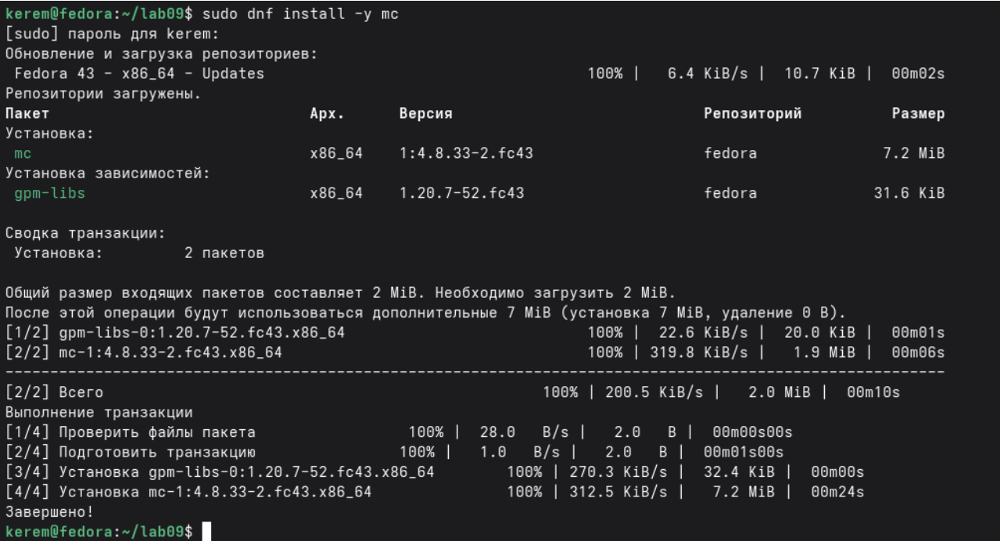
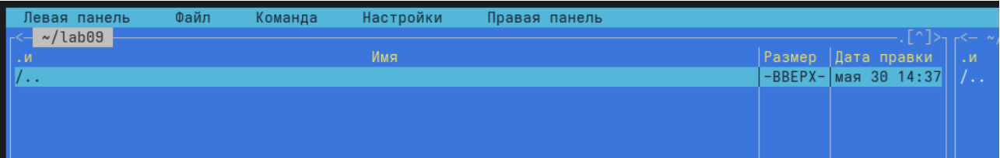
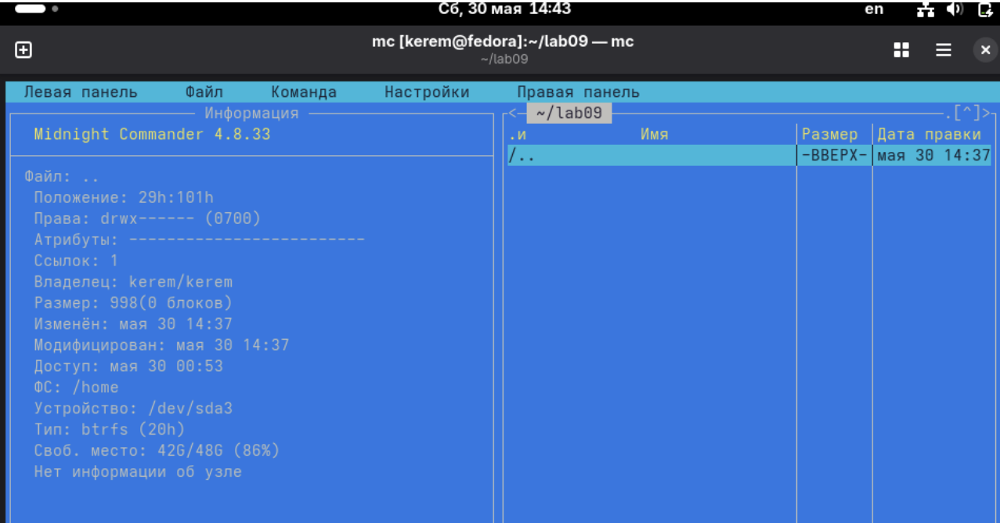
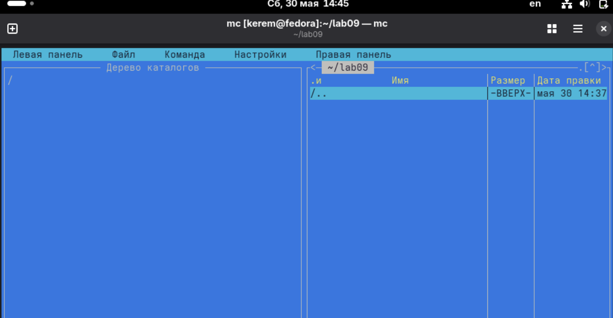
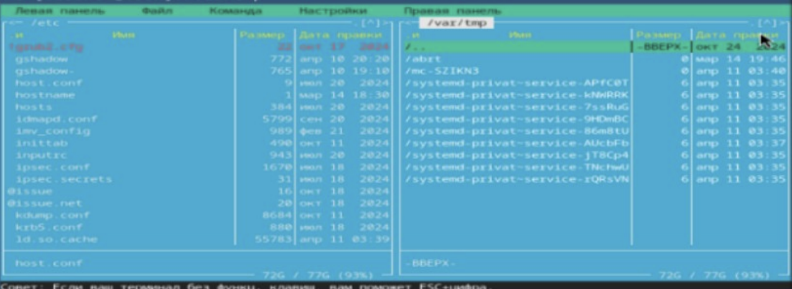
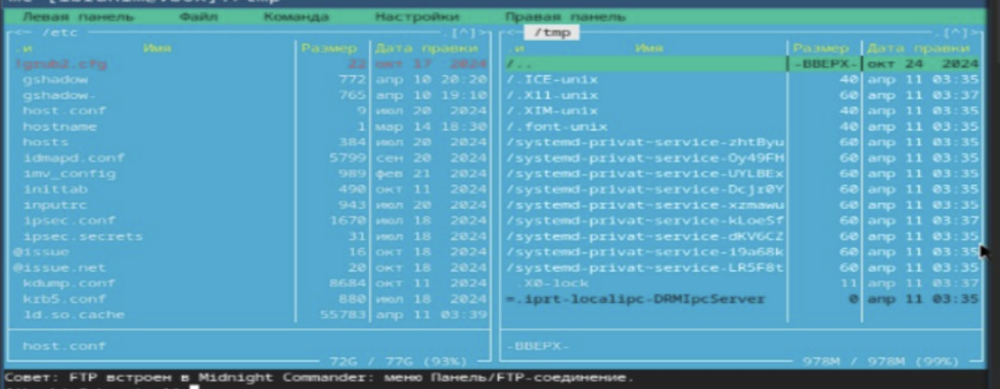
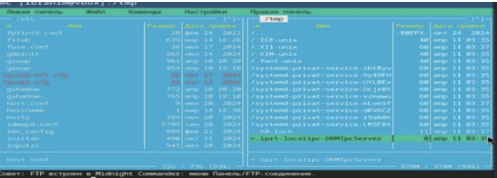
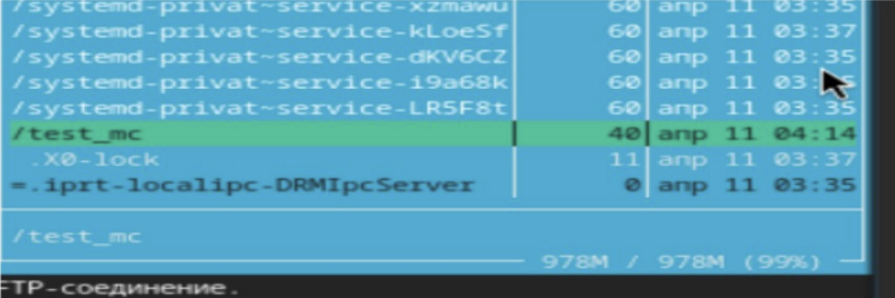
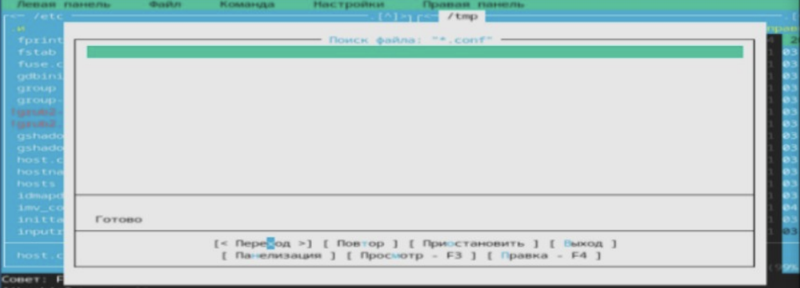
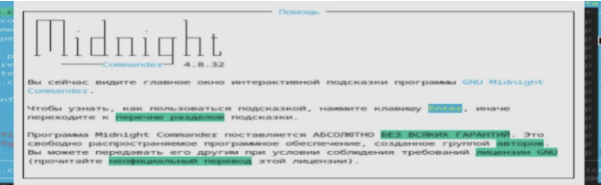

---
## Author
author:
  name: Пириев Керем
  email: 1032254162@rudn.ru
  affiliation:
    - name: Российский университет дружбы народов
      country: Российская Федерация
      postal-code: 117198
      city: Москва
      address: ул. Миклухо-Маклая, д. 6

## Title
title: "Лабораторная работа № 9"
subtitle: "Освоение возможностей командной оболочки Midnight Commander (mc)"
license: CC BY
date: today
date-format: "YYYY-MM-DD"
---

# Информация

## Докладчик

:::::::::::::: {.columns align=center}
::: {.column width="70%"}

* Пириев Керем
* студент группы НПИбд-02-25
* Российский университет дружбы народов
* [1032254162@rudn.ru](mailto:1032254162@rudn.ru)

:::
::: {.column width="30%"}

:::
::::::::::::::

# Цель работы

Освоение основных возможностей командной оболочки Midnight Commander (`mc`), приобретение навыков работы с каталогами, файлами и элементами управления.

# Задание

1. Установка и запуск Midnight Commander.
2. Изучение режимов отображения панелей (Информация, Дерево).
3. Навигация по файловой системе.
4. Копирование файлов и создание каталогов.
5. Поиск файлов через встроенные диалоги.
6. Работа со встроенным редактором и справкой.

# Выполнение лабораторной работы

## 1. Установка Midnight Commander

Установка пакета `mc` с помощью диспетчера пакетов `dnf`:

{width=50%}

## 2. Запуск Midnight Commander

Интерфейс программы после запуска командой `mc`:

{width=50%}

## 3.1 Режим «Информация»

Активация информационного режима левой панели:

{width=50%}

## 3.2 Режим «Дерево»

Переключение панели в режим структуры каталогов:

{width=50%}

## 3.3 Дерево каталогов

Отображение древовидной структуры:

{width=50%}

## 4.1 Корневой каталог /

Навигация по корневому каталогу на левой панели:

{width=50%}

## 4.2 Правая панель = /var

Открытие системного каталога `/var` на правой панели:

{width=50%}

## 4.3 Две активные панели

Одновременное отображение каталогов `/etc` и `/var`:

{width=50%}

## 5.1 Переход в каталог /tmp

Подготовка правой панели для копирования файлов:

{width=50%}

## 5.2 Выбор файла host.conf

Выделение файла конфигурации в директории `/etc`:

{width=50%}

## 5.3 Копирование файла

Перенос файла с помощью функциональной клавиши `F5`:

{width=50%}

## 6. Создание каталога

Создание новой директории `test_mc` по клавише `F7`:

{width=50%}

## Пользовательское меню

Вызов встроенного меню дополнительных операций:

{width=50%}

## 7.1 Меню «Команда»

Переход к разделу поиска файлов через верхнее меню:

{width=50%}

## 7.2 Диалог поиска (начало)

Открытие окна параметров поиска:

{width=50%}

## 7.3 Диалог поиска (заполнение)

Настройка маски и параметров поиска:

{width=50%}

## 7.4 Критерии поиска: *.conf

Поиск файлов конфигурации в каталоге `/etc`:

{width=50%}

## 7.5 Результат поиска

Отображение найденных элементов во встроенном окне:

{width=50%}

## 8. Редактирование файла

Открытие текстового файла во встроенном редакторе (`F4`):

{width=50%}

## 9. Справка Midnight Commander

Интерактивная справочная система программы (`F1`):

{width=50%}

# Выводы

* Успешно установлен и настроен файловый менеджер Midnight Commander.
* Освоены средства навигации и управления файлами (копирование, создание каталогов).
* Изучены режимы работы панелей и встроенный инструмент поиска файлов.
* Получены практические навыки использования встроенного редактора и системы помощи.
