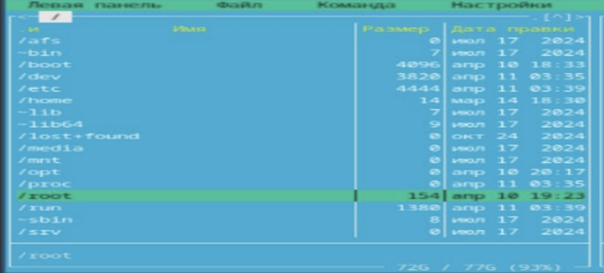
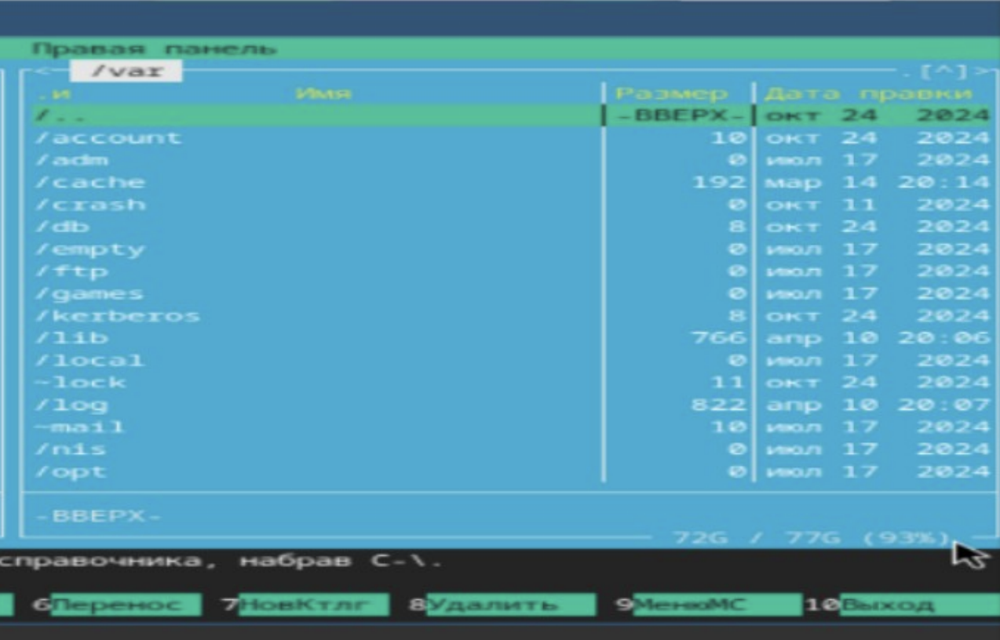
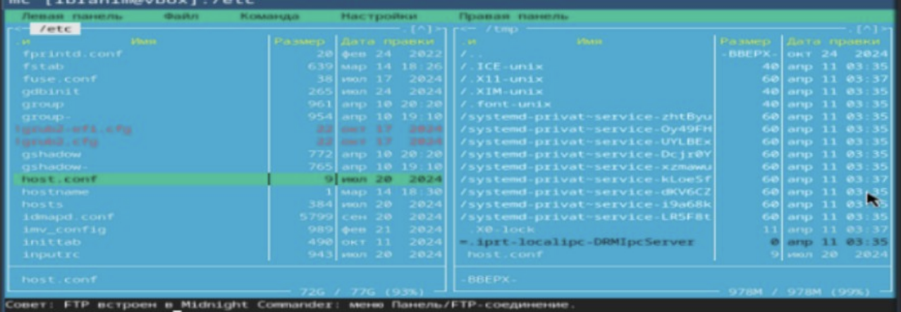
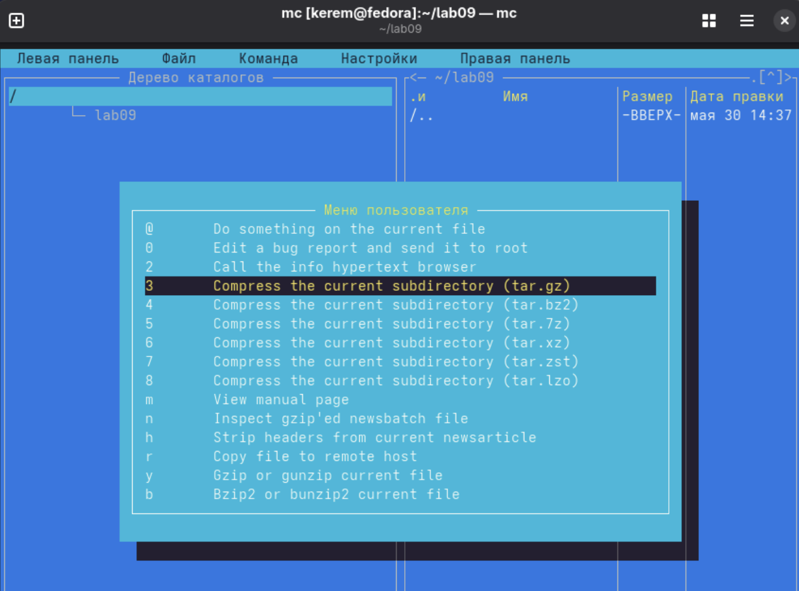
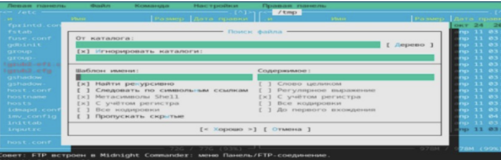
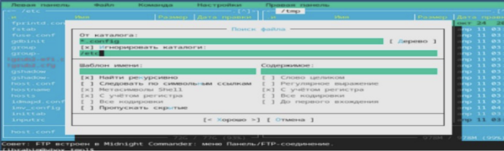
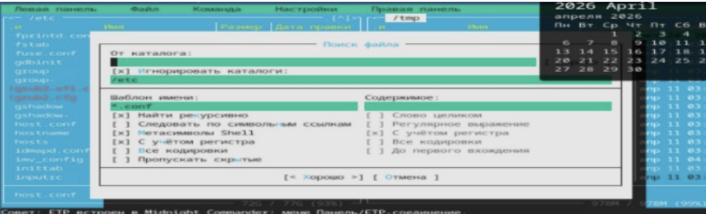
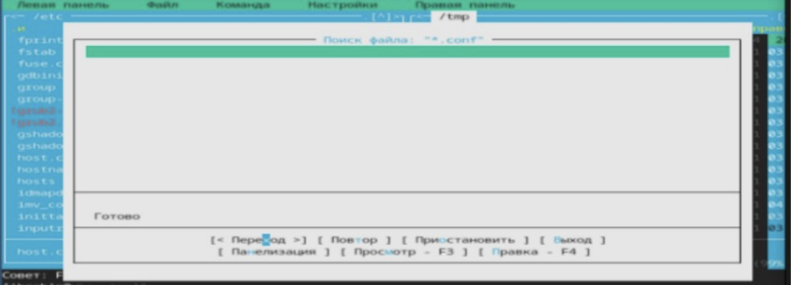
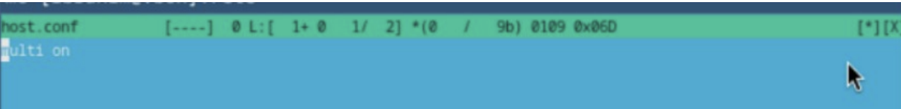
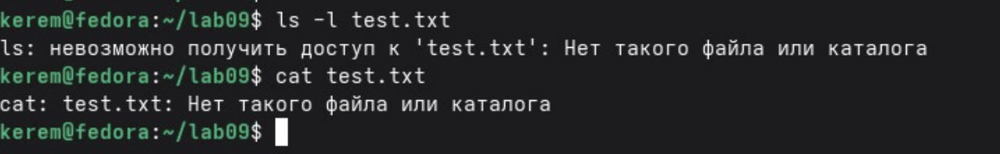

---
## Author
author:
  name: Пириев Керем
  degrees: DSc
  orcid: 0000-0002-0877-7063
  email: 1032254162@rudn.ru
  affiliation:
    - name: Российский университет дружбы народов
      country: Российская Федерация
      postal-code: 117198
      city: Москва
      address: ул. Миклухо-Маклая, д. 6

## Title
title: "Лабораторная работа № 9"
subtitle: "Освоение возможностей командной оболочки Midnight Commander (mc)"
license: "CC BY"

bibliography: bib/cite.bib
csl: _resources/csl/gost-r-7-0-5-2008-numeric.csl

nocite: "@*"
---

# Цель работы

Освоение основных возможностей командной оболочки Midnight Commander (mc). Приобретение навыков практической работы по просмотру каталогов и файлов; манипуляций с ними.

# Задание

1. Установить файловый менеджер Midnight Commander.
2. Запустить Midnight Commander и изучить режимы отображения панелей (Информация, Дерево каталогов).
3. Отработать навигацию по файловой системе на двух панелях.
4. Выполнить операции копирования и перемещения файлов.
5. Создать новый каталог и освоить меню пользователя.
6. Выполнить поиск файлов с использованием встроенных диалогов.
7. Ознакомиться со встроенным редактором, справочной системой и правилами выхода из программы.
8. Ответить на контрольные вопросы.

# Выполнение лабораторной работы

## 1. Установка Midnight Commander
Пакет `mc` был успешно установлен с помощью пакетного менеджера командой `sudo dnf install -y mc` (рис. @fig-001).

{#fig-001 width=70%}

## 2. Запуск Midnight Commander
Выполнен запуск программы командой `mc` из терминала, открылся классический двухпанельный интерфейс (рис. @fig-002).

{#fig-002 width=70%}

## 3. Режимы отображения панелей

### 3.1. Режим «Информация»
С помощью меню `F9` -> `Left` -> `Info` был активирован информационный режим левой панели для просмотра атрибутов и параметров файловой системы (рис. @fig-003).

{#fig-003 width=70%}

### 3.2. Режим «Дерево»
Включен режим отображения структуры каталогов в виде дерева (рис. @fig-004).

{#fig-004 width=70%}

### 3.3. Дерево каталогов
Дополнительное отображение древовидной структуры каталогов в интерфейсе (рис. @fig-005).

{#fig-005 width=70%}

## 4. Навигация по файловой системе

### 4.1. Корневой каталог /
Отработана навигация по корневому каталогу `/` на левой панели (рис. @fig-006).

{#fig-006 width=70%}

### 4.2. Правая панель = /var
Правая панель переведена в каталог `/var` для просмотра системных подкаталогов (рис. @fig-007).

{#fig-007 width=70%}

### 4.3. Левая панель = /etc, правая панель = /var
Настроено одновременное отображение каталога `/etc` на левой панели и каталога `/var` на правой панели (рис. @fig-008).

{#fig-008 width=70%}

## 5. Копирование файла

### 5.1. Правая панель = /tmp
На правой панели осуществлен переход в каталог `/tmp` для подготовки к копированию файлов (рис. @fig-009).

{#fig-009 width=70%}

### 5.2. Выбор файла host.conf в /etc
На левой панели в каталоге `/etc` выделен целевой файл конфигурации `host.conf` (рис. @fig-010).

{#fig-010 width=70%}

### 5.3. Копирование в /tmp
Выполнено копирование файла в каталог `/tmp` с помощью клавиши `F5` (рис. @fig-011).

{#fig-011 width=70%}

## 6. Создание каталога
С помощью функциональной клавиши `F7` в рабочей директории был создан новый каталог `test_mc` (рис. @fig-012).

{#fig-012 width=70%}

Дополнительно в процессе работы вызывалось пользовательское меню утилиты (рис. @fig-013).

{#fig-013 width=70%}

## 7. Поиск файлов

### 7.1. Меню «Команда» → «Поиск файла»
Через верхнее меню «Команда» был вызван диалог поиска файлов (рис. @fig-014).

{#fig-014 width=70%}

### 7.2. Диалог поиска (начало)
Начальное окно настройки параметров и стартового каталога поиска (рис. @fig-015).

{#fig-015 width=70%}

### 7.3. Диалог поиска (почти заполнен)
Ввод маски файлов и критериев фильтрации (рис. @fig-016).

{#fig-016 width=70%}

### 7.4. Критерии поиска: *.conf в /etc
Указаны параметры поиска файлов по маске `*.conf` в каталоге `/etc` (рис. @fig-017).

{#fig-017 width=70%}

### 7.5. Результат поиска
Отображение результатов поиска во встроенном окне программы (рис. @fig-018).

{#fig-018 width=70%}

## 8. Редактирование файла во встроенном редакторе
Продемонстрировано открытие файла во встроенном текстовом редакторе по клавише `F4` (рис. @fig-019).

{#fig-019 width=70%}

## 9. Справка Midnight Commander
Открыта встроенная справочная система программы по клавише `F1` для изучения руководства пользователя (рис. @fig-020).

{#fig-020 width=70%}

## 10. Выход из Midnight Commander
Выполнен выход из интерфейса `mc` в терминал с помощью клавиши `F10`, после чего проверено состояние командной строки.

# Вывод

В ходе работы были освоены основные возможности Midnight Commander:
* навигация по файловой системе;
* копирование, перемещение, удаление файлов и каталогов;
* поиск файлов;
* использование встроенного редактора;
* работа с двумя панелями одновременно.
Получены навыки эффективной работы с файловой системой в текстовом режиме.

# Контрольные вопросы

## 1. Какие режимы отображения панелей есть в mc?
* Список — стандартный режим отображения файлов и каталогов.
* Информация — отображает подробные данные о текущем файле/каталоге и файловой системе.
* Дерево — показывает древовидную структуру каталогов.

## 2. Какие операции с файлами можно выполнять как через shell, так и через mc?
| Операция | Через shell | Через mc |
|---|---|---|
| Копирование | `cp` | `F5` |
| Перемещение | `mv` | `F6` |
| Удаление | `rm` | `F8` |
| Создание каталога | `mkdir` | `F7` |
| Изменение прав | `chmod` | Меню (F9 -> File -> Chmod) |

## 3. Структура меню «Левая панель»
* Список — обычный режим отображения.
* Быстрый просмотр — просмотр содержимого выделенного файла.
* Информация — информация о файле/каталоге.
* Дерево — древовидный режим.
* Формат списка — настройка отображаемых колонок.
* Фильтр — фильтрация отображаемых файлов.

## 4. Меню «Файл»
Просмотр (`F3`), Правка (`F4`), Копия (`F5`), Переместить (`F6`), Создать каталог (`F7`), Удалить (`F8`).

## 5. Меню «Команда»
Дерево каталогов, Поиск файла, Переставить панели, Сравнить каталоги, Размеры каталогов, История командной строки.

## 6. Меню «Настройки»
Конфигурация, Оформление, Настройки панелей, Подтверждения, Формат списка.

## 7. Встроенные команды mc (функциональные клавиши)
* `F1` — Помощь
* `F2` — Меню
* `F3` — Просмотр файла
* `F4` — Правка файла
* `F5` — Копирование
* `F6` — Перемещение
* `F7` — Создать каталог
* `F8` — Удалить
* `F9` — Верхнее меню
* `F10` — Выход

## 8. Команды встроенного редактора mc
* `F1` — Помощь
* `F2` — Сохранить файл
* `F4` — Поиск
* `F6` — Замена
* `F7` — Перейти к строке с указанным номером
* `F10` — Выход из редактора

## 9. Как создать пользовательское меню?
Через `F9` -> Команда -> Править файл меню. При этом создается (или редактируется) файл `~/.mc/menu`, в котором можно определить собственные пункты меню и соответствующие им команды.

## 10. Как выполнить произвольную команду над текущим файлом?
Можно использовать `F9` -> Файл -> Править файл расширений для настройки действий по умолчанию. Также можно нажать `Ctrl+Enter` для вставки имени текущего файла в командную строку, после чего вручную дописать нужную команду.

# Список литературы{.unnumbered}

::: {#refs}
:::
