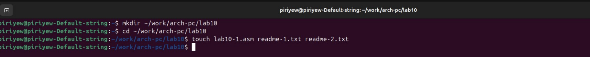
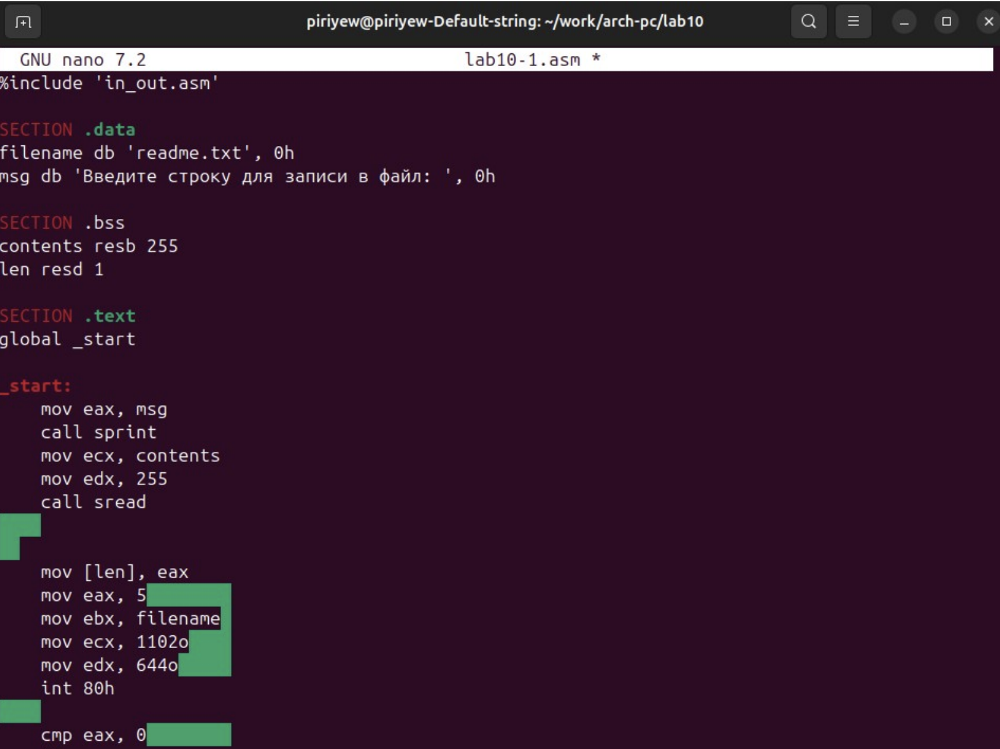
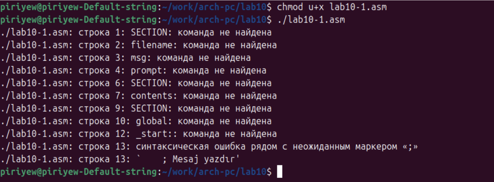
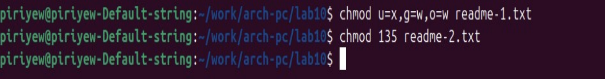
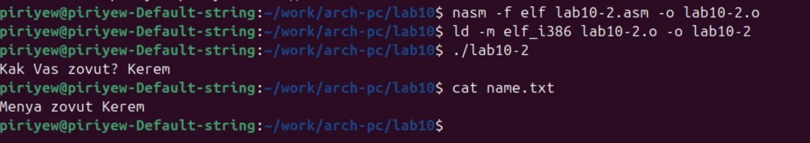

---
## Author
author:
  name: Пириев Керем
  email: 1032254162@rudn.ru
  affiliation:
    - name: Российский университет дружбы народов
      country: Российская Федерация
      postal-code: 117198
      city: Москва
      address: ул. Миклухо-Маклая, д. 6

## Title
title: "Лабораторная работа № 10"
subtitle: "Работа с файлами в ОС Linux"
license: CC BY
date: today
date-format: "YYYY-MM-DD"
---

# Информация

## Докладчик

:::::::::::::: {.columns align=center}
::: {.column width="70%"}

* Пириев Керем
* студент группы НПИбд-02-25
* Российский университет дружбы народов
* [1032254162@rudn.ru](mailto:1032254162@rudn.ru)

:::
::: {.column width="30%"}

:::
::::::::::::::

# Цель работы

Приобретение навыков написания программ для работы с файлами.

# Задание

1. Создание файлов в программах.
2. Изменение прав на файлы для разных групп пользователей.
3. Выполнение самостоятельных заданий.

# Выполнение лабораторной работы

## Создание рабочего каталога

Инициализация каталога для лабораторной работы № 10:

{width=50%}

## Программа первого листинга

Создание и редактирование файла `lab10-1.asm`:

{width=50%}

## Запуск программы

Компиляция и выполнение программы создания файла:

{width=50%}

## Права доступа (chmod)

Изменение прав владельца и проверка их влияния:

{width=50%}

## Запуск текстового файла

Интерпретация текстового файла оболочкой bash:

{width=50%}

## Символьная и числовая записи

Установка прав для readme файлов по варианту:

{width=50%}

## Самостоятельная работа

Демонстрация работы программы `lab10-2.asm`:

{width=50%}

# Выводы

* Приобретены практические навыки написания ассемблерных программ для создания и записи файлов.
* Изучены механизмы управления правами доступа к файлам в ОС Linux (`chmod`).