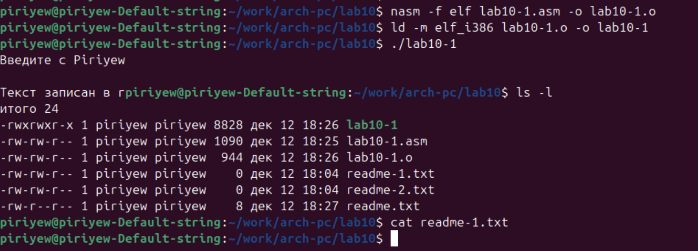
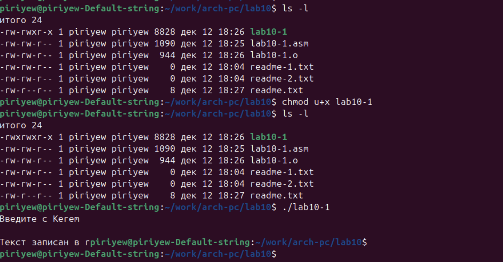

---
## Author
author:
  name: Пириев Керем
  degrees: DSc
  orcid: 0000-0002-0877-7063
  email: 1032254162@rudn.ru
  affiliation:
    - name: Российский университет дружбы народов
      country: Российская Федерация
      postal-code: 117198
      city: Москва
      address: ул. Миклухо-Маклая, д. 6

## Title
title: "Лабораторная работа № 10"
subtitle: "Работа с файлами в ОС Linux"
license: "CC BY"

bibliography: bib/cite.bib
csl: _resources/csl/gost-r-7-0-5-2008-numeric.csl

nocite: "@*"
---

# Цель работы

Приобретение навыков написания программ для работы с файлами.

# Задание

1. Создание файлов в программах.
2. Изменение прав на файлы для разных групп пользователей.
3. Выполнение самостоятельных заданий по материалам лабораторной работы.

# Теоретическое введение

ОС GNU/Linux является многопользовательской операционной системой. Для обеспечения защиты данных одного пользователя от действий других пользователей существуют специальные механизмы разграничения доступа к файлам. Кроме ограничения доступа, данный механизм позволяет разрешить другим пользователям доступ к данным для совместной работы.

# Выполнение лабораторной работы

Создаю каталог для программ лабораторной работы № 10 и необходимые файлы (рис. @fig-001).

{#fig-001 width=70%}

Ввожу в созданный файл программу из первого листинга (рис. @fig-002).

{#fig-002 width=70%}

Запускаю программу, она просит на ввод строку, после чего создает текстовый файл с введенной пользователем строкой (рис. @fig-003).

{#fig-003 width=70%}

Меняю права владельца, запретив исполнять файл, после чего система отказывает в исполнении файла (рис. @fig-004).

{#fig-004 width=70%}

Добавляю к исходному файлу программы права владельцу на исполнение. Исполняемый текстовый файл интерпретирует каждую строку как команду, из-за чего выдает ошибки (рис. @fig-005).

{#fig-005 width=70%}

Согласно своему варианту, устанавливаю соответствующие права на текстовые файлы, созданные в начале лабораторной работы, используя символьную и числовую записи (рис. @fig-006):
1. В символьном виде для 1-го readme файла: `-x -w--w-`.
2. В двоичной системе для 2-го readme файла: `001 011 101`.

{#fig-006 width=70%}

## 4.1 Задание для самостоятельной работы

Пишу программу, транслирую и компилирую. Программа выводит приглашение, просит ввод с клавиатуры и создает текстовый файл с указанной в программе строкой и вводом пользователя. Проверяю корректность работы (рис. @fig-007).

{#fig-007 width=70%}

**Код программы (`lab10-2.asm`):**
```assembly
%include 'in_out.asm'

SECTION .data
filename db 'name.txt', 0
prompt db 'Как Вас зовут? ', 0
intro db 'Меня зовут ', 0

SECTION .bss
name resb 255

SECTION .text
global _start

_start:
    mov eax, prompt
    call sprint
    
    mov ecx, name
    mov edx, 255
    call sread
    
    mov eax, 8
    mov ebx, filename
    mov ecx, 07440
    int 80h
    
    mov esi, eax
    
    mov eax, intro
    call slen
    mov edx, eax
    mov ecx, intro
    mov ebx, esi
    mov eax, 4
    int 80h
    
    mov eax, name
    call slen
    mov edx, eax
    mov ecx, name
    mov ebx, esi
    mov eax, 4
    int 80h
    
    mov ebx, esi
    mov eax, 6
    int 80h
    
    call quit

# Выводы

В процессе выполнения лабораторной работы я приобрел навыки написания программ для работы с файлами, научился редактировать права для файлов.

# Список литературы{.unnumbered}

::: {#refs}
:::
