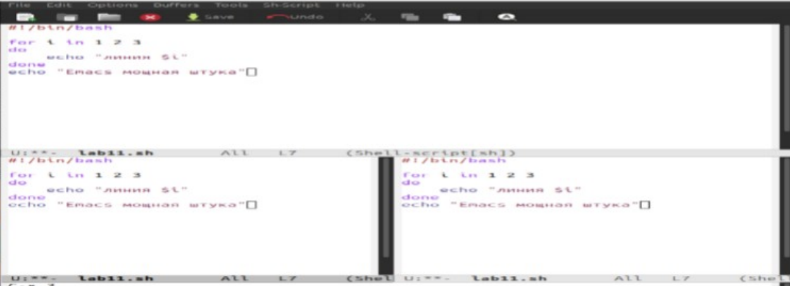
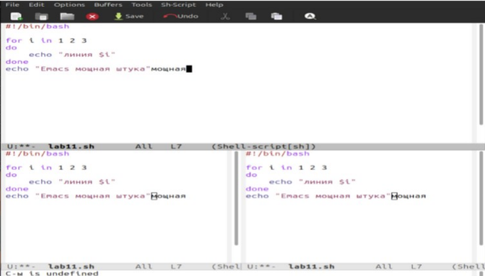

---
## Author
author:
  name: Пириев Керем
  email: 1032254162@rudn.ru
  affiliation:
    - name: Российский университет дружбы народов
      country: Российская Федерация
      postal-code: 117198
      city: Москва
      address: ул. Миклухо-Маклая, д. 6

## Title
title: "Лабораторная работа № 11"
subtitle: "Текстовый редактор Emacs"
license: CC BY
date: today
date-format: "YYYY-MM-DD"
---

# Информация

## Докладчик

:::::::::::::: {.columns align=center}
::: {.column width="70%"}

* Пириев Керем
* студент группы НПИбд-02-25
* Российский университет дружбы народов
* [1032254162@rudn.ru](mailto:1032254162@rudn.ru)

:::
::: {.column width="30%"}

:::
::::::::::::::

# Цель работы

Знакомство с операционной системой Linux и получение практических навыков работы с текстовым редактором Emacs.

# Задание

1. Установка и запуск Emacs.
2. Создание файла `lab11.sh`.
3. Ввод содержимого и сохранение файла.
4. Управление буферами и окнами.
5. Поиск и замена текста.
6. Завершение работы.

# Выполнение лабораторной работы

## Установка и запуск Emacs

Запуск редактора Emacs в фоновом режиме:

{width=50%}

## Создание файла lab11.sh

Инициализация нового файла для работы:

{width=50%}

## Сохранение файла

Ввод текста скрипта и сохранение через `C-x C-s`:

{width=50%}

## Управление буферами и окнами (1)

Разделение экрана на части для параллельной работы:

{width=50%}

## Управление буферами и окнами (2)

Многооконный режим отображения содержимого:

{width=50%}

## Поиск и замена текста

Использование инкрементального поиска и замены строк:

{width=50%}

# Выводы

* Освоены базовые принципы работы в текстовом редакторе Emacs.
* Изучены комбинации клавиш для сохранения файлов и управления буферами.
* Получены навыки многооконного редактирования и поиска текста.