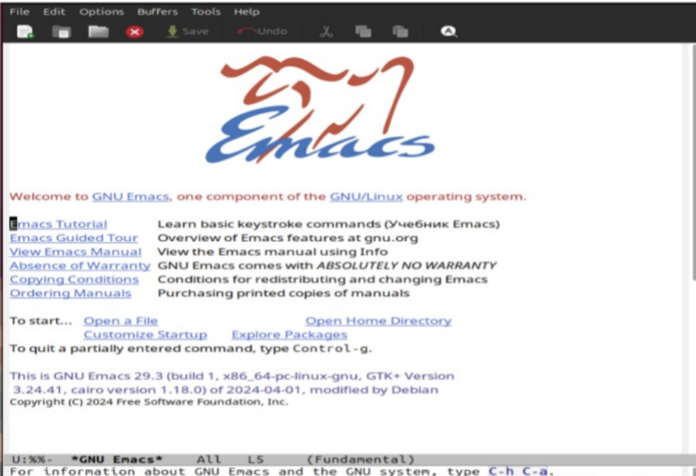
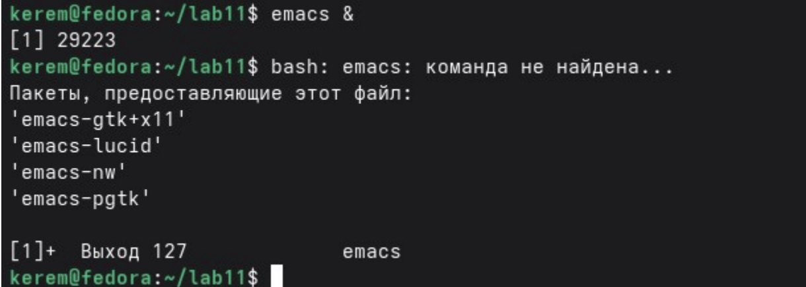
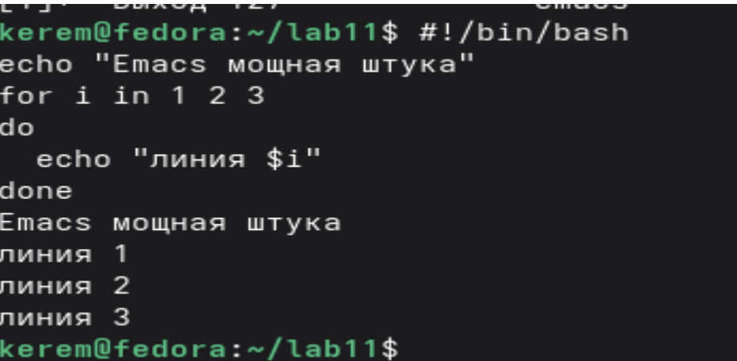

---
## Author
author:
  name: Пириев Керем
  degrees: DSc
  orcid: 0000-0002-0877-7063
  email: 1032254162@rudn.ru
  affiliation:
    - name: Российский университет дружбы народов
      country: Российская Федерация
      postal-code: 117198
      city: Москва
      address: ул. Миклухо-Маклая, д. 6

## Title
title: "Лабораторная работа № 11"
subtitle: "Текстовый редактор Emacs"
license: "CC BY"

bibliography: bib/cite.bib
csl: _resources/csl/gost-r-7-0-5-2008-numeric.csl

nocite: "@*"
---

# Цель работы

Познакомиться с операционной системой Linux. Получить практические навыки работы с редактором Emacs.

# Задание

1. Установка и запуск редактора Emacs.
2. Создание файла `lab11.sh`.
3. Ввод содержимого (bash-скрипта) и сохранение файла.
4. Управление буферами и окнами (разделение экрана, переключение).
5. Освоение операций поиска и замены текста.
6. Завершение работы с редактором и ответы на контрольные вопросы.

# Выполнение лабораторной работы

## 1. Установка и запуск Emacs
Выполнена установка редактора Emacs с помощью пакетного менеджера, затем редактор запущен в фоновом режиме (рис. @fig-001).

{#fig-001 width=70%}

## 2. Создание файла lab11.sh
В редакторе Emacs создан новый файл с именем `lab11.sh` (рис. @fig-002).

{#fig-002 width=70%}

## 3. Ввод содержимого и 4. Сохранение файла
В созданный файл введён bash-скрипт и выполнено сохранение комбинацией `C-x C-s` (рис. @fig-003).

{#fig-003 width=70%}

## 5. Управление буферами и окнами (Часть 1)
Отработано разделение экрана на несколько окон и одновременная работа с буферами (рис. @fig-004).

{#fig-004 width=70%}

## 5. Управление буферами и окнами (Часть 2)
Дополнительное разделение и редактирование содержимого в различных частях фрейма (рис. @fig-005).

{#fig-005 width=70%}

## 6. Поиск и замена текста
Освоен инкрементальный поиск текста (`C-s`) и замена строк (`M-%`) (рис. @fig-006).

{#fig-006 width=70%}

## 7. Завершение работы
Для выхода из редактора использована комбинация `C-x C-c`.

# Вывод

В ходе работы были освоенные основные команды Emacs:
* открытие и сохранение файлов;
* управление буферами и окнами;
* поиск и замена текста.
Полученные навыки позволяют эффективно использовать Emacs для редактирования текстов и написания программ в среде Linux.

# Контрольные вопросы

## 1. Кратко охарактеризуйте редактор Emacs.
Emacs — мощный расширяемый редактор с поддержкой подсветки синтаксиса, множеством режимов и встроенных утилит (файловый менеджер, терминал, отладчик). Работает в графическом и текстовом режиме.

## 2. Какие особенности редактора могут сделать его сложным для новичка?
* Обилие комбинаций клавиш (`C-x`, `C-c`, `M-x` и др.).
* Собственная терминология (буфер, фрейм, минибуфер).
* Многофункциональность.

## 3. Своими словами объясните, что такое буфер и окно в терминологии Emacs.
* **Буфер** — область памяти, содержащая текст (файл, сообщение, лог).
* **Окно** — область фрейма (видимого окна Emacs), отображающая содержимое буфера. Один буфер может быть открыт в нескольких окнах.

## 4. Можно ли открыть больше 10 буферов в одном окне?
Да, количество буферов не ограничено. Окно отображает только один буфер в данный момент, но переключаться между ними можно командой `C-x b`.

## 5. Какие буферы создаются по умолчанию при запуске Emacs?
* `GNU Emacs` (приветственный экран);
* `*scratch*` (черновик, временный буфер);
* `*Messages*` (системные сообщения и логи).

## 6. Какие клавиши вы нажмёте, чтобы ввести следующую комбинацию: C-c | C-c C-c?
Сначала нажать `Ctrl+c`, затем клавишу `|` (вертикальная черта), затем снова `Ctrl+c` и ещё раз `Ctrl+c`.

## 7. Как поделить текущее окно на две части?
* Горизонтальное разделение: `C-x 2`.
* Вертикальное разделение: `C-x 3`.

## 8. В каком файле хранятся настройки редактора Emacs?
`~/.emacs` или `~/.emacs.d/init.el`.

## 9. Какую функцию выполняет клавиша C-g? Можно ли её переназначить?
`C-g` прерывает текущую выполняемую команду (отмена). Да, её можно переназначить через функцию `global-set-key`.

## 10. Какой редактор вам показался удобнее в работе vi или Emacs? Почему?
Мне удобнее Emacs, потому что в нём есть понятное меню (в графическом режиме), интуитивно понятные комбинации для сохранения и выхода, а также гибкие возможности работы с буферами и окнами.

# Список литературы{.unnumbered}

::: {#refs}
:::
