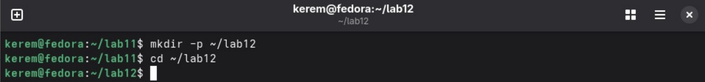
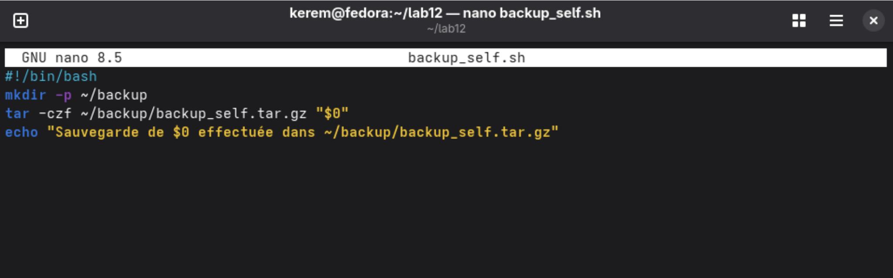
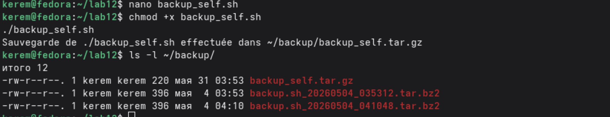

---
## Author
author:
  name: Пириев Керем
  email: 1032254162@rudn.ru
  affiliation:
    - name: Российский университет дружбы народов
      country: Российская Федерация
      postal-code: 117198
      city: Москва
      address: ул. Миклухо-Маклая, д. 6

## Title
title: "Лабораторная работа № 12"
subtitle: "Программирование в командном процессоре ОС UNIX"
license: CC BY
date: today
date-format: "YYYY-MM-DD"
---

# Информация

## Докладчик

:::::::::::::: {.columns align=center}
::: {.column width="70%"}

* Пириев Керем
* студент группы НПИбд-02-25
* Российский университет дружбы народов
* [1032254162@rudn.ru](mailto:1032254162@rudn.ru)

:::
::: {.column width="30%"}

:::
::::::::::::::

# Цель работы

Изучение основ программирования в оболочке bash: переменные, циклы, условия, работа с аргументами и тестирование файлов.

# Задание

1. Создание рабочего каталога `~/lab12`.
2. Создание скрипта резервного копирования `backup_self.sh`.
3. Создание скрипта обработки аргументов `show_args.sh`.
4. Разработка эмулятора команды `ls` — `my_ls.sh`.
5. Разработка скрипта подсчета файлов по расширению `count_ext.sh`.

# Выполнение лабораторной работы

## 1. Создание рабочего каталога

Инициализация директории для выполнения скриптов:

{width=50%}

## 2. Скрипт backup_self.sh (Создание)

Написание кода скрипта резервного копирования самого себя:

{width=50%}

## 2. Скрипт backup_self.sh (Запуск)

Выполнение скрипта и проверка созданного архива:

{width=50%}

## 3. Скрипт show_args.sh (Создание)

Написание кода для обработки произвольного числа аргументов:

{width=50%}

## 3. Скрипт show_args.sh (Запуск)

Тестирование скрипта с переданными аргументами:

{width=50%}

## 4. Скрипт my_ls.sh (Создание)

Разработка аналога команды `ls -l` на bash:

{width=50%}

## 4. Скрипт my_ls.sh (Запуск)

Запуск эмулятора для текущего каталога и `/etc`:

{width=50%}

## 5. Скрипт count_ext.sh (Создание)

Написание скрипта для поиска и подсчета файлов по расширению:

{width=50%}

## 5. Скрипт count_ext.sh (Запуск)

Проверка работы скрипта для файлов `.txt` в каталоге `/etc`:

{width=50%}

# Выводы

* Изучены базовые конструкции программирования в командной оболочке bash.
* Разработаны и протестированы скрипты для резервного копирования, обработки аргументов, эмуляции системных команд и фильтрации файлов.
* Закреплены навыки работы с переменными, циклами, условиями и специальными параметрами shell.