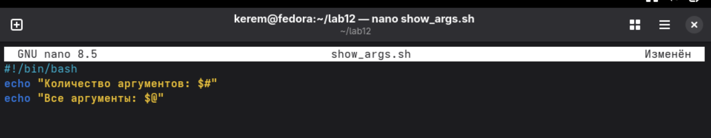
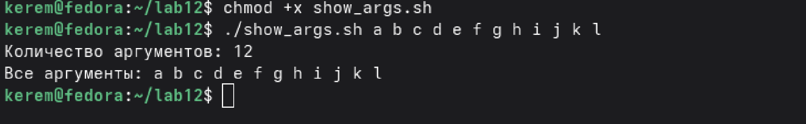
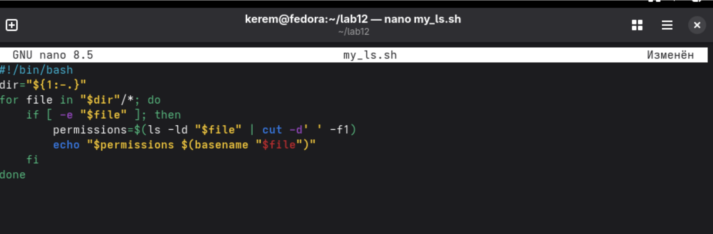
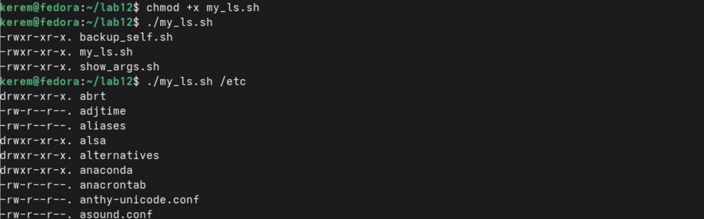
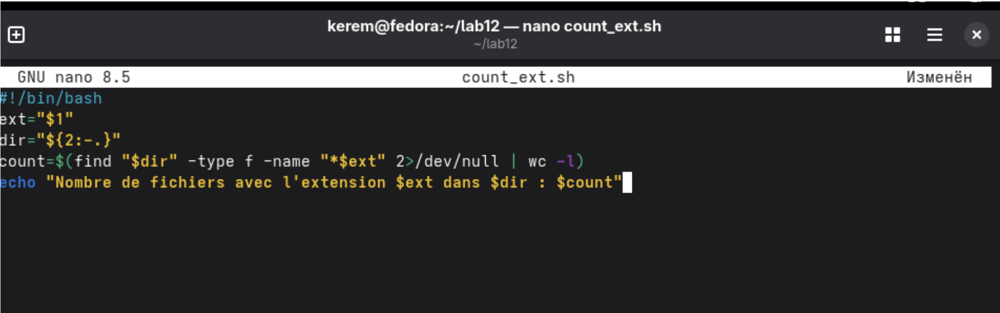
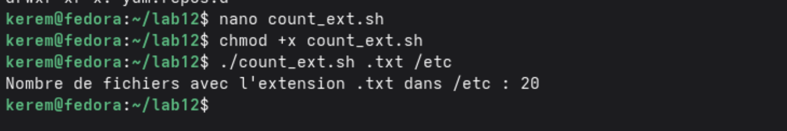

---
## Author
author:
  name: Пириев Керем
  degrees: DSc
  orcid: 0000-0002-0877-7063
  email: 1032254162@rudn.ru
  affiliation:
    - name: Российский университет дружбы народов
      country: Российская Федерация
      postal-code: 117198
      city: Москва
      address: ул. Миклухо-Маклая, д. 6

## Title
title: "Лабораторная работа № 12"
subtitle: "Программирование в командном процессоре ОС UNIX"
license: "CC BY"

bibliography: bib/cite.bib
csl: _resources/csl/gost-r-7-0-5-2008-numeric.csl

nocite: "@*"
---

# Цель работы

Изучить основы программирования в оболочке bash: переменные, циклы, условия, работа с аргументами, тестирование файлов.

# Задание

1. Создать рабочий каталог `~/lab12` для размещения всех скриптов.
2. Создать скрипт резервного копирования самого себя (`backup_self.sh`).
3. Создать скрипт обработки произвольного числа аргументов (`show_args.sh`).
4. Создать скрипт-эмулятор команды `ls` (`my_ls.sh`).
5. Создать скрипт подсчёта файлов по расширению (`count_ext.sh`).
6. Дать ответы на контрольные вопросы.

# Выполнение лабораторной работы

## 1. Создание рабочего каталога
Создан каталог `~/lab12` для размещения всех скриптов (рис. @fig-001).

{#fig-001 width=70%}

## 2. Скрипт 1: резервное копирование самого себя
Создан файл `backup_self.sh` с помощью редактора nano (рис. @fig-002).

{#fig-002 width=70%}

Выполнен запуск скрипта и проверка содержимого резервной копии (рис. @fig-003).

{#fig-003 width=70%}

## 3. Скрипт 2: обработка произвольного числа аргументов
Создан файл `show_args.sh` (рис. @fig-004).

{#fig-004 width=70%}

Выполнен запуск скрипта с 12 аргументами (рис. @fig-005).

{#fig-005 width=70%}

## 4. Скрипт 3: аналог команды ls (без использования ls)
Создан файл `my_ls.sh`, эмулирующий вывод команды `ls -l` (рис. @fig-006).

{#fig-006 width=70%}

Выполнен запуск скрипта для текущего каталога и каталога `/etc` (рис. @fig-007).

{#fig-007 width=70%}

## 5. Скрипт 4: подсчёт файлов по расширению
Создан файл `count_ext.sh` для подсчета файлов с заданным расширением (рис. @fig-008).

{#fig-008 width=70%}

Выполнен запуск скрипта после исправления для поиска файлов `.txt` в `/etc` (рис. @fig-009).

{#fig-009 width=70%}

# Вывод

В ходе работы были написаны и отлажены четыре bash-скрипта:
1. Резервное копирование самого себя — скрипт создаёт архив с собственным исходным кодом.
2. Обработка произвольного количества аргументов — скрипт выводит число и список всех переданных аргументов.
3. Эмуляция команды `ls` — скрипт выводит содержимое каталога с правами доступа без использования встроенной команды `ls`.
4. Подсчёт файлов заданного расширения — скрипт подсчитывает количество файлов с указанным расширением в заданном каталоге.
Получены практические навыки работы с переменными, циклами, условиями, передачей параметров и тестированием файлов в оболочке bash.

# Контрольные вопросы

## 1. Объясните понятие командной оболочки. Приведите примеры командных оболочек. Чем они отличаются?
Командная оболочка (shell) — это программа, обеспечивающая интерфейс между пользователем и операционной системой, интерпретирующая команды, вводимые пользователем. Примеры: `sh`, `bash`, `csh`, `zsh`, `fish`. Отличаются синтаксисом и дополнительными возможностями.

## 2. Что такое POSIX?
POSIX (Portable Operating System Interface) — набор стандартов, описывающих интерфейсы между ОС и прикладными программами для обеспечения переносимости.

## 3. Как определяются переменные и массивы в языке программирования bash?
Переменная: `var=value`. Массив: `arr=(val1 val2 val3)`.

## 4. Каково назначение операторов let и read?
`let` — для арифметических операций. `read` — для чтения ввода пользователя.

## 5. Какие арифметические операции можно применять в языке программирования bash?
`+`, `-`, `*`, `/`, `%`, `+=`, `-=`, `*=`, `/=`, `++`, `--`.

## 6. Что означает операция `(())`?
Конструкция для выполнения арифметических операций в стиле языка С без использования `$` перед переменными.

## 7. Какие стандартные имена переменных Вам известны?
`HOME`, `PATH`, `USER`, `SHELL`, `PWD`, `PS1`, `IFS`, `LOGNAME`.

## 8. Что такое метасимволы?
Символы, имеющие специальное значение для оболочки (`*`, `?`, `[ ]`, `&`, `;` и др.).

## 9. Как экранировать метасимволы?
С помощью обратного слеша (`\*`), одинарных (`'*'`) или двойных (`"*"`) кавычек.

## 10. Как создавать и запускать командные файлы?
Создать файл с `#!/bin/bash`, сделать исполняемым (`chmod +x`), запустить через `./file`.

## 11. Как определяются функции в языке программирования bash?
Через ключевое слово `function name { ... }` или `name() { ... }`.

## 12. Каким образом можно выяснить, является файл каталогом или обычным файлом?
С помощью условных операторов `test` или `[ ]` с ключами `-d` (каталог) и `-f` (файл).

## 13. Каково назначение команд set, typeset и unset?
`set` — параметры оболочки и переменные; `typeset` — объявление переменных с атрибутами; `unset` — удаление переменных или функций.

## 14. Как передаются параметры в командные файлы?
Через пробел после имени скрипта при запуске (`./script.sh arg1 arg2`).

## 15. Назовите специальные переменные языка bash и их назначение.
* `$#` — количество аргументов.
* `$*` — все аргументы как одна строка.
* `$@` — все аргументы как отдельные строки.
* `$?` — код возврата последней команды.
* `$$` — PID текущей оболочки.
* `$!` — PID последнего фонового процесса.
* `$0` — имя скрипта.

# Список литературы{.unnumbered}

::: {#refs}
:::
