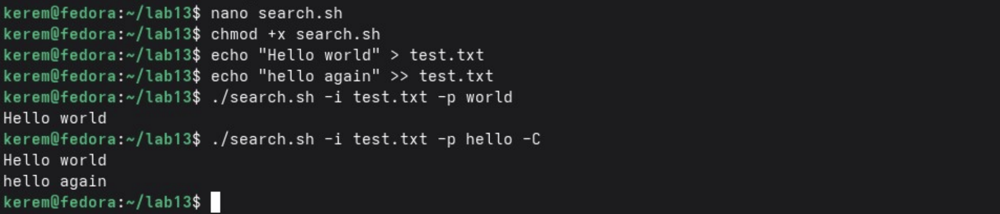
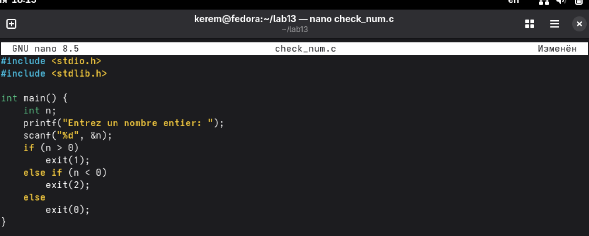
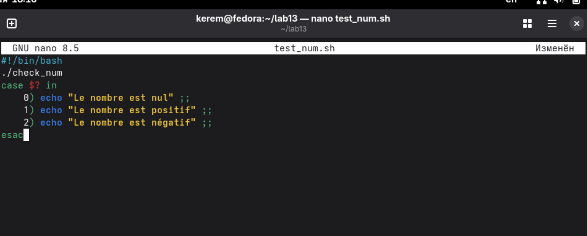
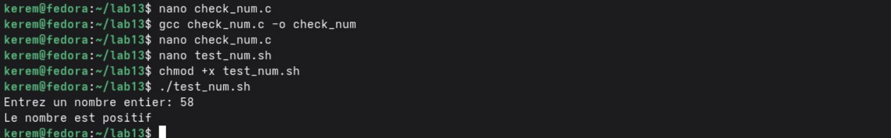
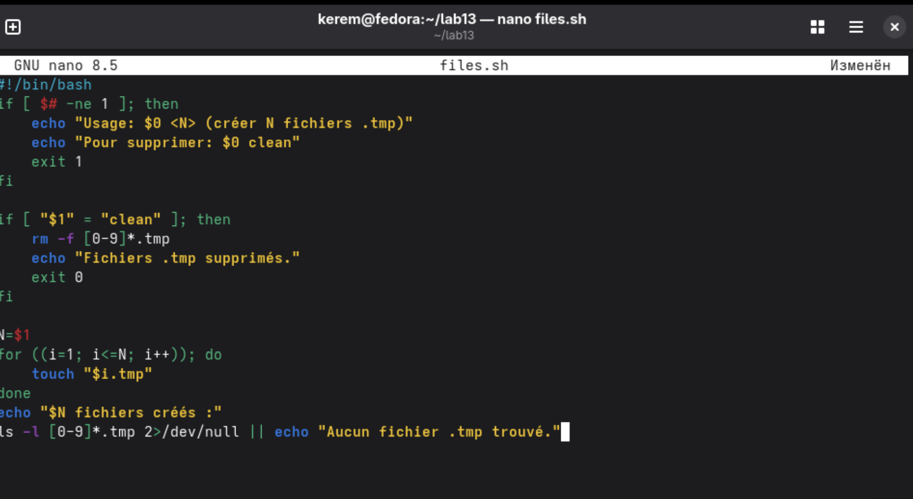
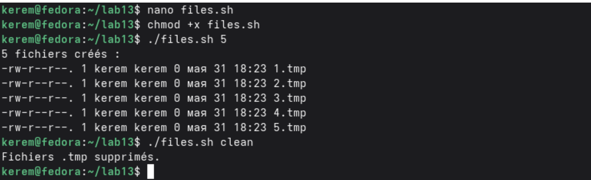
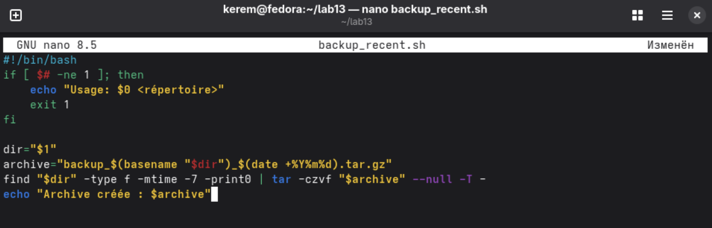
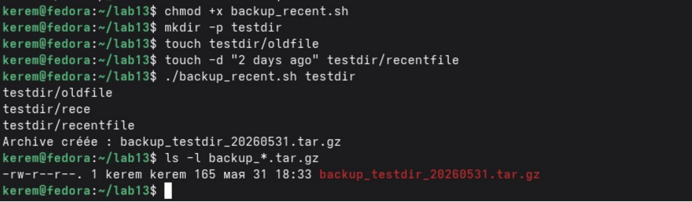

---
## Author
author:
  name: Пириев Керем
  degrees: DSc
  orcid: 0000-0002-0877-7063
  email: 1032254162@rudn.ru
  affiliation:
    - name: Российский университет дружбы народов
      country: Российская Федерация
      postal-code: 117198
      city: Москва
      address: ул. Миклухо-Маклая, д. 6

## Title
title: "Лабораторная работа № 13"
subtitle: "Программирование в командном процессоре ОС UNIX. Ветвления и циклы"
license: "CC BY"

bibliography: bib/cite.bib
csl: _resources/csl/gost-r-7-0-5-2008-numeric.csl

nocite: "@*"
---

# Цель работы

Изучить основы программирования в оболочке ОС UNIX. Научиться писать более сложные командные файлы с использованием логических управляющих конструкций и циклов.

# Задание

1. Создать рабочий каталог `~/lab13` для размещения всех скриптов.
2. Разработать программу на языке C `check_num.c` для проверки знака числа и возврата различных кодов завершения.
3. Разработать bash-скрипт `test_num.sh` для анализа кода возврата программы на C с использованием оператора `case`.
4. Разработать скрипт `files.sh` для массового создания и удаления временных файлов с использованием циклов.
5. Разработать скрипт `backup_recent.sh` для архивации файлов, изменённых за последние 7 дней, с использованием утилит `find` и `tar`.
6. Ответить на контрольные вопросы.

# Выполнение лабораторной работы

## 1. Создание рабочего каталога
Для размещения всех скриптов был создан рабочий каталог `~/lab13` (рис. @fig-001).

{#fig-001 width=70%}

## 2. Программа на языке C (check_num.c)
Создан файл `check_num.c`, который принимает целое число и возвращает код завершения в зависимости от его знака: `1`, если больше нуля; `2`, если меньше нуля; `0`, если равен нулю (рис. @fig-002).

{#fig-002 width=70%}

## 3. Анализ кода возврата (test_num.sh)
Создан bash-скрипт `test_num.sh`, который вызывает скомпилированную программу `check_num` и с помощью конструкции `case` анализирует код возврата `$?` (рис. @fig-003).

{#fig-003 width=70%}

Успешно выполнена компиляция программы на C (`gcc`) и запуск скрипта (рис. @fig-004).

{#fig-004 width=70%}

## 4. Скрипт для создания и удаления временных файлов (files.sh)
Разработан скрипт `files.sh`, который позволяет создавать заданное количество файлов (`.tmp`) с помощью цикла `for` или удалять их при передаче аргумента `clean` (рис. @fig-005).

{#fig-005 width=70%}

Проверена корректность создания файлов и их последующее удаление опцией `clean` (рис. @fig-006).

{#fig-006 width=70%}

## 5. Скрипт для архивации недавно изменённых файлов (backup_recent.sh)
Создан скрипт `backup_recent.sh`, осуществляющий поиск файлов в указанном каталоге, изменённых за последние 7 дней (`-mtime -7`), и их упаковку в архив (рис. @fig-007).

{#fig-007 width=70%}

Проведено тестирование скрипта на специально подготовленной структуре каталога с помощью тестовых файлов (рис. @fig-008).

{#fig-008 width=70%}

# Вывод

В ходе работы были написаны и отлажены командные файлы и программы:
1. `check_num.c` / `test_num.sh` — демонстрация анализа кода возврата программы на C в bash-скрипте с использованием `case`.
2. `files.sh` — скрипт для массового создания временных файлов и их удаления с помощью циклов.
3. `backup_recent.sh` — скрипт для архивации файлов, изменённых за последние 7 дней.
Получены практические навыки использования цикла `for`, условного оператора `if`, оператора выбора `case`, разбора аргументов и работы с кодами возврата (`$?`).

# Контрольные вопросы

## 1. Какие символические имена (метасимволы) существуют в оболочке bash?
* `*` — любая строка (0 и более символов).
* `?` — один любой символ.
* `[...]` — один символ из указанного диапазона или набора.
* `{...}` — генерация списка строк.
* `|` — конвейер.
* `&` — запуск команды в фоновом режиме.
* `;` — разделитель команд.
* `<`, `>`, `>>` — перенаправление ввода-вывода.
* `$` — подстановка значения переменной.

## 2. Какое отношение метасимволы имеют к генерации имён файлов?
Метасимволы (`*`, `?`, `[...]`) используются для шаблонов имён файлов (globbing). Оболочка автоматически заменяет шаблон на список имён файлов, соответствующих ему.

## 3. Какие операторы управления действиями вы знаете?
* Условные: `if/then/else/elif/fi`, `case/esac`.
* Циклы: `for`, `while`, `until`.
* Управление циклом: `break`, `continue`.
* Завершение скрипта: `exit`.

## 4. Какие операторы используются для прерывания цикла?
* `break` — полный выход из цикла.
* `continue` — переход к следующей итерации цикла.

## 5. Для чего нужны команды false и true?
* `true` — всегда возвращает код возврата 0 (успех).
* `false` — всегда возвращает ненулевой код возврата (обычно 1).
Используются для организации бесконечных циклов (`while true`) или логических заглушек.

## 6. Что означает строка `if test -f man\$s/\$i.\$1`, встреченная в командном файле?
Эта строка проверяет, существует ли файл с именем, составленным из каталога `man\$s`, значения переменной `$1` и т.д., с учётом экранирования знака доллара.

## 7. Объясните различие между конструкциями while и until.
* `while` — цикл выполняется, пока условие истинно (код возврата равен 0).
* `until` — цикл выполняется, пока условие ложно (повторяется до тех пор, пока условие не станет истинным).

# Список литературы{.unnumbered}

::: {#refs}
:::
