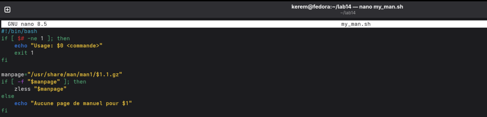

---
## Author
author:
  name: Пириев Керем
  email: 1032254162@rudn.ru
  affiliation:
    - name: Российский университет дружбы народов
      country: Российская Федерация
      postal-code: 117198
      city: Москва
      address: ул. Миклухо-Маклая, д. 6

## Title
title: "Лабораторная работа № 14"
subtitle: "Программирование в командном процессоре ОС UNIX. Ветвления и циклы (продолжение)"
license: CC BY
date: today
date-format: "YYYY-MM-DD"
---

# Информация

## Докладчик

:::::::::::::: {.columns align=center}
::: {.column width="70%"}

* Пириев Керем
* студент группы НПИбд-02-25
* Российский университет дружбы народов
* [1032254162@rudn.ru](mailto:1032254162@rudn.ru)

:::
::: {.column width="30%"}

:::
::::::::::::::

# Цель работы

Изучение основ программирования в оболочке ОС UNIX, написание сложных командных файлов с использованием логических конструкций, циклов и механизмов синхронизации.

# Задание

1. Создание рабочего каталога `~/lab14`.
2. Разработка скрипта семафоров `semaphore.sh`.
3. Разработка аналога команды man — `my_man.sh`.
4. Разработка генератора случайных букв `random_letters.sh`.

# Выполнение лабораторной работы

## Создание рабочего каталога и semaphore.sh

Разработка скрипта синхронизации процессов через блокировки:

{width=50%}

## Запуск semaphore.sh

Проверка работы механизма таймаута и ожидания ресурса:

{width=50%}

## Скрипт my_man.sh (Создание)

Написание скрипта для поиска и чтения страниц руководства:

{width=50%}

## Скрипт my_man.sh (Тест)

Проверка поиска и вывода справки для команды `ls`:

{width=50%}

## Скрипт random_letters.sh (Создание)

Разработка генератора случайных строк на базе `$RANDOM`:

{width=50%}

## Скрипт random_letters.sh (Тест)

Генерация случайной последовательности из 10 символов:

{width=50%}

# Выводы

* Разработаны скрипты для демонстрации межпроцессного взаимодействия через семафоры и блокировки.
* Реализован собственный аналог утилиты `man` для работы со сжатыми файлами справки.
* Освоено использование переменной `$RANDOM` и строковых подстановок для генерации случайных данных в bash.