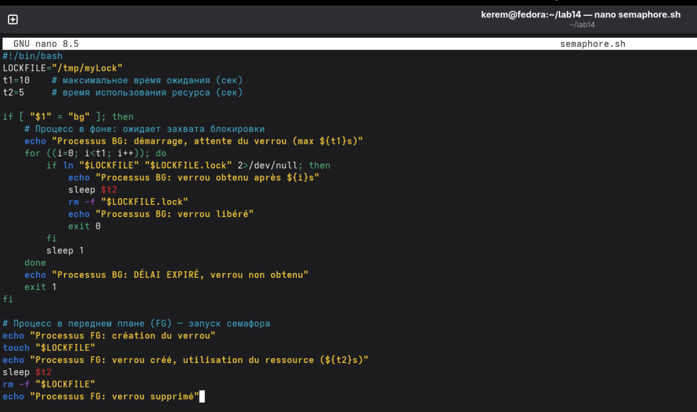
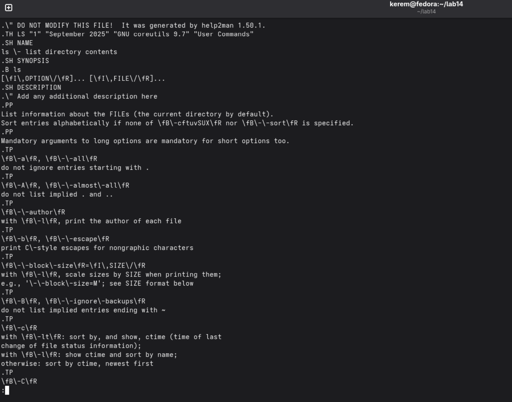
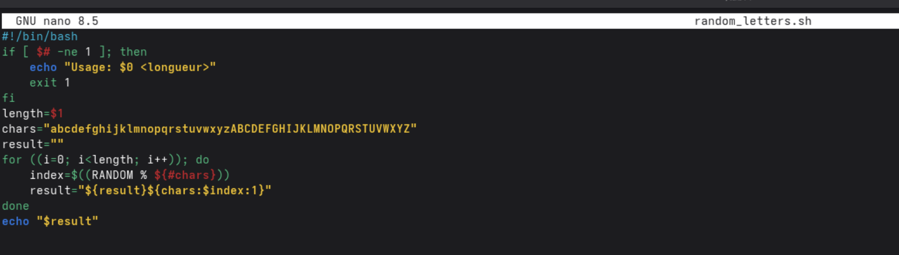

---
## Author
author:
  name: Пириев Керем
  degrees: DSc
  orcid: 0000-0002-0877-7063
  email: 1032254162@rudn.ru
  affiliation:
    - name: Российский университет дружбы народов
      country: Российская Федерация
      postal-code: 117198
      city: Москва
      address: ул. Миклухо-Маклая, д. 6

## Title
title: "Лабораторная работа № 14"
subtitle: "Программирование в командном процессоре ОС UNIX. Ветвления и циклы (продолжение)"
license: "CC BY"

bibliography: bib/cite.bib
csl: _resources/csl/gost-r-7-0-5-2008-numeric.csl

nocite: "@*"
---

# Цель работы

Изучить основы программирования в оболочке ОС UNIX. Научиться писать более сложные командные файлы с использованием логических управляющих конструкций и циклов.

# Задание

1. Создать рабочий каталог `~/lab14` для размещения всех скриптов.
2. Разработать скрипт `semaphore.sh` для демонстрации взаимодействия и синхронизации процессов с помощью файловых блокировок.
3. Разработать скрипт `my_man.sh` для эмуляции работы команды `man` (поиск и отображение страниц руководства, включая сжатые файлы).
4. Разработать скрипт `random_letters.sh` для генерации случайных строк заданной длины из букв латинского алфавита с помощью переменной `$RANDOM`.
5. Дать ответы на контрольные вопросы.

# Выполнение лабораторной работы

## 1. Создание рабочего каталога и скрипт semaphore.sh
Создан каталог `~/lab14`. Разработан скрипт `semaphore.sh`, демонстрирующий ожидание ресурса и управление блокировками (`/tmp/myLock`) между фоновыми и переднеплановыми процессами (рис. @fig-001).

{#fig-001 width=70%}

Проверено выполнение скрипта в терминале, отработал механизм создания и удаления блокировки (рис. @fig-002).

{#fig-002 width=70%}

## 2. Реализация команды man (my_man.sh)
Создан скрипт `my_man.sh`, который осуществляет поиск и постраничный вывод страниц руководства из каталога `/usr/share/man/man1/`, поддерживая работу со сжатыми файлами `.gz` (рис. @fig-003).

{#fig-003 width=70%}

Выполнено тестирование скрипта для команды `ls` (рис. @fig-004).

{#fig-004 width=70%}

## 3. Генератор случайных букв (random_letters.sh)
Создан скрипт `random_letters.sh` для генерации случайной последовательности символов указанной длины с использованием `$RANDOM` и подстановки строк (рис. @fig-005).

{#fig-005 width=70%}

Проведено тестирование генерации строки длиной 10 символов (рис. @fig-006).

{#fig-006 width=70%}

# Вывод

В ходе работы были разработаны три скрипта:
1. Семафор (`semaphore.sh`) — демонстрация ожидания ресурса между двумя процессами (синхронизация с использованием таймаута).
2. Собственная команда man (`my_man.sh`) — поиск и отображение страниц руководства, включая сжатые (`.gz`).
3. Генератор случайных строк (`random_letters.sh`) — использование переменной `$RANDOM` для создания буквенной последовательности заданной длины.
Получены навыки работы с блокировками, обработкой аргументов командной строки, чтением системных каталогов (`/usr/share/man`), а также генерацией случайных данных в bash.

# Контрольные вопросы

## 1. Найдите синтаксическую ошибку в следующей строке: `while [\$1 != "exit"]`
Ошибка: не хватает пробелов внутри квадратных скобок, а также переменная `$1` должна быть взята в кавычки. Правильно: `while [ "$1" != "exit" ]`.

## 2. Как объединить (конкатенация) несколько строк в одну?
Использовать простое присваивание: `new="$str1$str2"` или с фигурными скобками: `new="${str1}${str2}"`.

## 3. Найдите информацию об утилите seq. Какими иными способами можно реализовать её функционал при программировании на bash?
`seq` — утилита для генерации последовательности чисел. Альтернативы в bash: цикл `for` в стиле Си (`for ((i=1; i<=N; i++))`) или конструкция `{1..N}`.

## 4. Какой результат даст вычисление выражения `$((10/3))`?
Результат: `3` (целочисленное деление, остаток отбрасывается).

## 5. Укажите кратко основные отличия командной оболочки zsh от bash.
Zsh обладает более мощным автодополнением, встроенной поддержкой массивов (индексация с 1 по умолчанию), загружаемыми модулями и расширенной экосистемой плагинов (Oh My Zsh), в то время как bash строже следует стандарту POSIX.

## 6. Проверьте, верен ли синтаксис данной конструкции: `for (( $a=1$; a <= LIMIT; a++))`
Ошибка: лишние знаки доллара и некорректная расстановка символов. Правильная форма: `for (( a=1; a <= LIMIT; a++ ))`.

## 7. Сравните язык bash с какими-либо языками программирования. Какие преимущества у bash по сравнению с ними? Какие недостатки?
* Преимущества bash: идеален для автоматизации задач администрирования, быстрой работы с файлами, процессами и конвейерами команд.
* Недостатки: медленный для сложных вычислений, отсутствие прямой поддержки чисел с плавающей точкой, слабая типизация.

# Список литературы{.unnumbered}

::: {#refs}
:::
